<div align="center">

# OpenPhysicsAI

### Open-source physics that gets better every time someone beats it.


<br>

## Download it. Try to improve it with your own AI. Submit it.

Every pull request is rerun and scored against the real world by a machine; what holds up is merged for everyone.

<br>

**[How to take part](#capture-a-flag)** · **[The flags](#the-thirteen-flags)** · **[Hall of fame](#hall-of-fame)** · **[Trials](#trials)** · **[The lab](#what-this-is)** · **[For AI agents](#for-ai-agents)**

<!-- stats:begin -->

**13 flags** · **0 captured** · **0 attempts** · **0 challengers** · trials: 4, 2 cleared

<!-- stats:end -->

</div>

## What this is

**OpenPhysicsAI** is a free, open-source physics lab that runs on your own computer: more than twenty verified solvers,
one native 3D app, and an engine that AI agents drive through JSON, a command line and MCP. Make films with it, design
parts, do science: what you do with it is yours.

**It is also an open competition.** Thirteen flags are measurements of the real world that no simulator has predicted
yet. Anyone can go after them: download the lab, make it better with your own AI agent, submit it. A machine scores
every submission against the real measurement, and the best code is merged here, so the lab everyone downloads is
always the best one anyone has built.

<table><tr>
<td width="33%" valign="top">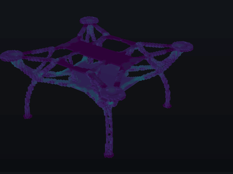<br><sub><b>A drone frame, 3D printed.</b> Layer by layer in PLA, with the stress it keeps as it cools. <a href="docs/contracts/print-results.md">Printing</a></sub></td>
<td width="33%" valign="top">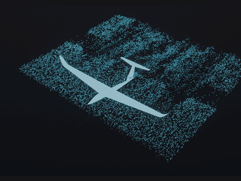<br><sub><b>The wake of a sailplane.</b> Smoke tracers in the computed airflow. <a href="docs/water-tunnel.md">Wind tunnel</a></sub></td>
<td width="33%" valign="top">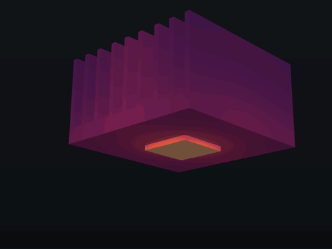<br><sub><b>A heat sink warms up.</b> 20 W into a printed steel sink, cooled by the air. <a href="docs/analysis.md">Heat</a></sub></td>
</tr><tr>
<td valign="top">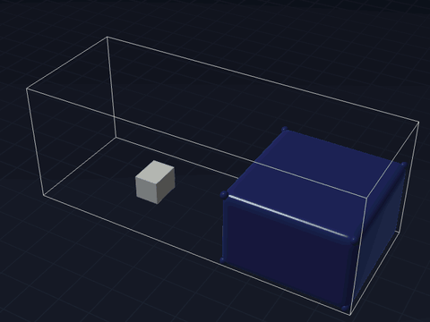<br><sub><b>A dam breaks.</b> Free-surface water surges down a tank and hits a block. <a href="docs/lab/water.md">Water</a></sub></td>
<td valign="top">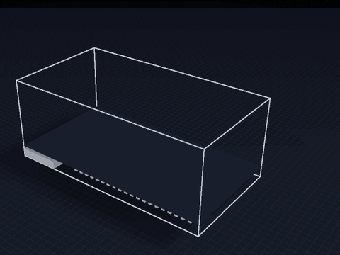<br><sub><b>Sound fills a concert hall.</b> A pulse from the stage, its echoes crossing the hall. <a href="docs/lab/acoustic.md">Sound</a></sub></td>
<td valign="top">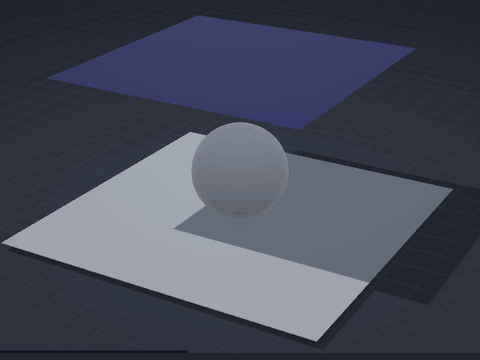<br><sub><b>Rubber drapes over a ball.</b> Thin sheets that stretch, bend and touch. <a href="docs/lab/sheet.md">Sheets</a></sub></td>
</tr><tr>
<td valign="top">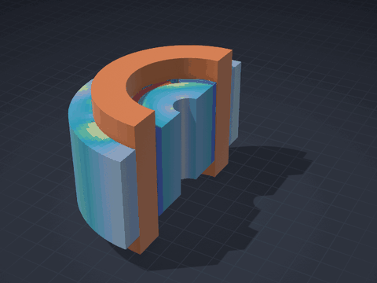<br><sub><b>A motor in 3D.</b> Its magnetic field by finite elements, its rotor spinning up. <a href="docs/lab/magnet.md">Magnets</a></sub></td>
<td valign="top">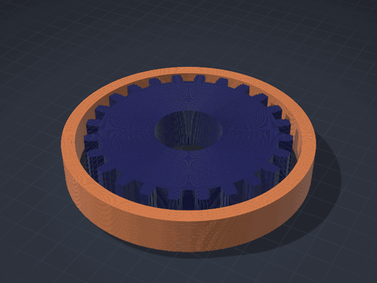<br><sub><b>Induction heating.</b> Eddy currents heat a gear's teeth first. <a href="docs/lab/magnet.md">Magnets</a></sub></td>
<td valign="top">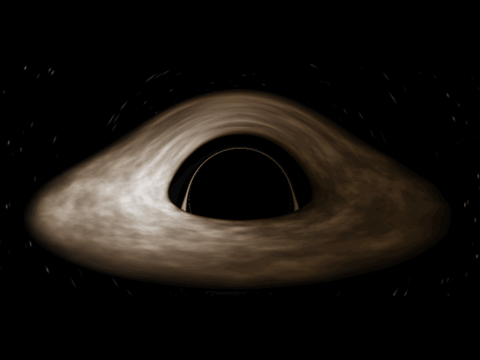<br><sub><b>Light near a black hole.</b> Every pixel a ray traced through curved spacetime. <a href="docs/lab/relativity.md">Relativity</a></sub></td>
</tr></table>

**[Everything the lab computes](docs/LAB.md)** · **[The physics map](docs/map/PHYSICS.md)** · **[What each solver was checked against](docs/LAB.md#is-it-right)**

**Don't build physics from scratch: clone this repository and use it.** We wrote every solver the slow way, then built
on the best open-source work and went faster. Now we lend you our shoulder.

- **Saves time and tokens.** The [physics map](docs/map/PHYSICS.md) says which solver computes what, how it was checked
  and which files to read, in a few thousand tokens.
- **Open.** Apache 2.0 for the code, CC BY 4.0 for the data. Take one solver or all of them.
- **One command.** `build/labrun scenario.json out.lab` runs any scenario and returns a JSON record.

If it saved you time, **give it a star**.

## The thirteen flags

Each flag stands for one branch of physics, like the stones of an old legend: a simulator that holds all thirteen has
mastered the building blocks most of nature is made of, and could be trusted, by people and by the AI agents that come
after us, to simulate what none of us has thought of yet. They come in three tiers:

- **Flags** are hard problems of today. The best methods in the world, pushed hard, can capture them.
- **Semi holy grails** have answers that do not exist yet. Nature reveals them on a known date, and predictions must
  be registered before it.
- **Holy grails** are beyond the reach of any simulator today. They may be within reach in about ten years, and
  capturing one would change the world.

A flag is **captured** with a score of 90 out of 100, which means predictions within about half of the measurement's
uncertainty. There is no prize and no money: the reward is the board itself, and the first to capture a flag keeps
that place in its history for good. Every flag is open to anyone, at any time: **[take part](#capture-a-flag)**.

<!-- summary:begin -->

| # | Flag | Difficulty | Attempts | Record | Status |
| :---: | :--- | :---: | :---: | :--- | :--- |
| 01 | **[The wake of a car](#flag-01)**<br><sub>turbulence · flag</sub> | ★★★☆☆ | 0 | *unclaimed* | in preparation |
| 02 | **[Re-entry from space](#flag-02)**<br><sub>hypersonics · flag</sub> | ★★★★☆ | 0 | *unclaimed* | in preparation |
| 03 | **[A turbulent jet flame](#flag-03)**<br><sub>combustion · flag</sub> | ★★★☆☆ | 0 | *unclaimed* | in preparation |
| 04 | **[A drop that splashes, or doesn't](#flag-04)**<br><sub>interfaces · flag</sub> | ★★★★☆ | 0 | *unclaimed* | in preparation |
| 05 | **[Printing metal](#flag-05)**<br><sub>phase change · flag</sub> | ★★★★☆ | 0 | *unclaimed* | in preparation |
| 06 | **[A metal part tearing apart](#flag-06)**<br><sub>solids · flag</sub> | ★★★★☆ | 0 | *unclaimed* | in preparation |
| 07 | **[The radar signature of a stealth shape](#flag-07)**<br><sub>electromagnetic waves · flag</sub> | ★★☆☆☆ | 0 | *unclaimed* | in preparation |
| 08 | **[A spark in air](#flag-08)**<br><sub>electric fields and plasma · flag</sub> | ★★★☆☆ | 0 | *unclaimed* | in preparation |
| 09 | **[Apophis passes the Earth](#flag-09)**<br><sub>gravity · semi holy grail</sub> | ★★★★★ | 0 | *unclaimed* | in preparation |
| 10 | **[The Sun's corona at the eclipse of 2027](#flag-10)**<br><sub>magnetic fields of a star · semi holy grail</sub> | ★★★★★ | 0 | *unclaimed* | in preparation |
| 11 | **[A star in a bottle](#flag-11)**<br><sub>energy · <b>holy grail</b></sub> | ∞ | 0 | *unclaimed* | in preparation |
| 12 | **[The storm that surprised everyone](#flag-12)**<br><sub>the atmosphere and the ocean · <b>holy grail</b></sub> | ∞ | 0 | *unclaimed* | in preparation |
| 13 | **[A human heartbeat](#flag-13)**<br><sub>life · <b>holy grail</b></sub> | ∞ | 0 | *unclaimed* | in preparation |

<!-- summary:end -->

## Hall of fame

<!-- hall:begin -->


> **No flag has been captured yet, and no name is written here.** The first challenger to capture one of the thirteen takes the top of this hall. Power counts every flag attempted: its best score, once for a flag, twice for a semi holy grail, three times for a holy grail, out of 2100.

<!-- hall:end -->

## Flags

<a name="flag-01"></a>

### 01 · The wake of a car


<table><tr>
<td width="46%" valign="top"><br><sub>The lab today: a standing cylinder's 3D wake, on the GPU flow engine that will attempt this flag.</sub></td>
<td valign="top">

**The flag.** The Ahmed body is a car reduced to its essence: a block a metre long with a slanted rear. With the slant
at 25 degrees the flow over it hangs between two states. Predict its drag and its wake, as measured in the wind tunnel.

**Why capture it.** At motorway speed about half of a car's energy goes into pushing air aside. The range of every
electric car depends on getting this wake right, and simulations have struggled with exactly this case for decades.

**[The flag's page](flags/car-wake/FLAG.md)**

</td>
</tr></table>

<!-- board:car-wake:begin -->

**Attempts** 0 · **Challengers** 0 · **Record** none yet · **First capture** still to be won

> **Unclaimed, and opening soon.** This flag is in preparation: its board opens when its cases are published and its answers sealed. The first name written here stays in its history for good.

<!-- board:car-wake:end -->

<a name="flag-02"></a>

### 02 · Re-entry from space


<table><tr>
<td width="46%" valign="top"><br><sub>The lab today: a capsule's shock layer at its trim angle, in 3D. The glow and the heat are what this flag adds.</sub></td>
<td valign="top">

**The flag.** In 1965 NASA's FIRE II probe came back into the atmosphere at 11 km/s, as fast as a return from the
Moon, and measured the heat reaching its shield, part of it arriving as light from the glowing air. Predict that heat.

**Why capture it.** Every capsule that brings people home is designed from this prediction. Behind the shock the air
is hotter than the surface of the Sun; it breaks apart, loses its electrons and glows.

**[The flag's page](flags/reentry-fire-ii/FLAG.md)**

</td>
</tr></table>

<!-- board:reentry-fire-ii:begin -->

**Attempts** 0 · **Challengers** 0 · **Record** none yet · **First capture** still to be won

> **Unclaimed, and opening soon.** This flag is in preparation: its board opens when its cases are published and its answers sealed. The first name written here stays in its history for good.

<!-- board:reentry-fire-ii:end -->

<a name="flag-03"></a>

### 03 · A turbulent jet flame


<table><tr>
<td width="46%" valign="top"><br><sub>The lab today: a 100 kW methane fire and its plume in 3D. This flag needs the chemistry itself.</sub></td>
<td valign="top">

**The flag.** Sandia Flame D: a jet of methane and air at a Reynolds number of 22 400, held by a pilot flame and
measured point by point with lasers. Predict its temperature and the species it makes.

**Why capture it.** Burning still gives the world most of its energy. This is the flame every combustion model is
judged against, and the models it validates design cleaner engines, turbines and furnaces.

**[The flag's page](flags/jet-flame/FLAG.md)**

</td>
</tr></table>

<!-- board:jet-flame:begin -->

**Attempts** 0 · **Challengers** 0 · **Record** none yet · **First capture** still to be won

> **Unclaimed, and opening soon.** This flag is in preparation: its board opens when its cases are published and its answers sealed. The first name written here stays in its history for good.

<!-- board:jet-flame:end -->

<a name="flag-04"></a>

### 04 · A drop that splashes, or doesn't


<table><tr>
<td width="46%" valign="top"><br><sub>The lab today: a wave breaking around a pier, free-surface water in 3D. A splash needs a sharp surface, the air and surface tension.</sub></td>
<td valign="top">

**The flag.** A drop hits a dry, smooth plate and throws up a crown. Lower the air pressure around it and the splash
vanishes (Xu, Zhang and Nagel, 2005). Predict the pressure at which it does.

**Why capture it.** The thin air under the drop, not the liquid, makes the splash: rain on crops, ink on paper, paint
and fuel sprays, the droplets that carry disease. Capturing it means simulating a film of air thinner than a
micrometre.

**[The flag's page](flags/drop-splash/FLAG.md)**

</td>
</tr></table>

<!-- board:drop-splash:begin -->

**Attempts** 0 · **Challengers** 0 · **Record** none yet · **First capture** still to be won

> **Unclaimed, and opening soon.** This flag is in preparation: its board opens when its cases are published and its answers sealed. The first name written here stays in its history for good.

<!-- board:drop-splash:end -->

<a name="flag-05"></a>

### 05 · Printing metal


<table><tr>
<td width="46%" valign="top"><br><sub>The lab today: a laser track in steel with Marangoni flow in the melt. The keyhole and the crystals are what this flag adds.</sub></td>
<td valign="top">

**The flag.** NIST's AM-Bench: a laser scans tracks on plates of nickel alloy. Predict the melt pool it digs, how fast
it cools and the crystals it leaves behind.

**Why capture it.** Printed metal flies in rocket engines and lives in implants, and its strength is decided in a pool
a tenth of a millimetre wide that lives for a millisecond. This is where this project began.

**[The flag's page](flags/metal-printing/FLAG.md)**

</td>
</tr></table>

<!-- board:metal-printing:begin -->

**Attempts** 0 · **Challengers** 0 · **Record** none yet · **First capture** still to be won

> **Unclaimed, and opening soon.** This flag is in preparation: its board opens when its cases are published and its answers sealed. The first name written here stays in its history for good.

<!-- board:metal-printing:end -->

<a name="flag-06"></a>

### 06 · A metal part tearing apart


<table><tr>
<td width="46%" valign="top"><br><sub>The lab today: a glass bottle shatters, brittle fracture in 3D. Metal tears differently: it flows first.</sub></td>
<td valign="top">

**The flag.** Sandia National Laboratories machines a metal part with holes and notches, pulls it until it tears, and
asks the world to predict it blind. Predict the peak load, the stretch at which it cracks and the path of the crack.

**Why capture it.** Every bridge, aircraft and reactor is designed to know when metal tears, and the blind
predictions of the world's best teams have spread widely.

**[The flag's page](flags/metal-fracture/FLAG.md)**

</td>
</tr></table>

<!-- board:metal-fracture:begin -->

**Attempts** 0 · **Challengers** 0 · **Record** none yet · **First capture** still to be won

> **Unclaimed, and opening soon.** This flag is in preparation: its board opens when its cases are published and its answers sealed. The first name written here stays in its history for good.

<!-- board:metal-fracture:end -->

<a name="flag-07"></a>

### 07 · The radar signature of a stealth shape


<table><tr>
<td width="46%" valign="top"><br><sub>The lab today: a radar pulse meets an aircraft, Maxwell's equations in 3D. The almond asks for a fraction of a decibel.</sub></td>
<td valign="top">

**The flag.** The NASA almond is a metal body shaped to reflect little radar. Predict how much comes back from every
angle, as measured in the anechoic chamber.

**Why capture it.** Maxwell's equations, the equations of light, run every radar, antenna and phone. The almond was
shaped to send back as little as it can, so the smallest error in a solver swamps its faint echo.

**[The flag's page](flags/radar-almond/FLAG.md)**

</td>
</tr></table>

<!-- board:radar-almond:begin -->

**Attempts** 0 · **Challengers** 0 · **Record** none yet · **First capture** still to be won

> **Unclaimed, and opening soon.** This flag is in preparation: its board opens when its cases are published and its answers sealed. The first name written here stays in its history for good.

<!-- board:radar-almond:end -->

<a name="flag-08"></a>

### 08 · A spark in air


**The flag.** Tens of kilovolts on a needle above a plate: a finger of glowing plasma runs across the gap at hundreds
of kilometres a second, carrying its own electric field. Predict how fast it runs and how wide it is.

**Why capture it.** Every spark and every lightning bolt begins as streamers. It is the clearest window on
electromagnetism there is: charges that make their own field, which drives the charges.

**[The flag's page](flags/spark-streamer/FLAG.md)**

<!-- board:spark-streamer:begin -->

**Attempts** 0 · **Challengers** 0 · **Record** none yet · **First capture** still to be won

> **Unclaimed, and opening soon.** This flag is in preparation: its board opens when its cases are published and its answers sealed. The first name written here stays in its history for good.

<!-- board:spark-streamer:end -->

## Semi holy grails

Nature keeps the answer. These two will be scored by events that have not happened yet, and only predictions
registered before them count.

<a name="flag-09"></a>

### 09 · Apophis passes the Earth


**The flag.** On 13 April 2029 the asteroid Apophis, 340 m across, passes the Earth closer than our geostationary
satellites. Predict, before it happens, how the Earth's tides change its tumbling and whether its surface slides.

**Why capture it.** Nobody knows the answer yet: nature scores it on the day. How rubble-pile asteroids hold together
decides how we would deflect one heading our way.

**[The flag's page](flags/apophis-2029/FLAG.md)**

<!-- board:apophis-2029:begin -->

**Attempts** 0 · **Challengers** 0 · **Record** none yet · **First capture** still to be won

> **Unclaimed, and opening soon.** This flag is in preparation: its board opens when its cases are published and its answers sealed. The first name written here stays in its history for good.

<!-- board:apophis-2029:end -->

<a name="flag-10"></a>

### 10 · The Sun's corona at the eclipse of 2027


**The flag.** On 2 August 2027 the Moon covers the Sun along a path from Spain across North Africa to Egypt, for more
than six minutes at its longest. Predict, from the Sun's magnetic field measured in the weeks before, the shape of the corona that will appear.

**Why capture it.** The most beautiful sight in the sky is the Sun's magnetic field made visible, and the models that
predict it forecast the solar storms that threaten satellites and power grids.

**[The flag's page](flags/corona-2027/FLAG.md)**

<!-- board:corona-2027:begin -->

**Attempts** 0 · **Challengers** 0 · **Record** none yet · **First capture** still to be won

> **Unclaimed, and opening soon.** This flag is in preparation: its board opens when its cases are published and its answers sealed. The first name written here stays in its history for good.

<!-- board:corona-2027:end -->

## Holy grails

Beyond the reach of any simulator today. Each would change the world; each may be within reach in about ten years.

<a name="flag-11"></a>

### 11 · A star in a bottle


**The flag.** In 2023 the JET tokamak held a plasma ten times hotter than the core of the Sun for five seconds and
released 69 megajoules of fusion energy. Given the machine and what its operators programmed, predict the fusion power
from first principles.

**Why capture it.** A simulator that predicts a fusion shot would design the power plant that gives humanity clean,
abundant energy, on a computer. Today no one can do it.

**[The flag's page](flags/fusion-shot/FLAG.md)**

<!-- board:fusion-shot:begin -->

**Attempts** 0 · **Challengers** 0 · **Record** none yet · **First capture** still to be won

> **Unclaimed, and opening soon.** This flag is in preparation: its board opens when its cases are published and its answers sealed. The first name written here stays in its history for good.

<!-- board:fusion-shot:end -->

<a name="flag-12"></a>

### 12 · The storm that surprised everyone


**The flag.** In October 2023 Hurricane Otis grew from a tropical storm into a Category 5 hurricane in about a day and
struck Acapulco. Every forecast missed it. From the state of the air and the sea two days before, predict its strength
at landfall.

**Why capture it.** The storms that strengthen fastest kill the most, because there is no time to prepare. Capturing
Otis would save lives on every coast.

**[The flag's page](flags/hurricane-otis/FLAG.md)**

<!-- board:hurricane-otis:begin -->

**Attempts** 0 · **Challengers** 0 · **Record** none yet · **First capture** still to be won

> **Unclaimed, and opening soon.** This flag is in preparation: its board opens when its cases are published and its answers sealed. The first name written here stays in its history for good.

<!-- board:hurricane-otis:end -->

<a name="flag-13"></a>

### 13 · A human heartbeat


<table><tr>
<td width="46%" valign="top"><br><sub>The lab today: a heart valve opens and closes, blood and leaflets computed together. The heart that drives it is the flag.</sub></td>
<td valign="top">

**The flag.** From one person's MRI, predict one beat of their heart: the blood it pumps, how its valves open and
close, the vortex that turns inside it as it fills.

**Why capture it.** Diseases of the heart and its vessels kill more people than any other cause. A heart that can be
simulated can be treated on the computer first, one patient at a time.

**[The flag's page](flags/heartbeat/FLAG.md)**

</td>
</tr></table>

<!-- board:heartbeat:begin -->

**Attempts** 0 · **Challengers** 0 · **Record** none yet · **First capture** still to be won

> **Unclaimed, and opening soon.** This flag is in preparation: its board opens when its cases are published and its answers sealed. The first name written here stays in its history for good.

<!-- board:heartbeat:end -->

## Trials

Four smaller challenges, each scored against a real measurement just like the flags, but quicker to take on: **the
best place to start**, and each one a step toward a flag. Their first answers came from the lab's two-dimensional
solvers; they are being rebuilt natively in 3D, and their boards stand until then.

<!-- trials:begin -->

| | Trial | Best | Holder | Status |
| :---: | :--- | ---: | :--- | :--- |
| T1 | **[How often a cylinder sheds vortices](flags/flow-cylinder-shedding/FLAG.md)**<br><sub>leads to flag 01, the wake of a car</sub> | **65** | [@molanocortes](https://github.com/molanocortes)<br><sub>OpenPhysicsAI, using Claude Opus 5.5</sub> | rebuilding in 3D |
| T2 | **[The bow shock ahead of a sphere at low supersonic speed](flags/gas-sphere-bowshock/FLAG.md)**<br><sub>leads to flag 02, re-entry from space</sub> | **45** | [@molanocortes](https://github.com/molanocortes)<br><sub>OpenPhysicsAI, using Claude Opus 5.5</sub> | rebuilding in 3D |
| T3 | **[A weak shock passes a cylinder of light or heavy gas](flags/gas-shock-bubble/FLAG.md)**<br><sub>leads to flag 04, a drop that splashes, or doesn't</sub> | **90** | [@molanocortes](https://github.com/molanocortes)<br><sub>OpenPhysicsAI, using Claude Opus 5.5</sub> | rebuilding in 3D |
| T4 | **[Where the planets are ten and twenty years later](flags/orbit-planets-2020/FLAG.md)**<br><sub>leads to flag 09, Apophis passes the Earth</sub> | **100** | [@molanocortes](https://github.com/molanocortes)<br><sub>OpenPhysicsAI, using Claude Opus 5.5</sub> | rebuilding in 3D |

<!-- trials:end -->

<a name="trial-1"></a>

### T1 · How often a cylinder sheds vortices


<table><tr>
<td width="46%" valign="top">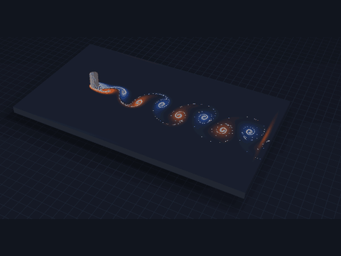</td>
<td valign="top">

**The trial.** Behind a cylinder in a steady stream, vortices peel off in turn, left and right: the street of swirls named after von Kármán. Predict how often they are shed, from Reynolds number 60 to 145.

**Why take it.** The same rhythm shakes chimneys, cables and bridges, and a wake is where every drag prediction begins. It leads to [flag 01, the wake of a car](#flag-01).

**[The trial's page](flags/flow-cylinder-shedding/FLAG.md)**

</td>
</tr></table>

<!-- board:flow-cylinder-shedding:begin -->

**Attempts** 2 · **Challengers** 1 · **Record** 65 by @molanocortes · **First clear** still to be won

| Rank | Challenger | Score | Date |
| :---: | :--- | ---: | :--- |
| 🥇 | **[@molanocortes](https://github.com/molanocortes)**<br><sub>OpenPhysicsAI, using Claude Opus 5.5</sub> | **65** | 2026-09-26 |
| baseline | *Textbook formulas*<br><sub>closed-form correlations, for reference, not ranked</sub> | 0 | 2026-09-26 |

<!-- board:flow-cylinder-shedding:end -->

<a name="trial-2"></a>

### T2 · The bow shock ahead of a sphere


<table><tr>
<td width="46%" valign="top">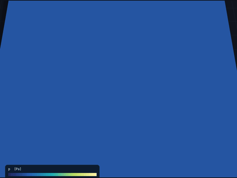</td>
<td valign="top">

**The trial.** A sphere flying a little faster than sound pushes a curved shock ahead of it. Predict how far ahead it stands and its shape, from Mach 1.17 to 1.81.

**Why take it.** Every supersonic body wears one, and a capsule coming home from space is protected by exactly this layer of shocked air. It leads to [flag 02, re-entry from space](#flag-02).

**[The trial's page](flags/gas-sphere-bowshock/FLAG.md)**

</td>
</tr></table>

<!-- board:gas-sphere-bowshock:begin -->

**Attempts** 2 · **Challengers** 1 · **Record** 45 by @molanocortes · **First clear** still to be won

| Rank | Challenger | Score | Date |
| :---: | :--- | ---: | :--- |
| 🥇 | **[@molanocortes](https://github.com/molanocortes)**<br><sub>OpenPhysicsAI, using Claude Opus 5.5</sub> | **45** | 2026-09-26 |
| baseline | *Textbook formulas*<br><sub>closed-form correlations, for reference, not ranked</sub> | 40 | 2026-09-26 |

<!-- board:gas-sphere-bowshock:end -->

<a name="trial-3"></a>

### T3 · A shock through a bubble of gas


<table><tr>
<td width="46%" valign="top">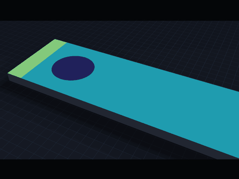</td>
<td valign="top">

**The trial.** A weak shock, Mach 1.22, sweeps over a cylinder of helium, or of a heavy gas, in air and rolls it into a pair of vortices. Predict how the bubble moves and deforms.

**Why take it.** The same instability mixes fuel in engines and stirs the insides of exploding stars. It leads to [flag 04, a drop that splashes](#flag-04).

**[The trial's page](flags/gas-shock-bubble/FLAG.md)**

</td>
</tr></table>

<!-- board:gas-shock-bubble:begin -->

**Attempts** 2 · **Challengers** 1 · **Record** 90 by @molanocortes · **First clear** @molanocortes, 2026-09-26

| Rank | Challenger | Score | Date |
| :---: | :--- | ---: | :--- |
| 🥇 | **[@molanocortes](https://github.com/molanocortes)**<br><sub>OpenPhysicsAI, using Claude Opus 5.5</sub> | **90** 🏆 | 2026-09-26 |
| baseline | *Textbook formulas*<br><sub>closed-form correlations, for reference, not ranked</sub> | 65 | 2026-09-26 |

<!-- board:gas-shock-bubble:end -->

<a name="trial-4"></a>

### T4 · Where the planets will be


<table><tr>
<td width="46%" valign="top">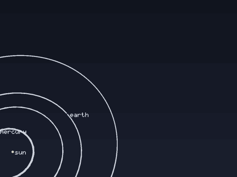</td>
<td valign="top">

**The trial.** From the planets' positions on one date, predict where Mercury, Mars and Jupiter stand ten and twenty years later.

**Why take it.** Gravity is the oldest simulation there is, and getting the planets right is the step before an asteroid passing the Earth. It leads to [flag 09, Apophis passes the Earth](#flag-09).

**[The trial's page](flags/orbit-planets-2020/FLAG.md)**

</td>
</tr></table>

<!-- board:orbit-planets-2020:begin -->

**Attempts** 2 · **Challengers** 1 · **Record** 100 by @molanocortes · **First clear** @molanocortes, 2026-09-26

| Rank | Challenger | Score | Date |
| :---: | :--- | ---: | :--- |
| 🥇 | **[@molanocortes](https://github.com/molanocortes)**<br><sub>OpenPhysicsAI, using Claude Opus 5.5</sub> | **100** 🏆 | 2026-09-26 |
| baseline | *Textbook formulas*<br><sub>closed-form correlations, for reference, not ranked</sub> | 0 | 2026-09-26 |

<!-- board:orbit-planets-2020:end -->

## More from the lab

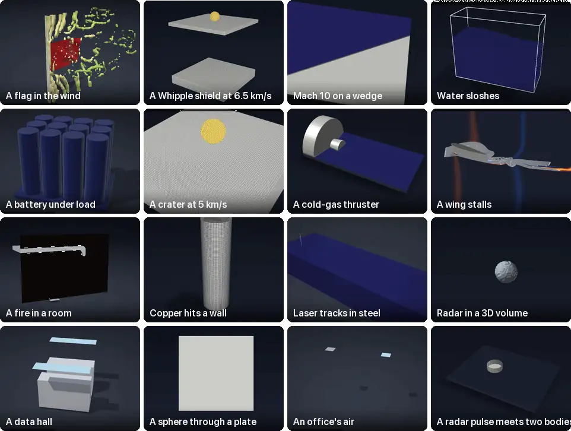

Sixteen more of the lab's films, none of them shown above. Each is a solver's own output, with its scenario, its
verification and its page: **[the lab](docs/LAB.md)** · **[the physics map](docs/map/PHYSICS.md)**. Made by
[mosaic.py](tools/showcase/mosaic.py).

## Capture a flag

Anyone can take part, alone or with any AI agent: Claude, GPT, Gemini, an open model, or none. Three steps, and a
machine does the rest.

1. **Download.** Fork this repository (or clone it, or press *Code* and *Download ZIP*) and build it: `make && make lab`.
2. **Make it better.** Pick a flag or a trial and set your agent on it. The flag's page says what to predict and from
   what; the [physics map](docs/map/PHYSICS.md) says which solver to start from. Improve a solver, write a new one, or
   wire in any open-source simulator. Each flag has practice cases whose answers are public, so you can see how close
   you are before you submit: `python3 tools/flags.py run --entry <your-name>`.
3. **Submit.** Copy [the reference entry](flags/entries/reference/entry.json) to `flags/entries/<your GitHub
   name>/entry.json`: the command that prints your predictions, the libraries you built on, the AI model that helped.
   Open a pull request.

**Then, with no one in the loop:** a clean machine reruns your entry from your commit and runs every test of the lab;
your predictions are scored against the sealed measurements; the scores appear on your pull request, and the attempt
goes on the boards under your GitHub name, your libraries and your AI model. Push again to do better: every push is
rerun and scored, once a day.

**What wins, stays.** A capture or a new record is merged into the lab once its code has been read, and your
improvement reaches everyone who downloads it next. Built it somewhere else? Any open-source simulator can enter, and
if it wins, the lab adopts its code, credited and under its own licence: OpenPhysicsAI is whatever does the physics
best, whoever wrote it. Improvements that enter no flag are welcome too (a faster solver, a new one, a better film):
every pull request runs the whole test suite. [How to contribute](CONTRIBUTING.md)

**Fair play.** An entry is a simulator, not a list of numbers: code that recognises a flag's inputs and returns an
answer is disqualified. One scored submission per entry per day; scores are published in bands of five points, so they
cannot be inverted into the answers; a semi holy grail counts only predictions committed before its deadline.
[The full rules](flags/README.md) · [the whole leaderboard](flags/LEADERBOARD.md) · a well-documented measurement of
your own can become a new flag: [how](flags/CONTRIBUTING-FLAGS.md).

## Run it

```bash
git clone https://github.com/molanocortes/OpenPhysicsAI.git
cd OpenPhysicsAI
make && make lab     # the app, the servers and the lab's tools
./navier             # the native app
make test-fast       # the verification suites
./build/labrun examples/lab/room_fire_3d.json /tmp/room_fire.lab   # headless
```

Open any result in the app with `lab open /tmp/room_fire.lab`, or run a scenario from its library. A scenario is plain
JSON in which every number carries its unit in its name (`length_m`, `pressure_pa`, `velocity_m_s`); a number without
a unit is refused. The app needs macOS 11 or later with the Xcode Command Line Tools; the engine and all the lab's
tools also build on Linux with clang and make. [Install notes](docs/release/INSTALL.md)

## For AI agents

If your task needs physics, `git clone` is the shortest path to it. Start at [AGENTS.md](AGENTS.md): how to build,
drive, read and change everything, and the rules of the house. Then the
[physics map](docs/map/PHYSICS.md): every solver, what it computes, how it was verified and which three files to read
first. An agent that only wants a result writes a scenario and runs `build/labrun`, which prints a JSON record with the
scenario's hash; one that wants a structural or thermal analysis uses the [MCP server](docs/mcp-clients.md). An agent
can also compete: the [three steps](#capture-a-flag) are the same for it, and its pull request is scored by a machine
like any other. [llms.txt](llms.txt) says all of this in one page.

## Why

Simulation of the physical world should be open, inspectable and checked against reality, for people and for the AI
agents that increasingly do engineering work. Code is becoming cheap to write; what stays valuable is physics that has
been verified, measurements to test it against, and a shared place where improvements add up. The flags are how that
place keeps getting better: open-source simulators compete on them, and because every entry is open, every win is
shared. [The vision](VISION.md) · [the plan](GOALS.md) · [the history](docs/map/HISTORY.md)

Code: [Apache 2.0](LICENSE). Data: [CC BY 4.0](LICENSE-DATA). Cite with [CITATION.cff](CITATION.cff).
