# The lab: what OpenPhysicsAI simulates today

Up: [the front page and the flags](../README.md) · [AGENTS.md](../AGENTS.md) · [the physics map](map/PHYSICS.md) ·
[the lab's documentation](lab/README.md) · [the plan](../GOALS.md)

Every simulation here lives in the same room and wears the same palette: one colour map for magnitudes, one for signed
quantities that glow out of the dark on both sides of zero, and solids that start as metal and colour where something
concentrates in them. Each picture is a frame of a solver's own output, nothing retouched, and each links the scenario
that made it, so anyone can run it again (`build/labrun examples/lab/NAME.json out.lab`, then `lab open out.lab` in the
app). The lab computes in three dimensions first; the older two-dimensional results are kept further down as sections
and references.

## In three dimensions

### Air, fire and rooms

<table><tr>
<td width="50%" valign="top">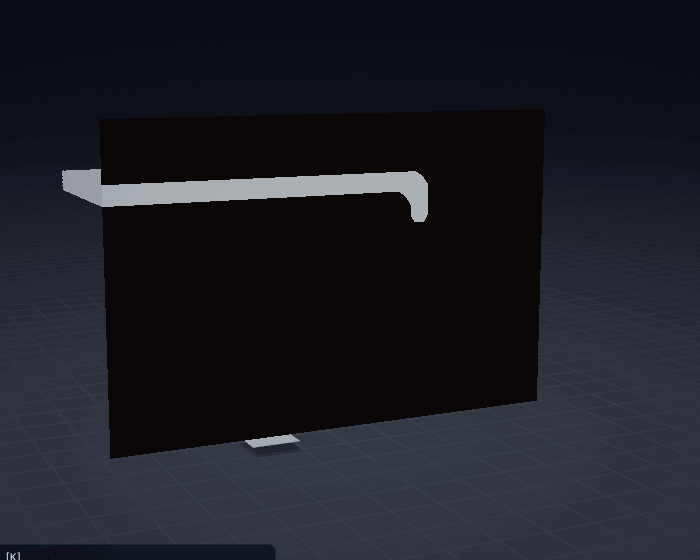<br><sub><b>A fire in a room.</b> A 250 kW methane fire in a room with one doorway: the plume strikes the ceiling, the hot layer deepens, smoke pours out of the top of the door and fresh air comes in below, leaning the flame. Low-Mach reacting flow in 3D. <a href="../examples/lab/room_fire_3d.json">Scenario</a> · <a href="lab/rooms.md">rooms</a></sub></td>
<td width="50%" valign="top"><br><sub><b>A methane fire and its plume.</b> 100 kW on a burner 0.3 m across in still air, the way fire-safety engineers compute it (after NIST's FDS), set against Heskestad's flame height and McCaffrey's plume. <a href="../examples/lab/methane_fire.json">Scenario</a> · <a href="lab/fire.md">fire</a></sub></td>
</tr><tr>
<td valign="top">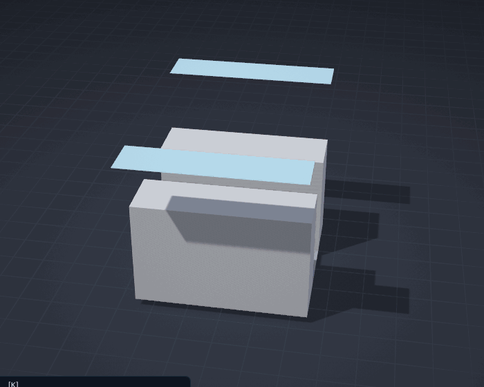<br><sub><b>A data hall.</b> Cold air rises through the tiles, the racks draw it through and blow it out hot; they draw a fifth more than the tiles supply, so hot air curls back over the rows. Demonstration loads. <a href="../examples/lab/data_centre_3d.json">Scenario</a> · <a href="lab/rooms.md">rooms</a></sub></td>
<td valign="top">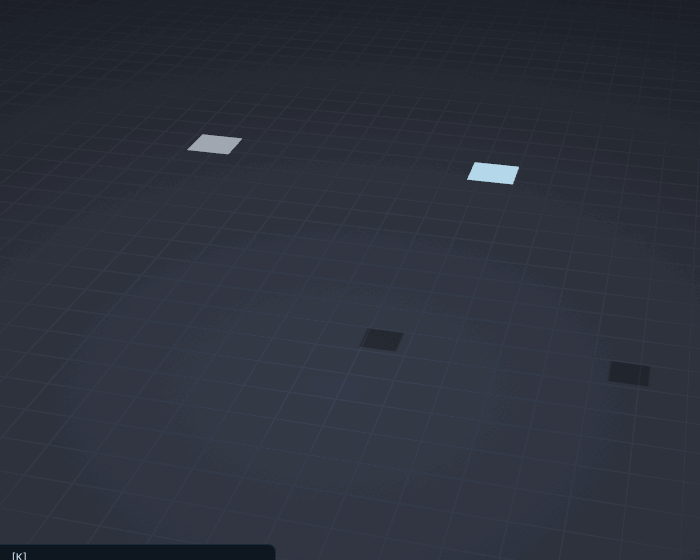<br><sub><b>An office cooled by a ceiling diffuser.</b> Air at 17 C falls and spreads over the floor; the plumes of two people and two computers rise through it. Demonstration loads. <a href="../examples/lab/office_hvac_3d.json">Scenario</a> · <a href="lab/rooms.md">rooms</a></sub></td>
</tr></table>

### Flow past bodies, and bodies that move with the flow

<table><tr>
<td width="50%" valign="top"><br><sub><b>A capsule at hypersonic speed.</b> The Apollo-shaped capsule at the angle of attack it trims at, its shock layer and wake in 3D. Inviscid, a perfect gas: the heat of re-entry is not modelled. <a href="../examples/lab/capsule_3d.json">Scenario</a> · <a href="lab/gas.md">gas</a></sub></td>
<td width="50%" valign="top"><br><sub><b>A cylinder standing in a stream.</b> A chimney or a bridge pier at Reynolds number 1000: the horseshoe vortex at its foot, the tip vortices and the wake, on the GPU. <a href="../examples/lab/cylinder_mounted_3d.json">Scenario</a> · <a href="lab/flow.md">flow</a></sub></td>
</tr><tr>
<td valign="top">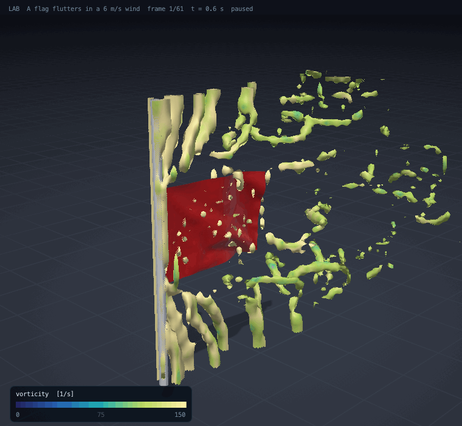<br><sub><b>A flag in the wind.</b> Cloth 0.6 m by 0.4 m in a wind of 6 m/s, the air and the cloth solved together: it flutters at 6.2 Hz, a Strouhal number of 0.27. <a href="../examples/lab/flag_3d.json">Scenario</a> · <a href="lab/fsi.md">fluid and structure</a></sub></td>
<td valign="top">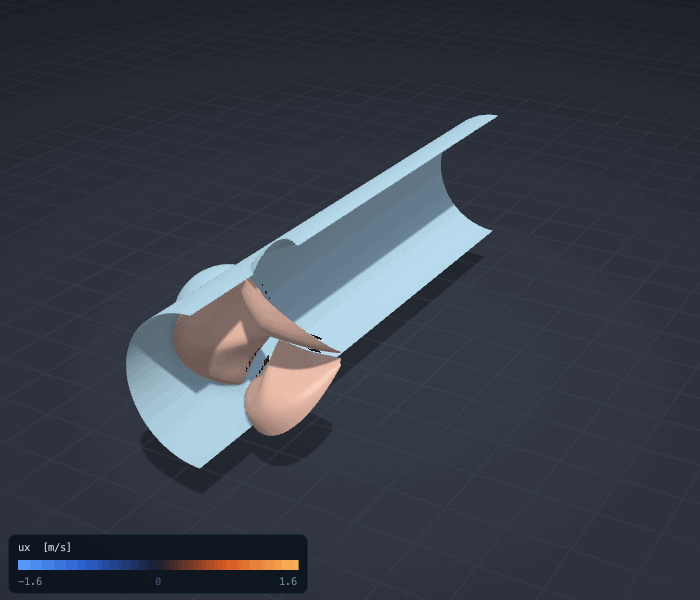<br><sub><b>A heart valve.</b> Three leaflets in an aortic root open, jet and close through a heartbeat, sealing by contact; in a straight tube they never closed, with the sinuses they do. <a href="../examples/lab/heart_valve.json">Scenario</a> · <a href="lab/fsi.md">fluid and structure</a></sub></td>
</tr></table>

### Water with a free surface

<table><tr>
<td width="50%" valign="top"><br><sub><b>A wave breaks around a pier.</b> A solitary wave runs up a beach, steepens and breaks around a pier, SPH on the GPU. <a href="../examples/lab/breaking_wave.json">Scenario</a> · <a href="lab/water.md">water</a></sub></td>
<td width="50%" valign="top">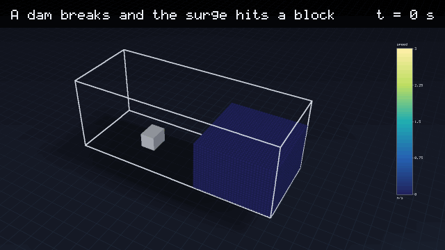<br><sub><b>A dam breaks.</b> A column of water 0.4 m high collapses and its surge runs over a block. Still water holds its hydrostatic pressure to 1.65 %, a sloshing tank swings at the period linear theory gives to 0.21 %; the geometry is a demonstration. <a href="../examples/lab/dam_break.json">Scenario</a> · <a href="lab/water.md">water</a></sub></td>
</tr></table>

### Solids that stretch, shatter and flow

<table><tr>
<td width="50%" valign="top">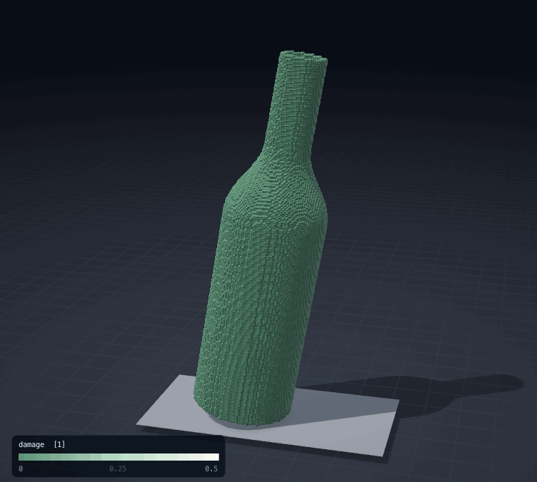<br><sub><b>A glass bottle shatters.</b> Dropped 1.3 m onto concrete: cracks start where the glass is stretched past what it can bear, run and branch. Peridynamics. <a href="../examples/lab/glass_bottle.json">Scenario</a> · <a href="lab/fracture.md">fracture</a></sub></td>
<td width="50%" valign="top">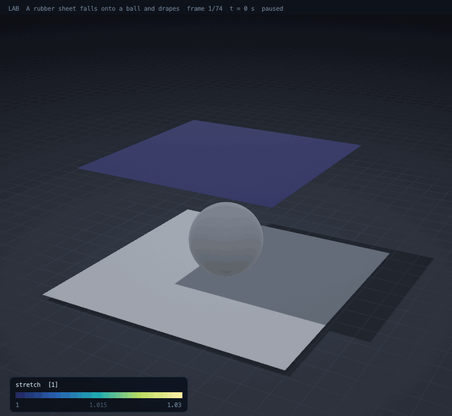<br><sub><b>Rubber drapes over a ball.</b> A sheet 0.5 mm thick falls 20 cm onto a ball, stretches over its crown and pleats into folds nothing placed. <a href="../examples/lab/rubber_sheet.json">Scenario</a> · <a href="lab/sheet.md">sheets</a></sub></td>
</tr><tr>
<td valign="top">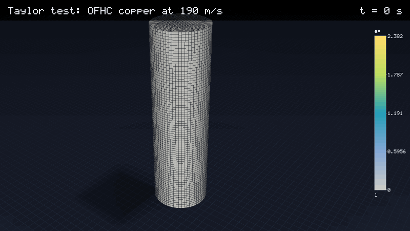<br><sub><b>The Taylor anvil test.</b> A copper cylinder 25.4 mm long strikes an anvil at 190 m/s and its foot spreads to 1.9 times its diameter. Johnson-Cook plasticity, a shock equation of state. <a href="../examples/lab/taylor_copper.json">Scenario</a> · <a href="lab/impact.md">impact</a></sub></td>
<td valign="top">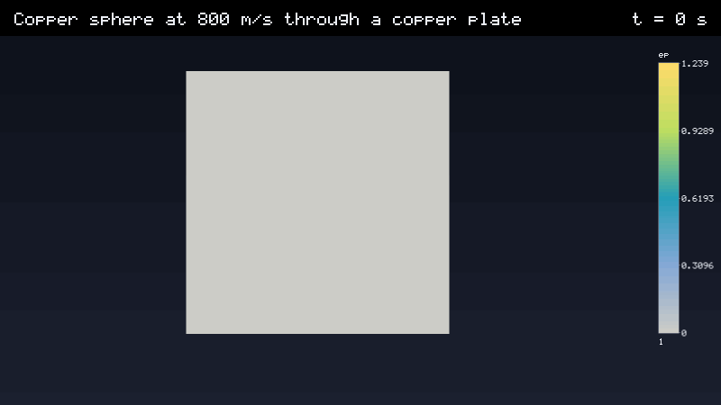<br><sub><b>A sphere through a plate.</b> A copper sphere at 800 m/s through a 4 mm copper plate, seen from below. The erosion limit is assumed for this demonstration. <a href="../examples/lab/sphere_plate.json">Scenario</a> · <a href="lab/impact.md">impact</a></sub></td>
</tr><tr>
<td valign="top">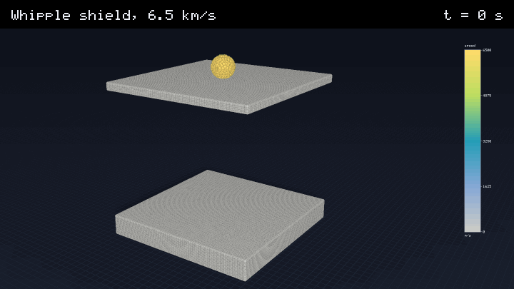<br><sub><b>A spacecraft shield.</b> A 3.2 mm aluminium sphere at 6.5 km/s breaks up on a 1 mm bumper, so the wall behind is hit by a spray, as Fred Whipple proposed in 1947. Demonstration geometry. <a href="../examples/lab/whipple_shield.json">Scenario</a></sub></td>
<td valign="top">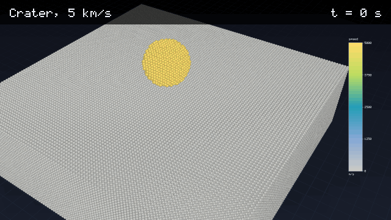<br><sub><b>A laboratory crater.</b> The same sphere at 5 km/s into a thick block: a bowl opens, a crown of jets rises, energy conserved to 1e-5. Demonstration geometry. <a href="../examples/lab/crater_aluminium.json">Scenario</a></sub></td>
</tr></table>

### Heat, melting and energy

<table><tr>
<td width="50%" valign="top"><br><sub><b>Marangoni flow in a melt pool.</b> The surface of the molten steel is pulled outward at metres per second and the pool grows wider and shallower than conduction alone makes it. <a href="../examples/lab/melt_pool_flow.json">Scenario</a> · <a href="lab/melt.md">melting</a></sub></td>
<td width="50%" valign="top">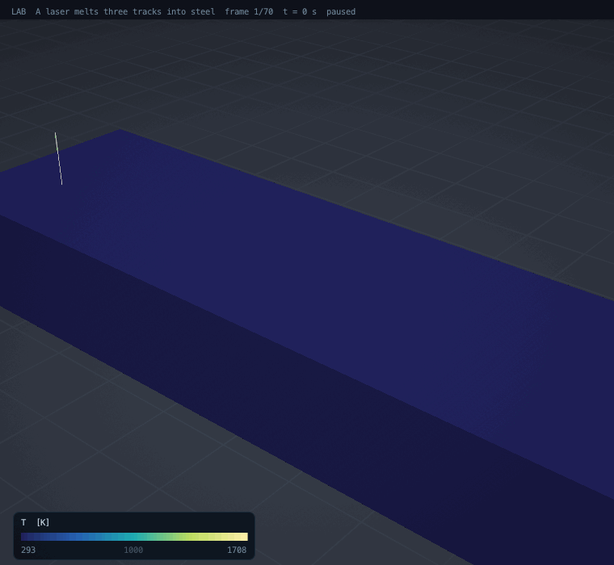<br><sub><b>Three laser tracks.</b> 200 W at 0.8 m/s melts three tracks into 316L, each remelting the edge of the one before, as in laser powder bed fusion without the powder. <a href="../examples/lab/laser_tracks.json">Scenario</a> · <a href="lab/melt.md">melting</a></sub></td>
</tr><tr>
<td valign="top">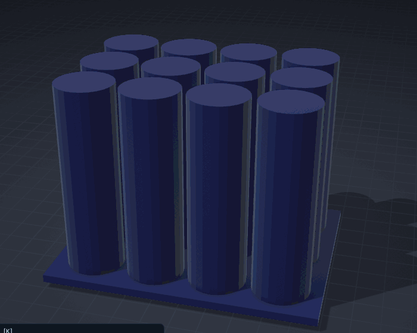<br><sub><b>A battery module under load.</b> Twelve LG M50 cells in parallel on a cooled plate at 2C, each its own Doyle-Fuller-Newman model; the cell with a poor weld ends hottest. <a href="../examples/lab/battery_module.json">Scenario</a> · <a href="lab/battery.md">batteries</a></sub></td>
<td valign="top">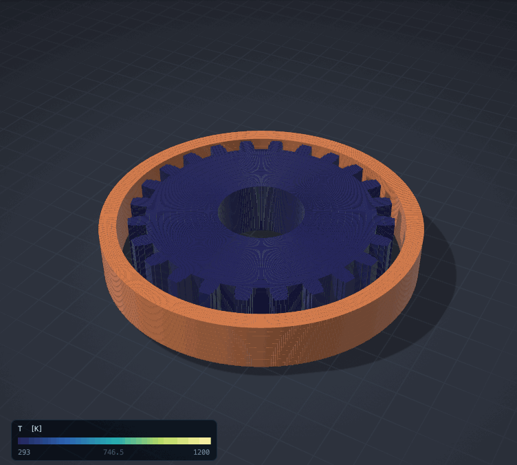<br><sub><b>Induction hardening.</b> Eddy currents at 30 kHz crowd into a gear's surface and heat its teeth first; finite elements on MFEM. <a href="../examples/lab/induction_gear.json">Scenario</a> · <a href="lab/magnet.md">magnets</a></sub></td>
</tr></table>

### Fields and waves

<table><tr>
<td width="50%" valign="top">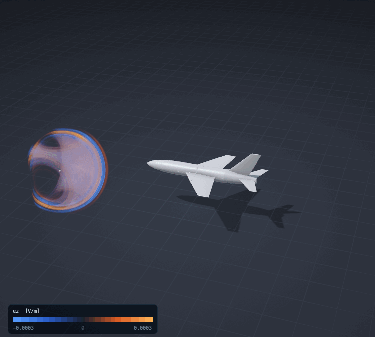<br><sub><b>Radar meets an aircraft.</b> A pulse at 300 MHz sweeps over an aircraft 15 m long, Maxwell's equations on a 3D grid. <a href="../examples/lab/radar_aircraft.json">Scenario</a> · <a href="lab/em.md">electromagnetism</a></sub></td>
<td width="50%" valign="top">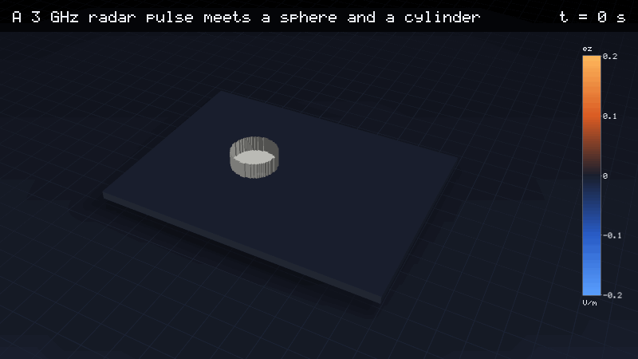<br><sub><b>A radar pulse, a sphere and a lens.</b> A 3 GHz pulse is shadowed by a metal sphere and bent by a plastic-like cylinder; 1.8 million Yee cells with absorbing boundaries. <a href="../examples/lab/radar_pulse.json">Scenario</a> · <a href="lab/em.md">electromagnetism</a></sub></td>
</tr><tr>
<td valign="top">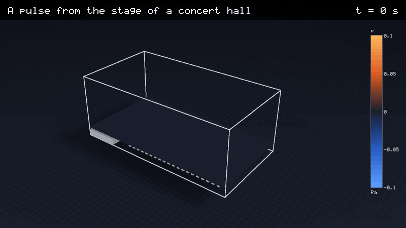<br><sub><b>Sound in a concert hall.</b> A pulse from the stage of a 30 m hall spreads over 480 seats; the wave equation on 5.9 million nodes, typical absorption per material class. <a href="../examples/lab/shoebox_hall.json">Scenario</a> · <a href="lab/acoustic.md">acoustics</a></sub></td>
<td valign="top">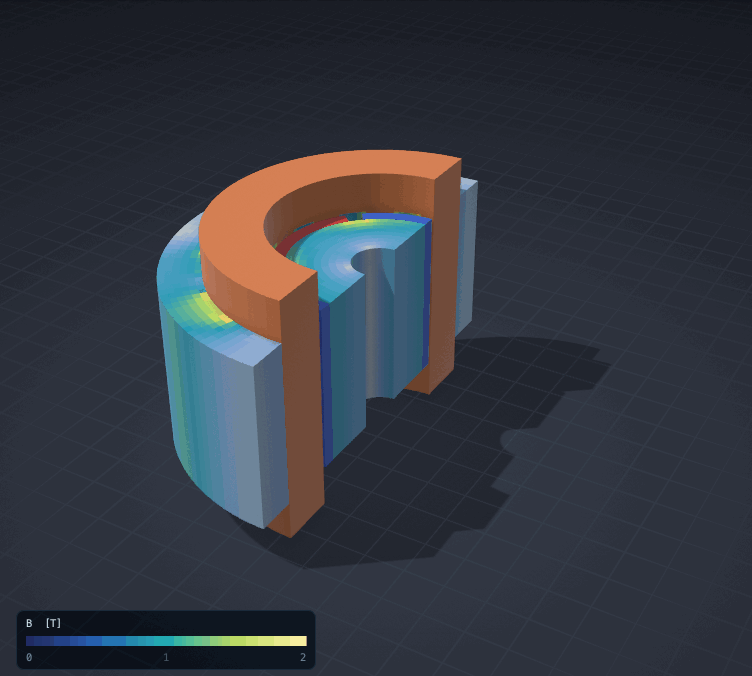<br><sub><b>An electric motor in 3D.</b> Its field by edge finite elements on MFEM, 282 672 unknowns per rotor position, the torque from the air gap, the rotor spinning up. <a href="../examples/lab/pm_motor_3d_drive.json">Scenario</a> · <a href="lab/magnet.md#the-motor-in-3d-mfem">magnets</a></sub></td>
</tr></table>

### Space and spacetime

<table><tr>
<td width="50%" valign="top">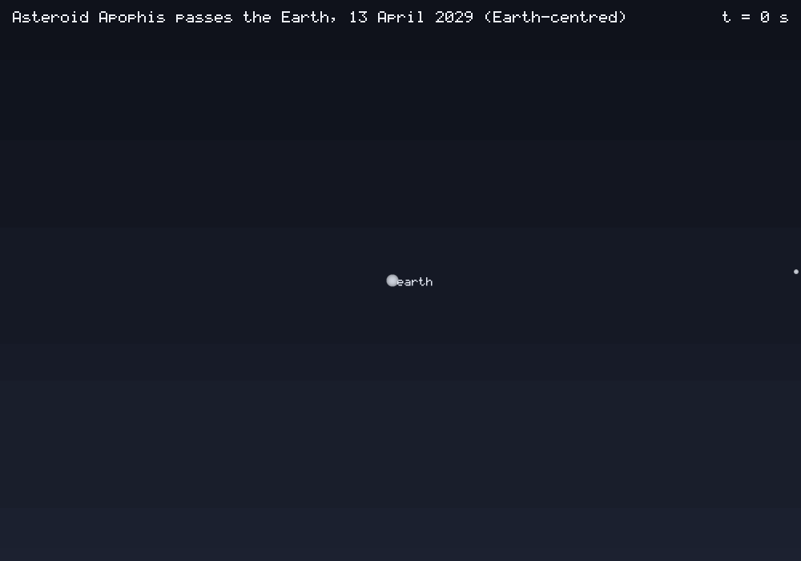<br><sub><b>Apophis passes the Earth.</b> From JPL's positions for 1 March 2029, the lab puts the closest approach of 13 April 2029 at 38 011.4 km from the Earth's centre; JPL's own orbit solution says 38 011.5 km. Agreement with another model, not a measurement. <a href="../examples/lab/apophis_flyby.json">Scenario</a> · <a href="lab/orbit.md">orbits</a></sub></td>
<td width="50%" valign="top">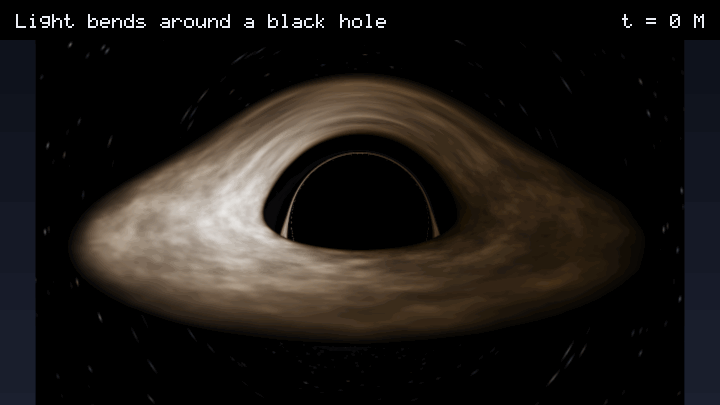<br><sub><b>Light near a black hole.</b> Every pixel a ray traced backward through the curved spacetime of a non-rotating hole; the photon sphere to 2e-13, an orbiting emitter's redshift to 1.5e-11. <a href="../examples/lab/black_hole.json">Scenario</a> · <a href="lab/relativity.md">relativity</a></sub></td>
</tr></table>

## Sections and two-dimensional references

Computed in a plane or on an axisymmetric section. The owner's rule is three dimensions first (a two-dimensional flow
extruded into 3D is not 3D physics), so these stay as sections and references while their three-dimensional versions
are built; the trials among the flags are being rebuilt the same way.

<table><tr>
<td width="50%" valign="top">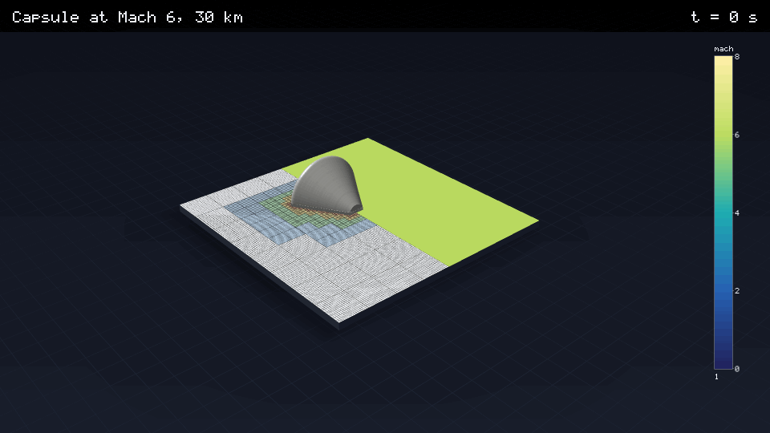<br><sub><b>A capsule at Mach 6, axisymmetric.</b> The Mach number on one half, on the other the mesh the solver chose for itself: finest along the bow shock, the body and the wake. <a href="../examples/lab/capsule_mach6.json">Scenario</a> · <a href="lab/gas.md">gas</a></sub></td>
<td width="50%" valign="top">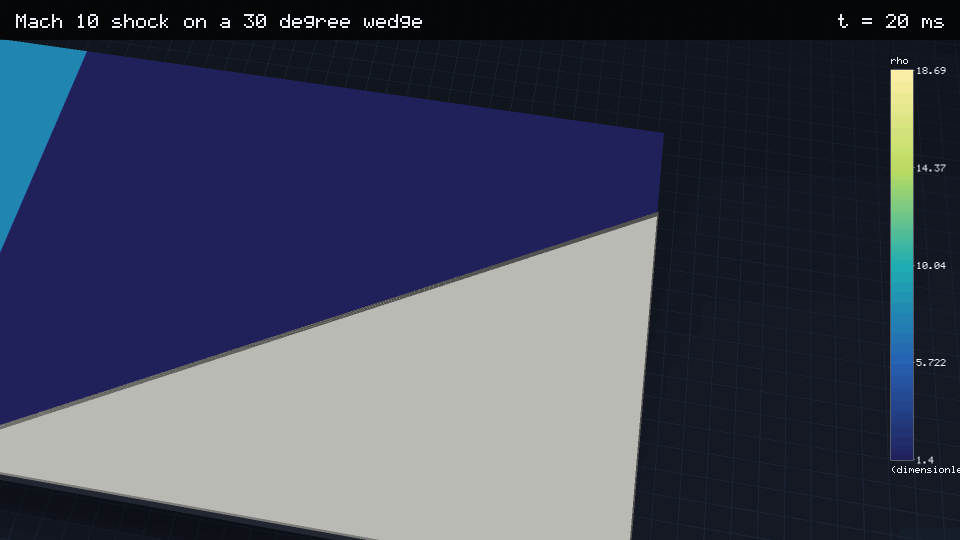<br><sub><b>Double Mach reflection.</b> A Mach 10 shock on a 30 degree wedge, Woodward and Colella's benchmark in its dimensionless units. <a href="../examples/lab/double_mach_reflection.json">Scenario</a></sub></td>
</tr><tr>
<td valign="top">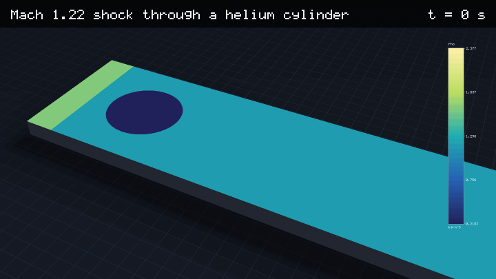<br><sub><b>A shock through helium.</b> The experiment of Haas and Sturtevant (1987): the light gas is squeezed into a kidney with two vortices. <a href="../examples/lab/shock_helium_cylinder.json">Scenario</a></sub></td>
<td valign="top">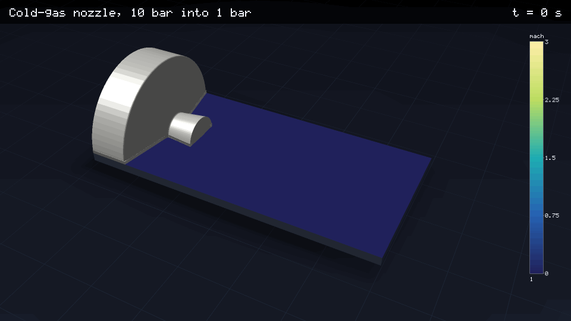<br><sub><b>A nozzle at 10 bar.</b> Shock diamonds in the jet and the vortex rings of its start. <a href="../examples/lab/thruster_nozzle.json">Scenario</a></sub></td>
</tr><tr>
<td valign="top">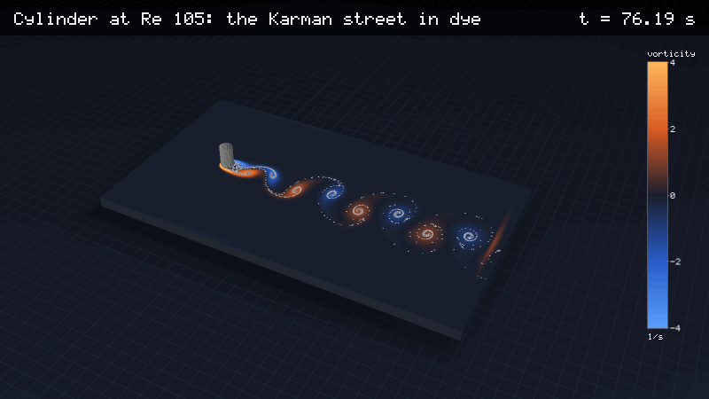<br><sub><b>Against the photographs.</b> A cylinder at Reynolds number 105 sheds a Karman street as in Taneda's photograph in Van Dyke's album; the lattice measures St = 0.175 (Roshko's fit, 0.169; the tunnel's walls account for most of the difference). <a href="../examples/lab/cylinder_re105.json">Scenario</a> · <a href="lab/flow.md">flow</a></sub></td>
<td valign="top">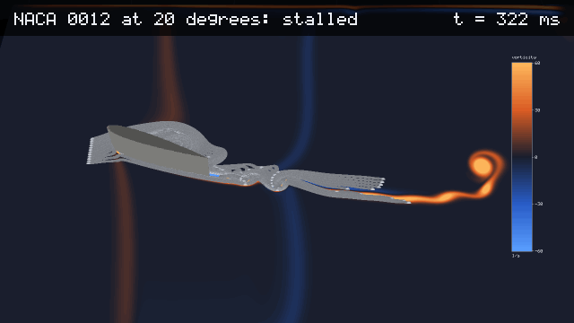<br><sub><b>A wing stalls.</b> A NACA 0012 at a chord Reynolds number of 5300: at 10 degrees the smoke follows the surface, at 20 it separates over the whole wing. <a href="../examples/lab/naca0012_re5300_aoa20.json">Scenario</a> · <a href="lab/flow.md">flow</a></sub></td>
</tr><tr>
<td valign="top">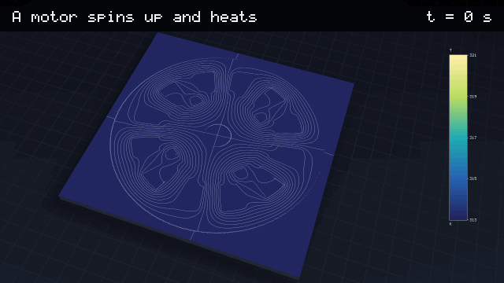<br><sub><b>A motor spins up and heats.</b> Its field gives the torque at every angle; the rotor settles at 3211 rpm (the mean torque against the fan gives 3213), then over 90 minutes the windings heat. <a href="../examples/lab/pm_motor_drive.json">Scenario</a> · <a href="lab/magnet.md">magnets</a></sub></td>
<td valign="top">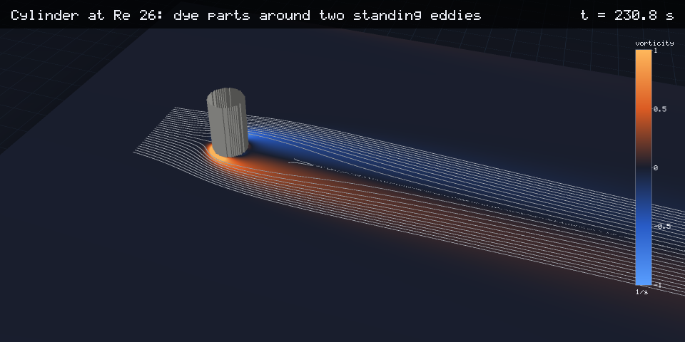<br><sub><b>Two standing eddies.</b> At Reynolds number 26 the wake is a pair of eddies 1.35 diameters long that the dye streaks part around. <a href="../examples/lab/cylinder_re26.json">Scenario</a></sub></td>
</tr></table>

## Metal printing, structures and the tunnel

Metal printing by laser powder bed fusion: the build model's distortion of printed cantilevers was compared with
laboratory measurements at 1.84 % mean error over six held-out conditions. Those measurements are not part of the
public repository, so the number cannot be rechecked from it.
[How the build is modelled](contracts/lpbf-build.md)

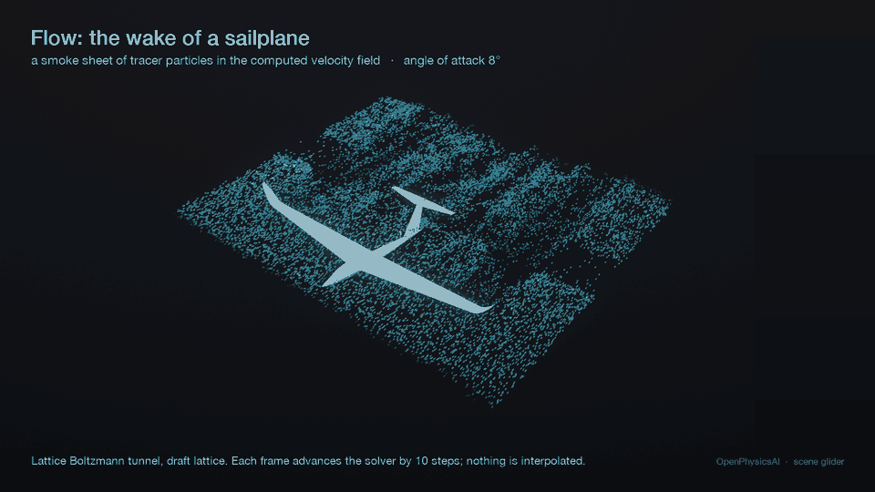 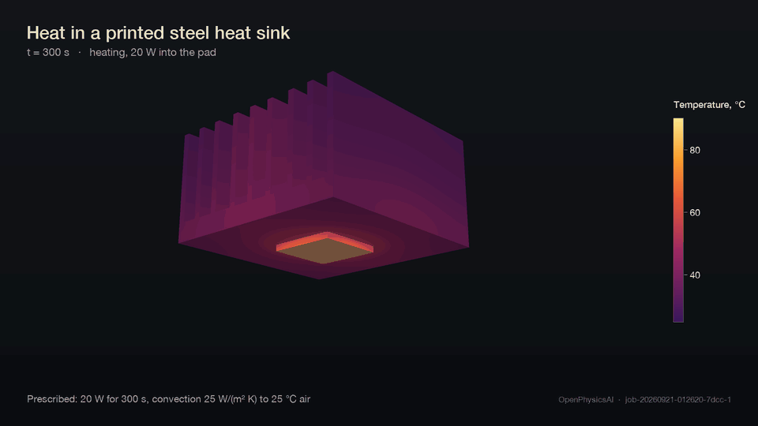

A smoke sheet over a sailplane in the real-time lattice Boltzmann tunnel ([reproduce](../tools/showcase/flow_film.py)); a
printed steel heat sink, 20 W for 300 s, then cooling ([reproduce](../tools/showcase/heat_sink.py)). The structural
solver, the polymer print process and topology optimisation: [the gallery](images/GALLERY.md).

## Is it right?

Four kinds of claim, and they are not interchangeable: a **demonstration** shows what the software computes;
**verification** compares it with an exact solution; a **comparison** sets it against another program; only a
**measurement** tests it against the physical world. Every criterion below was written before its first run. Where a
criterion was wrong it was amended openly with the original result kept; where a test found a defect, the defect and
the fix are written down in the solver's page and the test's header.

| Physics | Checked against | Result | Record |
|---|---|---|---|
| Shock waves | the exact shock tube; oblique shock theory on a ramp; the Taylor-Maccoll cone | L1 density error 0.0012 at 512 cells; shock angles within 0.02 degrees; cone pressure -0.07 % | [gastest](../tools/gastest.c) |
| Flow past a cylinder | the Schaefer-Turek benchmark (1996) | drag +2.0 %, Strouhal number +0.2 % | [flowtest](../tools/flowtest.c) |
| Flow in rooms and ducts | a square duct (Shah and London); the differentially heated cube (Tric et al. 2000); the first law; a ventilated room's energy; the exhaust's mean age of air (Sandberg) | centreline speed -0.60 %, f Re -0.17 %; Nu +1.24 % (Ra 1e4), +1.14 % (Ra 1e5); -0.41 %; -0.84 %; the age of the air -0.29 % | [roomtest](../tools/roomtest.c) |
| Fire | the projection, mass and heat; Heskestad's flame height; McCaffrey's plume | 1e-10, 6e-13, +0.22 %; -16.4 %; the plume: open, since reruns after the rooms engine (2026-09-27) scatter from -18 % to -40 % 2.0 m up where earlier runs gave +15 % to +37 %, more than their error bars allow ([the record](lab/fire.md#open-the-plume-after-the-rooms-engine-2026-09-27)) | [firetest](../tools/firetest.c) |
| Poisson's equation | manufactured solutions, a sevenfold coefficient jump | second order (error ratio 3.99), 8 to 10 iterations to 1e-10 | [poissontest](../tools/poissontest.c) |
| Batteries | Crank's diffusion in a sphere; conservation of lithium and charge; the heat identity; the cell's nominal capacity | second order; 3e-14; 5e-14; 1e-14; +1.5 % | [battest](../tools/battest.c) |
| Melting | Rosenthal's moving source; Neumann's solidification; the thermocapillary return flow | +0.86 %; -0.001 %; 0.19 % of the surface speed | [melttest](../tools/melttest.c) |
| Thin sheets | a clamped circular plate (Kirchhoff) | -0.95 % | [sheettest](../tools/sheettest.c) |
| Fluid and structure | a sphere in a periodic array (Hasimoto); momentum | -3.79 %; 0.002 % | [fsitest](../tools/fsitest.c) |
| Free-surface water | hydrostatic pressure; the first sloshing mode | 1.65 %; 0.21 %; the GPU's stillness case W1 is a recorded failure | [wtest](../tools/wtest.c) |
| Sound | the modes of a rectangular room; reflection from an impedance wall; reverberation time | 0.01 %; 0.001 in the reflection coefficient; 8.7 % from Eyring | [actest](../tools/actest.c) |
| Impact | the shock Hugoniot of copper; the Taylor test's energy; contact | pressure +0.04 %; energy 0.00 %; momentum to 4e-15 | [imptest](../tools/imptest.c) · [sphtest](../tools/sphtest.c) |
| Orbits | Kepler's closed form; Mercury's relativistic perihelion; 10 000 years of Jupiter and Saturn | 5.6e-10; 42.98 arcseconds a century; energy to 7e-14 | [orbtest](../tools/orbtest.c) |
| Light near a black hole | the photon sphere; an orbiting emitter's redshift | 2e-13; 1.5e-11 | [rttest](../tools/rttest.c) |
| Radar and light | a resonant cavity; Mie scattering by a dielectric sphere | -0.016 %; -0.9 % | [emtest](../tools/emtest.c) |
| Structures | stress at a hole (Kirsch); large-deflection elastica; a published optimum | -1.33 %, +0.02 %, -0.02 % | [tettest](../tools/tettest.c) · [dyntest](../tools/dyntest.c) · [topotest](../tools/topotest.c) |
| Metal printing | **laboratory measurements**: distortion of AlSi10Mg cantilevers after cutting, six held-out conditions | **1.84 %** mean error | measurements not in the public repository |
| The flags | **measurements**, sealed | [the leaderboard](../flags/LEADERBOARD.md) | [how the flags work](../flags/README.md) |

What is not modelled is stated on each solver's page and in [LIMITATIONS.md](release/LIMITATIONS.md).

## Run and look

```bash
make lab
./build/labrun examples/lab/taylor_copper.json /tmp/taylor.lab       # any scenario: prints a JSON run record
./build/labfilm /tmp/taylor.lab --out /tmp/frames --field ep --cmap ember --mesh --light
./build/labprobe /tmp/taylor.lab --field p --stats                   # numbers out of a result
```

In the app, type `lab open /tmp/taylor.lab` (or `lab run examples/lab/taylor_copper.json`) in the panel's terminal:
dragging turns a 3D result, the wheel zooms, `lab play` plays it, `lab field NAME` changes the colour, `lab section y 0.5`
cuts it open, `lab help` lists the rest.

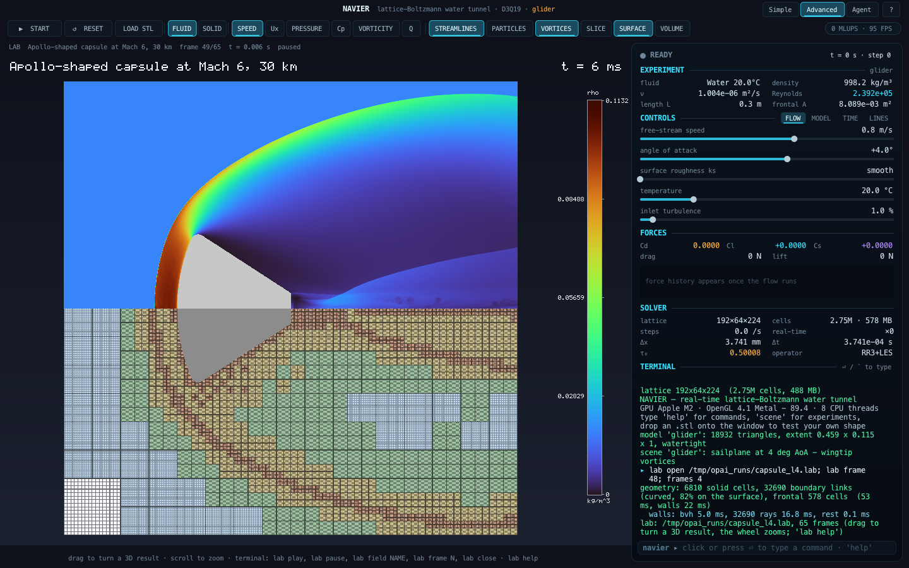
