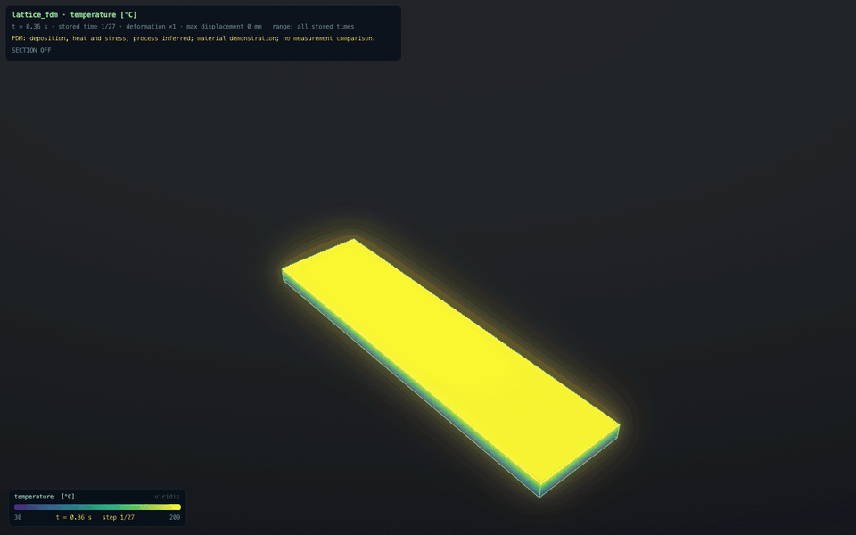

# Structural and thermal analysis

How NAVIER-AM turns an STL file into a verified analysis - linear-elastic statics, transient conduction, or the two
coupled - what every step assumes, and what the files in a run directory contain. Every step is an operation of the
control API (terminal `am`, control socket, MCP tool, or a button in the application's SOLID workspace).

## Workflow

To compare two to four designs of a part under equivalent mounting and load (mesh refinement, sensitivities and an
Engineering Evidence Record), use the comparison-study operations `study_check`, `study_run`, `study_evidence` and
`study_replay`, or `navier-ctl study ...`: see `docs/release/WORKFLOW.md`. The table below lists the detailed operations
those studies compose.

| Step | Operation | Produces |
|---|---|---|
| Import | `geometry_import` (units required), `geometry_place`, `geometry_diagnostics` | body in the build frame, repair and thickness report |
| Faces | `surfaces_list`, `view_render`, `view_pick` | face patches with area, normal, type; labelled images with cameras |
| Selections | `selection_create`, `selection_list`, `selection_preview`, `selection_delete` | named face sets with SHA-256 set hashes |
| Material | `materials_list`, `material_list`, `material_define`, `material_assign` | material records with status and provenance; `material_list` gives every record at a glance with what it lacks for a stress or a heat analysis |
| Mesh | `mesh_generate`, `mesh_inspect` | voxel hex8 mesh with approximation errors |
| Loads | `boundary_apply`, `boundary_list`, `boundary_remove` | supports and loads bound to selection hashes |
| Check | `setup_validate` | errors with hints, warnings, model summary, specification hash |
| Solve | `analysis_run` (`static_structural`, `transient_thermal`, `thermomechanical`), `job_status`, `job_cancel`, `job_list` | background job, run directory |
| Results | `results_query`, `results_probe`, `results_render`, `results_export` | statistics, point values, images, files |

Coordinates are in the build frame (right-handed, +z build direction, z = 0 on the plate top) in mm; stresses in MPa;
forces in N. Internally everything is SI and double precision.

## Mesh

`mesh_generate` samples all part and support bodies on a regular grid aligned with the build frame and keeps the
cells whose centres lie inside the closed STL surface. All elements are undistorted boxes (positive, constant
Jacobian), which also makes element layers line up with deposited layers. The price is a staircase boundary. The
response reports, per body, mesh and STL volume and area, the mean and largest distance from boundary faces to the
STL, face-connected regions, edge-only contacts, walls thinner than two elements (when `geometry_diagnostics` has
measured thickness) and how many mesh faces carry each selection. Omitting the element size rebuilds the stored
settings of a reopened project and reports whether the mesh hash is reproduced; with no stored settings an automatic
size is chosen and reported. Confirm results by halving the element size.

## Materials

Library entries (`src/ctl/materials.json`) are demonstration values: typical magnitudes that let workflows run,
not traceable to a grade, supplier or test, and not calibrated. Project materials (`material_define`) carry a status
(`user_supplied`, `calibrated`, `demonstration`) and a provenance text. Properties are SI values named by their key
(`youngs_modulus_pa`, `poisson_ratio`, `density_kg_m3`, ...), either constants or temperature tables in degC,
interpolated linearly and held constant outside the table. Values outside plausible ranges (for example a modulus
typed in GPa as Pa) are rejected. The static analysis evaluates properties at `reference_temperature` (default 20 degC).

## Boundary conditions

| Kind | Meaning on the mesh |
|---|---|
| `fixed` | all displacement components of the selection's mesh nodes are zero |
| `displacement` | the given components (mm) are prescribed; omitted or null components stay free |
| `frictionless_support` | the normal component is zero; only flat faces normal to x, y or z (within 1 degree) |
| `force` | total force; uniform traction force / mesh area, integrated consistently over the mesh faces |
| `pressure` | traction -p n with the normal of the STL triangle behind each mesh face, scaled by STL area / mesh area, so the resultant equals the STL surface resultant on planar faces |
| `traction` | traction vector scaled by STL area / mesh area (resultant = traction x STL area) |
| `gravity` | body force density x acceleration on every meshed element |

Constraints are eliminated from the system; no penalty springs or artificial stiffness are added. Two supports that
prescribe different values on shared faces are rejected (`CONFLICTING_BOUNDARY_CONDITIONS`); where their faces only
meet at an edge, the earlier condition is kept on the shared nodes and a warning is issued. Each condition stores the
hash of its selection: if the selection later resolves to other faces (geometry or placement changed, selection
redefined), validation reports `STALE_REFERENCE` instead of silently moving the load.

## Transient thermal and thermomechanical analyses

`analysis_run` with `analysis: "transient_thermal"` steps the conduction equation on the same mesh. `end_time` and
`time_step` are required; `theta` chooses backward Euler (1, the default) or Crank-Nicolson (0.5), `capacity` chooses
lumped or consistent, `initial_temperature` sets the starting field and `output_every` how often a time is stored.

Conditions (`boundary_apply`): `temperature` (prescribed), `heat_flux` (into the body, negative cools), `convection`
(`{coefficient, ambient}`, Newton cooling), `radiation` (`{emissivity, ambient}`, linearised by a Newton step about
the face-mean temperature, not by a fixed film coefficient), and `heat_source` (`power_density` over a whole body).
Material properties may be tables in temperature: k, cp and rho are re-evaluated by Picard iteration inside each
step, and latent heat is carried as an apparent capacity over the solidus-liquidus interval.

Each step is solved in correction form, so the linear-solver tolerance applies to the change over the step rather
than to the absolute temperature. The response reports the per-step energy balance - what went in through sources
and boundaries against what is stored - so a run can be checked without a reference solution.

`analysis: "thermomechanical"` additionally solves the structure at every stored time with the thermal strain
integrated from `stress_free_temperature` and the temperature-dependent modulus applied per element. The coupling is
sequential and one-way: the structure does not feed back into the temperature field, and without plasticity or
element activation this is **not** a residual-stress prediction - the thermal stresses vanish again when the part
returns to a uniform temperature.

Results are time-indexed: `results_query`, `results_probe` and `results_render` take a time (or a stored index),
`results_export` writes `results.nvt`, one VTU per stored time with a `.pvd` collection that carries the times, and
a CSV time series with the temperature range, the energies and, for a thermomechanical run, the mechanical peaks.

## In the application

Earlier interface review and design references are [`docs/app/REVIEW.md`](app/REVIEW.md) and
[`docs/app/DESIGN.md`](app/DESIGN.md). The current two-mode workflow is described below.

The top-right switch selects **Manual** or **Agentic** and remembers the choice. Manual provides a paged physics
library with scenario inputs, RUN and playback; FLUID and SOLID remain reachable from the same window. The SOLID
inspector keeps the six-step analysis workflow, with explicit METAL (LPBF) and PLASTIC (FDM/FFF) choices. FDM uses
PROCESS, RUN PRINT and PLAY PRINT instructions. Loading a printing result adopts its workflow, and a result only
offers the fields it contains. Manual collapses the terminal output until requested; typed commands remain available.

Agentic connects the user's external command-line agent to this window's engine through its private control socket.
It passes the question as `$NAVIER_PROMPT`, shows the agent's transcript and engine journal, and follows the jobs it
starts. Both modes operate on the same projects and results. Legacy Advanced/Agent command aliases remain accepted;
they do not add another physics engine. The retained library inputs and real keyboard playback/section paths are
checked by `python3 tools/uicheck.py --lab`.

CLEAN VIEW (`hud clean`, H to restore the interface) gives the result the full viewport while retaining its field,
units, stored time, range policy, deformation scale, maximum displacement, section setting and model/provenance notice. Printing
examples say when inputs are inferred, material values are demonstrations, yielding is absent or no measurement
comparison was made. A polished image must not imply a more complete model than the one that computed it.

Compute the open-cell example, wait for the actual jobs, and capture its native views and every FDM stored state:

```bash
make
python3 tools/demo_printing.py --capture --film
```

The script saves inputs, summaries, native results, `capture.nav`, views and raw PNG frames below
`build/demo-printing`. It does not resolve individual deposited roads or a metal melt pool. The saved
[evidence record](media/foundation/evidence.json) includes exact inputs, model scope, hashes and playback timing.



This replay uses 27 computed states and one temperature range. Playback is accelerated, with a one-second final
hold; lighting and the neutral studio are presentation aids. [The clean FDM view](media/foundation/fdm-clean.png)
and [the metal section](media/foundation/lpbf-section.png) use the same renderer and visual language.
[Before](media/foundation/ui-before.png) and [after](media/foundation/ui-after.png) show the interface on the same
synthetic two-element fixture. [The old LPBF cut](media/foundation/lpbf-cut-before.png) and
[corrected cut](media/foundation/lpbf-cut-after.png) show why the visible FE boundary matters: the old STL spanned
material that the solver had removed.

The SOLID workspace (`W`, or the SOLID button) drives the same operations from the interface: import, element size
and GENERATE, a material, FIX BASE and the conditions list, the analysis kind and RUN ANALYSIS, then the result on
the model in the 3D view - the hex-mesh boundary, displaced by the chosen exaggeration and coloured by von Mises
stress, displacement magnitude or temperature with the shared colour map. The stored-time slider steps a transient
result; `fem range all` keeps one colour range over every stored time so the change is visible while stepping, and
`fem range step` rescales to the step being shown. Nothing in the panel bypasses the operation layer, and anything
that needs a number the user must choose (a force, a film coefficient) is prefilled in the terminal instead of being
invented.

The panel is six steps and only the step being worked on is open; a line under the strip says what to do next, and a
control that cannot be used yet says why when the pointer rests on it. There are two paths through the same six
steps, and PART asks which one: PART, MESH, MATERIAL, HOLD & LOAD, SOLVE, RESULTS for what the part carries in
service, or PART, MESH, MATERIAL, BUILD, RUN, RESULTS for what the printer does to it. PART takes a dropped or opened
STL, asks the one thing that is never guessed (the unit its numbers are in) and gives the geometry verdict in words.
MESH suggests an element size for about 20 000 elements, takes the size from a slider or typed in millimetres, and
reports the volume the staircase mesh costs against the STL. HOLD & LOAD works by clicking the part: the face under the cursor
lights up, a click collects it, shift-click drops it, and HOLD or LOAD (force typed in the panel, direction normal,
-normal or an axis) turns the picked faces into a condition. RESULTS carries the engineering summary - displacement
and where, peak stress with its singularity flag beside the 99th percentile to design with, safety factor against
yield shown only next to what the material values are worth, applied load against the reactions with the residual,
mass, and the mesh the numbers came from. CHECK MESH solves the same case again at 0.7 of the element size (capped
near 60 000 elements) and says how far the answer moved, with both changes below 5 % labelled a small change.
Two meshes show sensitivity, not an accuracy bound or proof of convergence. REPORT writes
<project>/report/<date>-<time>/ - one folder per report, so a second report never overwrites the first - with the
summary, the setup, the checks, the mesh sensitivity and three images, and says what the numbers are not.

BUILD is the same six steps asked of the printer instead of the part, for the two job kinds the engine has. LPBF
METAL sets the build orientation (the machine axis the long side lay along), the simulation layer thickness, the
inherent strain (three numbers typed with the provenance the operation demands), the cut height, kerf and start along the part, and
the elastic constants, which default to the assigned material and can be typed for the material the build is really
for. FFF PLASTIC sets layer height, printed layer height, nozzle, bed and ambient temperatures and the deposition
rate, each with its unit. Nothing is guessed and nothing is sent without a provenance: the typed strain carries the
word chosen, and the cut carries "assumed" because no source states a cut height and kerf. RUN BUILD submits `lpbf_build_run` or `mech_print_run`
and the window follows its own job. RESULTS then reports the tip deflection on the plate, after the cut and the
springback (or, for a print, the warp after release), the peak stress before and after, and what the cut removed;
PLAY BUILD replays the stored times with the deformation at scale 1, so what is on screen is the distortion itself,
and AFTER THE CUT jumps to the released part. REPORT writes the build's own report: the answer, the strain and its
source, the cut and its provenance, the elastic constants actually used, the solver's equilibrium error, and what an
inherent-strain answer is not.

A surface that is not closed is meshed, not refused. The inside test casts one ray along each of x, y and z through
one sample point per cell, offset from the centre by an odd fraction of the cell so that a part modelled on the same
grid does not put its faces where the rays ask, and takes the majority. A ray whose crossing count is odd cannot have
started and ended outside the part, so it went through a hole or through a sheet of zero thickness: it abstains for
that column rather than voting wrongly, which is what keeps a gap from flipping everything behind it. Cells the
remaining rays disagree on are counted as uncertain and reported per mesh with the box they occupy, and the mesh is
refused above five per cent of the elements. A generalised winding number would answer the same question more
generally; it costs a solid angle over every facet for every cell, which on a 631 167 facet casting is out of reach
here, while three parity rays cost what the three jittered rays of the old single-axis test cost.

`geometry_repair` is the other half, and it changes the part, so it is never automatic: it keeps only the shell the
part is made of (walking manifold edges alone, so a sheet stitched on along non-manifold edges is seen for what it
is) and fills boundary loops up to a stated number of edges, with a provenance, because filling a hole invents
material. Every change is counted in the answer and repeated in the PART step, and the repaired surface is stored in
the project like any other input. REPAIR in PART runs it.

What is drawn is the part, not the mesh. The solver's domain is the voxel mesh, but the surface on screen is the
STL the engineer supplied: every one of its vertices is placed in the element that contains it and carries the
displacement and the field interpolated inside that element with the solver's own shape functions, so a chamfer is a
chamfer and a fillet is a fillet. A vertex outside the staircase, and the STL is up to about half an element outside
it, is snapped to the nearest point of the nearest element within two element sizes; the panel prints the largest
such distance, and a vertex further out than that is not drawn. Normals are the STL's own, averaged per vertex
except where a facet turns away from that average by more than 45 degrees, so creases stay sharp. The mapping is
built once per geometry and mesh (12 018 vertices onto 20 080 elements in 3 ms) and cached. SURFACE and VOXELS
switch between the part and the mesh the numbers came from (`fem surface on|off|toggle`), and a marker sits on the
largest value of what is drawn. Whenever any element is hidden by growth, a cut, a section, groups or topology,
SURFACE uses the visible finite-element boundary and labels that fallback: a long original STL facet can otherwise
bridge absent material even when all its corner elements exist. This boundary closes the newly exposed interior
faces and keeps the original STL feature edges out of the gap. The undeformed white outline follows the same
visible element boundary. Generated support and plate groups keep this boundary even when all elements exist,
because that extra geometry need not be in the original part STL. An intact part-only result can return to the
smooth mapped STL.

Rendering regression criteria (2026-10-03, declared before execution): a cube represented by only twelve STL facets
must use its finite-element boundary whenever birth, death, a section or a hidden group removes any element. The
intact six-cell cube remains twelve mapped facets; a one-cell interior cut has exactly 528 FE triangles, first-third
growth has 240, and a half section has 288. No filled STL facet or feature edge may span the removed material.
Native before/after captures of the same saved LPBF build must show a changed cut silhouette (at least 500 changed
pixels in the 3D view), while SURFACE and VOXELS show the same filled boundary at the released time. These are
presentation contract checks, not physical validation.

`python3 tools/uicheck.py --printsurface` additionally solves real demonstration LPBF and FDM jobs through MCP on a
216-cell cube and clicks SURFACE/VOXELS in the native app: the first layer is exactly 192 triangles, the LPBF kerf
cut is 532, and the fully born FDM skin is twelve. In active states, their viewport pictures must differ by fewer
than 50 pixels; early/final pictures must differ by more than 500.

The result studio uses artificial key/fill lighting and a quiet reference floor, solely for shape readability. Its
scalar texture, numerical range, geometry and legend are unchanged. Before execution, the presentation check
requires identical legend pixels and triangle counts across the change, plus at least 500 changed body pixels; the
result shader multiplies all colour channels by one bounded factor (0.52 to 0.98), with no white specular term.
Fluid shading retains its original path. The SOLID workspace keeps this studio while its result is hidden, so
SHOW/HIDE comparisons use the same room instead of confusing a background change with computed material.

Observed in the native checks: the sparse-STL regression failed four cases before the fix; the completed renderer
suite passed 69/69, including three additional review cases which failed before their fixes. `--printsurface`
passed 19/19 (LPBF early/released: zero differing pixels against VOXELS, FDM early: zero). The same
saved wall cut changed 61,677 view pixels, first birth 38,010; the studio changed 244,359. The opaque colour-bar
interior had zero changed RGB pixels; its translucent frame edges changed with the background. The fluid viewport
differed by two pixels. These checks establish display consistency, not measured-print accuracy.


Print FIT criterion (2026-10-03, declared before execution): fitting the first shallow stored layer must frame every
later visible computed vertex at deformation scales 1, 10 and AUTO. Camera bounds use the complete time-indexed
visible domain and a conservative displacement bound, cached with the existing all-times deformation scan. Native
LPBF and FDM playback, fitted at their first layer, must keep the final geometry at least 20 pixels from the viewport
edges. Eligible mapped STL vertices join the envelope because they can extend outside a coarse staircase even
at zero deformation. Orbiting or stepping does not reset the user's camera.

Review regression criteria (2026-10-03, before their first run): fully visible support and plate elements must
remain on the finite-element boundary even if the original part STL is intact; plate vertices keep their grey
sentinel. A zero-displacement print whose mapped STL extends 0.25 mm outside its FE nodes must fit that final
smooth surface inside the camera bounds chosen at the first shallow layer.

The final 24,389-element section/AUTO/outline check took a mean 2.554 ms, maximum 5.288 ms over twelve cached
rebuilds. This is viewer rebuild time on this machine, not a solver timing or a guaranteed frame rate.

BOX in HOLD & LOAD arms a rectangle: drag it and every face whose centre falls inside is taken, shift-drag drops
them, and a selection carries up to 512 faces. There is no occlusion test, so a box takes the faces behind the part
as well. LAYER STUDY in the build results runs the build again at half the simulation layer and reports how far the
tip after the cut and the springback moved, labelled for what it is, a change to the model rather than to the
discretisation; when the finer layer is below the element height the panel says that the element height, not the
layer, is the limit, and names the mesh size to refine to.

PLAY runs through the stored times at the speed on the slider (`fem play`, `fem pause`, `fem speed <n>`); the colour
range stays over all stored times while it runs, so the change is what you see. SECTION cuts the drawn part with a
plane (`fem section x|y|z <fraction> | off | flip`) and shows the field on the interior elements, during playback too.
The surface is built from element visibility, so a build result draws only what exists at the shown time, read from
the result file itself (results.nvt format 4): `elem_birth` adds elements as they are deposited, `elem_death` removes
them when a part is cut from the plate, and `elem_group` splits part, support and base plate - PART / SUPPORT / PLATE switch them (`fem show part|support|plate on|off`), the
plate is drawn neutral grey and the colour range covers the visible groups only. Build results arrive as the job kinds
`fff_print` and `lpbf_build`, time-indexed like the other transient results, and the panel offers only the fields a
result carries (a metal build has no temperature field). The white outline is the undeformed shape; AUTO exaggerates
the warp, TRUE draws it at scale 1, and the panel prints the largest displacement of the shown stored time in mm.

## Validation

`setup_validate` (and `analysis_run`, which refuses to start otherwise) checks that the mesh exists and matches the
current geometry and placement, that every meshed body has a material with the needed properties, that selections and
conditions are current and mapped onto mesh faces, that no supports conflict, and that every face-connected region of
the mesh is free of unconstrained rigid-body modes (translations and rotations are reported with the region
centroid). Warnings cover demonstration materials, loads on supported nodes, load resultants that the staircase
distorts by more than 2 %, mesh volume errors above 3 %, edge-only contacts and missing loads.

## Jobs

`analysis_run` returns at once with a job id. One worker runs jobs in submission order; each solve uses all
performance cores. The worker never touches the project: the model is copied when the job is submitted. A submission
whose specification hash matches a queued or running job returns that job (`deduplicated`), unless
`allow_duplicate` is set; an `idempotency_key` makes retries return the original response. `job_cancel` removes a
queued job at once and stops a running solve at its next progress check. Jobs belong to the server process, so they
continue when an MCP client disconnects; `job_status` and the result operations reload results from the run directory
of the open project when the job ran in an earlier session.

Linear solvers: sparse Cholesky with nested-dissection ordering (default up to 250000 equations when the factor fits
the memory guard) or conjugate gradients with nodal block-Jacobi preconditioning (`solver: iterative`), both
reporting iterations, residuals and the recomputed true residual.

## Run directory

`<project>/runs/<job_id>/`:

- `spec.json`: everything the result depends on: analysis settings, software version, compiler and floating-point
  mode, the full project setup (bodies with input hashes, placement, selections, materials, conditions, mesh settings),
  the mesh hash and the resolved material records. `spec_hash` is the SHA-256 of this document without `job_id`,
  `created`, `project_revision` and `spec_hash`.
- `results.nvr`: 8 bytes `NVRES001`, a little-endian uint64 header length, a JSON header (sizes, bodies, materials,
  settings, condition summaries, selections on the mesh, solver statistics, summary, array table) and the arrays in
  table order (float64 `d`, int32 `i`, uint8 `b`, int8 `c`): mesh, prescribed displacements, nodal loads,
  displacements, reactions, nodal and Gauss-point stresses, von Mises fields, re-entrant edges and selection node sets.
  Loading checks sizes, the array table, the end of file and every index.
- `summary.json`: model, solver, displacement and von Mises extremes with percentiles, checks, reactions per support,
  load resultants, setup and result warnings, interpretation notes, units, and the hash of `results.nvr`.
- After `results_export`: `results.vtu` (VTK XML unstructured grid, appended raw data with UInt64 headers; point data
  `displacement_m`, `stress_nodal_average_pa`, `von_mises_nodal_average_pa`, `reaction_force_n`,
  `prescribed_displacement`; cell data `von_mises_gauss_point_max_pa`, `stress_gauss_point_mean_pa`, `body`,
  `material`), `nodes.csv` (coordinates and displacements in mm, stresses in MPa, reactions in N) and `summary.json`,
  each returned with its SHA-256.

## Reading results

- Check `summary.checks` first: `equilibrium_ok` (applied loads plus reactions vanish) and `energy_ok` (twice the strain
  energy equals the external work, as it must for linear statics).
- Nodal averages smooth Gauss-point stresses over the elements around a node; Gauss-point values are the raw element
  solution. `results_query` can report either.
- Ideal supports and sharp inside corners are stress singularities: their peaks grow with mesh refinement.
  `PEAK_STRESS_AT_SUPPORT` and `PEAK_AT_REENTRANT_CORNER` flag them; compare the 99th percentile or query away from them.
- Staircase boundaries perturb stresses on inclined and curved surfaces.
- Deformation in images is magnified (the factor is reported); an image is not evidence of correctness.

## Verification

| Case | Result |
|---|---|
| Cantilever 100 x 10 x 10 mm, 100 N, 40 x 4 x 4 incompatible-mode elements | tip deflection 0.19962 mm vs Timoshenko 0.20156 mm (-0.96 %); mid-span bending stress within 5 % of +-30 MPa |
| Same, full integration | 0.19297 mm: 3.3 % stiffer (shear locking), as expected |
| Reactions and gravity | 100 N to 1e-6 N; gravity adds the weight 0.770085 N |
| Energy and equilibrium | 2U/W = 1 to 1e-6; equilibrium error about 1e-12 |
| Convergence (L/h = 10, femtest) | incompatible modes 4.010 / 4.0175 / 4.0222 / 4.0236 against 4.024 |
| Patch test, rigid-body modes, uniaxial tension, thermal strain, constraint detection | `build/femtest`, 42 checks |
| Voxel mesher, curved volume | 5.78 % / 0.59 % / 0.59 % error at h = 2 / 1 / 0.5 mm |
| Steady conduction with a flux boundary, and k(T) through Kirchhoff's transform | nodally exact |
| Semi-infinite step (decaying sine mode) | second order in space and time for Crank-Nicolson, first order for backward Euler |
| Lumped cooling, radiation equilibrium, fin with lateral convection | closed-form solutions matched |
| Moving Gaussian source | energy in equals energy stored plus energy lost, per step |
| Latent heat, melt and re-freeze of 2.106e9 J/m^3 | worst enthalpy mismatch 1.3e-13 |
| Stefan melting front, Stefan number 1 | 39.167 mm vs the similarity solution 39.216 mm (-0.12 %) |
| Thermal contact resistance, 29 K/W in series | 3.448 W through the wall, 17.24 K jump at the interface |
| Whole transient run through the operation layer | energy closure error < 1e-6; absorbed heat within 12 % of the semi-infinite solution |
| Thermal solver speed | 96000 elements, 0.084 s per backward Euler step (assembly 0.013, solve 0.066, energy 0.005; 4 threads) |
| All of the above | `build/thermtest`, 72 checks; `build/amtest`, 102 checks |

## Limitations

Small-strain linear elasticity with isotropic materials; no contact, plasticity, creep, geometric nonlinearity or
anisotropy of the printed material (these belong to later milestones); frictionless supports only on axis-aligned
faces; bodies interact only through shared voxel nodes; the build plate is excluded from static analyses.

Thermal strain is included only through the sequential thermomechanical analysis described above, which is one-way
and carries no plasticity or deposition history, so it does not predict residual stress. Conduction is solved on the
same staircase mesh, so convection and radiation areas are the mesh areas, not the STL areas (both are reported).
Static jobs do not checkpoint: a cancelled or interrupted static run is lost and has to be repeated. Transient jobs write checkpoints and can be paused and resumed (`job_pause`, `job_resume`; see `Thermal Sim/STATUS.md`).

The library distinguishes demonstration records from published records with property sources. Demonstration
values support examples, not calibrated predictions. Published properties still require a match to the actual grade,
processing state, temperature range and loading direction; a material citation alone is not print validation.
Inspect the resolved record and per-property provenance in `spec.json` before using a magnitude.
