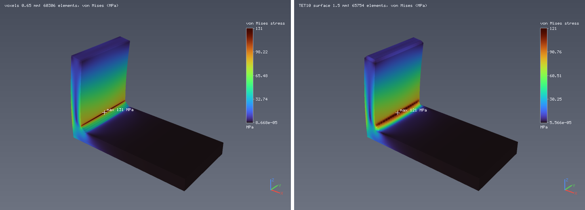
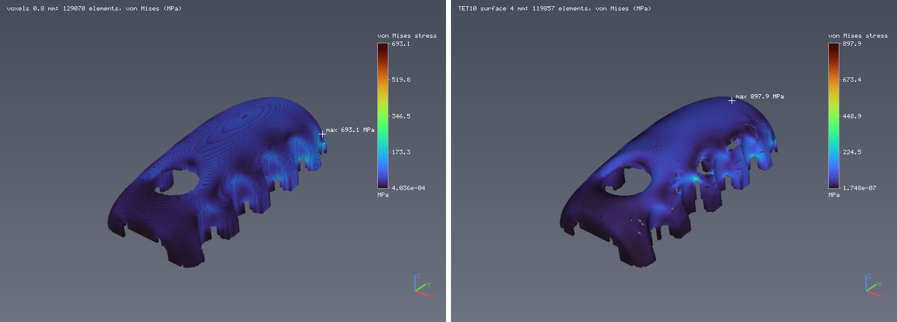

# Voxels and 10-node tetrahedra on the same parts (T17, step 5)

Written 2026-09-19. Made by `python3 tools/tetcompare.py` through the operation layer (the embedded MCP server), on the
fanless M2 laptop while another session's builds were running. Same material (the 316L demonstration record), same
conditions, element counts chosen to be comparable. Contract: [../contracts/tet-mesh.md](../contracts/tet-mesh.md).

## The bracket with a 3 mm fillet

The L-bracket of `tools/amflow.py` (base 60 x 6 mm, upright 6 x 40 mm, 30 mm deep) with a 3 mm fillet in the inside
corner; the base fixed, 500 N sideways at the top of the upright. "Fillet peak" is the largest nodal von Mises stress in
the 5 mm box around the fillet, away from the supports and the load.

| mesh | elements | nodes | max displacement | 99th percentile von Mises | fillet peak | mesh + solve |
|---|---|---|---|---|---|---|
| voxels 0.65 mm | 60 306 | 68 902 | 0.0785 mm | 77.8 MPa | 131.0 MPa | 0.0 + 7.7 s |
| TET10, surface 1.5 mm | 65 754 | 101 340 | 0.0708 mm | 74.2 MPa | 121.0 MPa | 0.4 + 9.8 s |
| TET10, surface 1 mm (reference) | 177 612 | 268 087 | 0.0712 mm | 73.7 MPa | 118.5 MPa | 1.1 + 48.5 s |

Against the finer TET10 mesh, the TET10 mesh of comparable size is within 0.6 % in displacement and 2.1 % at the
fillet; the voxel mesh is 10 % above in displacement and 10.5 % above at the fillet, where its staircase replaces the arc.
The reference is a finer mesh of the same kind, not an independent solution.

## The owner's assembly

`Zero_Final_Assembly_Complete.stl`, one end face fixed (surface patch 0), 500 N down on the other end face (patch 2).

| mesh | elements | nodes | max displacement | 99th percentile von Mises | mesh + solve |
|---|---|---|---|---|---|
| voxels 0.8 mm | 129 070 | 186 819 | 1.446 mm | 160.3 MPa | 0.1 + 324.9 s |
| TET10, surface 4 mm, one thin-wall level | 119 857 | 218 488 | 1.552 mm | 185.5 MPa | 3.8 + 42.8 s |

The two differ by 7 % in displacement and 16 % in the 99th percentile, and **neither is shown to be converged**: in the
tetrahedral walkthrough, CHECK MESH from 4 mm to 3.2 mm moved the displacement by 18.7 % and the stress by 12.4 % (other
conditions: two faces clicked on screen). This part is thin-walled throughout; a TET10 mesh that keeps its walls needs
cells near the wall thickness, and at 4 mm (halved once where a wall is thin) the surface shows a few small
perforations where a wall lost its thickness locally (visible in the figure) and the volume is 3.9 % below the STL. A
finer tetrahedral mesh (2.5 mm, 412 000 elements) did not fit the time and memory of this machine for a solve. The TET10
solve is faster than the voxel one here because it runs a two-level preconditioner (the TET4 problem on the corner
nodes as the coarse space) while the voxel path uses block-Jacobi conjugate gradients.

Peak values in both figures sit at sharp inside corners and supports, where linear elastic stresses are singular; the
table uses the 99th percentile for that reason.
