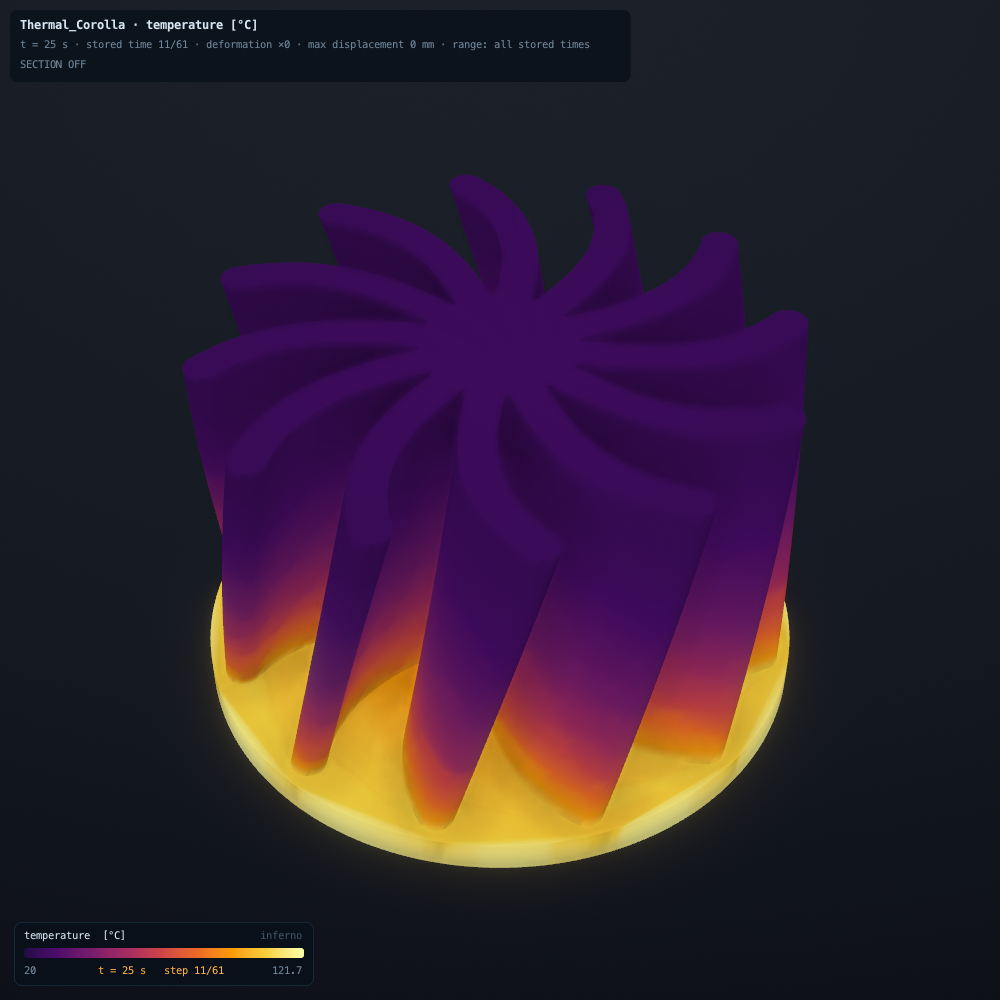
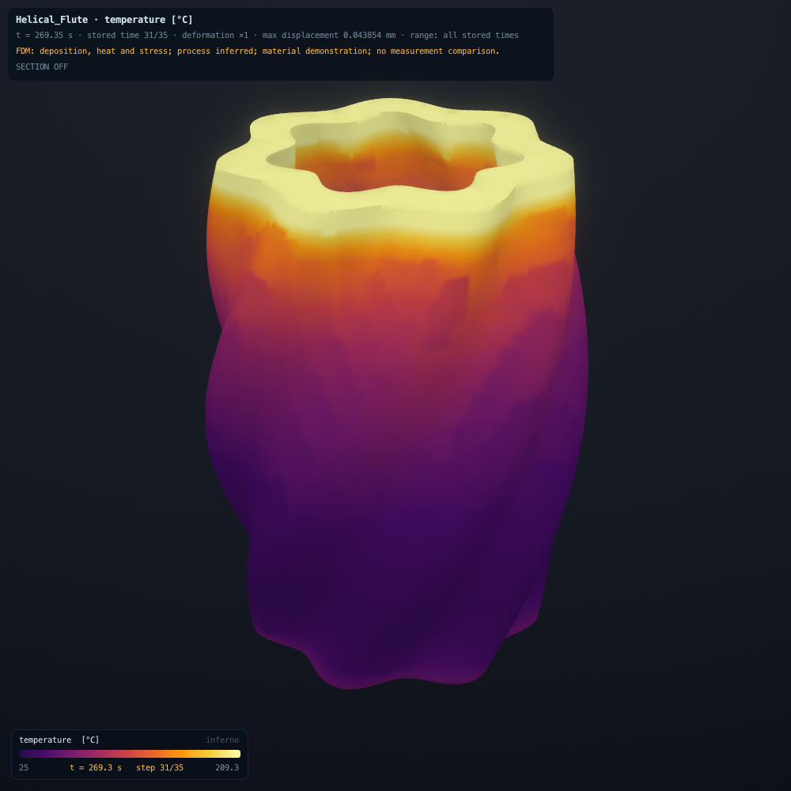
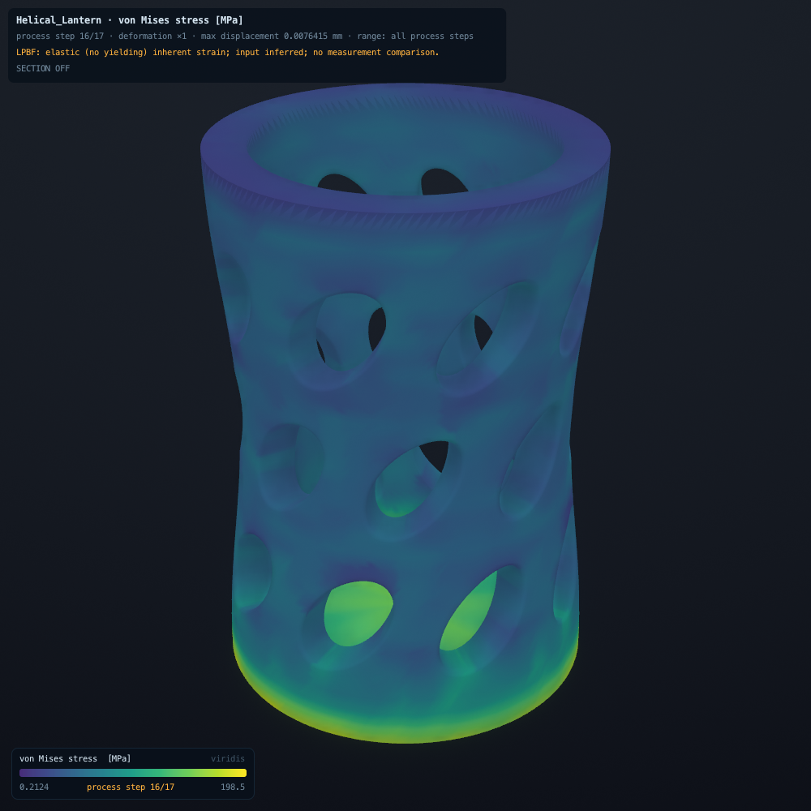

# Computed sculptures

Three designed geometries, three computed fields, one native renderer. Every colour comes from a saved numerical
result. Camera, background, lighting, ambient occlusion and subtle bloom are presentation choices, not emitted
radiation. Full-range legends remain fixed through each film; deformation is shown at its true scale.

## Thermal Corolla



[Watch heating and cooling](media/art-gallery/thermal.mp4). A 25-second heat pulse enters the base of twelve curved
fins. Conduction carries it upward while convection and radiation remove heat. The stored-state peak is 121.669 C
at 25 s; by 150 s the nodal range is 24.147 to 25.134 C. The film compresses physical time and moves the camera.

## Helical Flute



[Watch deposition and cooling](media/art-gallery/fdm.mp4). A hot rim grows above a cooling shell. The FDM model
activates material, accounts for deposited enthalpy, solves cooling and incremental thermal stress, then releases
it from the bed. Sixteen 1.5 mm simulation layers aggregate nominal 0.2 mm printed layers; bead paths are unresolved. Key times have equal screen duration but uneven physical spacing.
Growth films keep the finite-element boundary throughout, so finishing the build does not introduce a display-only
shape change. The complete-part stills interpolate the saved field onto the original STL surface.

## Helical Lantern



[Orbit the stress result](media/art-gallery/lpbf.mp4). The camera explores one completed, pre-cut state. The holes
and curved load paths carry the stress field from a 16-layer elastic inherent-strain build. This is an assumed
part-scale metal-printing model, without a resolved laser, melt pool, temperature history or yielding.
The companion build/cut film and section captures are generated locally by the recipe below. Process indices are
labelled as steps, not seconds. The model has no supports; the base cut removes actual finite elements.

## Numerical evidence

These are demonstration inputs, not measurements or calibrated print predictions. The threshold was fixed before
running: at most 12,000 hexes, at most 480 seconds, all stored floating values finite, equilibrium or heat diagnostics
below 1e-6, and thermal enthalpy mismatch below 1e-9.

| Case | Hex elements | Stored states | Run time | Numerical result |
|---|---:|---:|---:|---|
| Thermal Corolla | 11,840 | 61 | 6.320 s | Energy closure 1.266e-12; enthalpy mismatch 2.548e-14 |
| Helical Flute | 5,385 | 35 | 30.914 s | Worst heat balance 1.730e-10; final equilibrium 5.250e-14 |
| Helical Lantern | 3,807 | 17 | 5.743 s | Final equilibrium 1.613e-14 |

Timings are from the owner's M2 machine and include job orchestration; they are not comparative benchmarks.
The [independent audit](../validation/art-gallery/independent-audit.json) reread every floating result array and
verified lengths, complete file consumption and hashes. Original run records:
[thermal](../validation/art-gallery/thermal-run.json), [FDM](../validation/art-gallery/fdm-run.json),
[LPBF](../validation/art-gallery/lpbf-run.json). Their resolved specifications are saved beside them.

The voxel surface areas exceed the STL areas by 29.43%, 37.92% and 29.69%, respectively. Thermal boundary conditions
use those mesh areas. Smooth STL display does not improve that approximation. Growth, removal and section views
show the active finite-element boundary. No spatial/time convergence study or experimental comparison was performed.
A small energy or equilibrium residual verifies numerical consistency, not accuracy against the physical world.

## Reproduce and explore

Build the repository, then use a fresh output directory:

```sh
make
python3 tools/art_gallery.py --output-dir /tmp/physics-gallery
python3 tools/art_gallery_compute.py thermal --output-dir /tmp/physics-gallery
python3 tools/art_gallery_compute.py fdm --output-dir /tmp/physics-gallery
python3 tools/art_gallery_compute.py lpbf --output-dir /tmp/physics-gallery
python3 tools/art_gallery_capture.py thermal --output-dir /tmp/physics-gallery
python3 tools/art_gallery_capture.py fdm --output-dir /tmp/physics-gallery
python3 tools/art_gallery_capture.py lpbf --output-dir /tmp/physics-gallery
swift tools/encode_video.swift /tmp/physics-gallery/thermal.mp4 20 /tmp/physics-gallery/frames/thermal/0*.png
swift tools/encode_video.swift /tmp/physics-gallery/fdm.mp4 20 /tmp/physics-gallery/frames/fdm/0*.png
swift tools/encode_video.swift /tmp/physics-gallery/lpbf.mp4 20 /tmp/physics-gallery/frames/lpbf/0*.png
swift tools/encode_gif.swift /tmp/physics-gallery/lpbf-build.gif 0.3 /tmp/physics-gallery/frames/lpbf/build-*.png
```

The native renderer and macOS video encoder need access to host graphics/media services. No Homebrew packages are
needed. The video encoder checks dimensions, frame count, timestamps, duration and codec. Encoding is lossy; PNGs
retain the original pixels. Existing video outputs are refused, to preserve earlier captures.

Open any saved project in the app, choose its result and explore with orbit, stored-step playback, fields and sections.
The geometry generator checks manifold edges, winding, connectedness, positive volume and its serialized STL data.
Its shapes are designed artifacts, not outcomes of topology optimization or claims of manufacturability.

Implementation: [geometry](../tools/art_gallery.py), [computation](../tools/art_gallery_compute.py),
[native capture](../tools/art_gallery_capture.py), [video encoding](../tools/encode_video.swift).
The original run used an earlier [compute script](../validation/art-gallery/original_compute.py); the current recipe
adds input hashes and preserves previous evidence on repeat runs. The independent audit includes a successful
fresh/repeat thermal reproduction of the current recipe.
