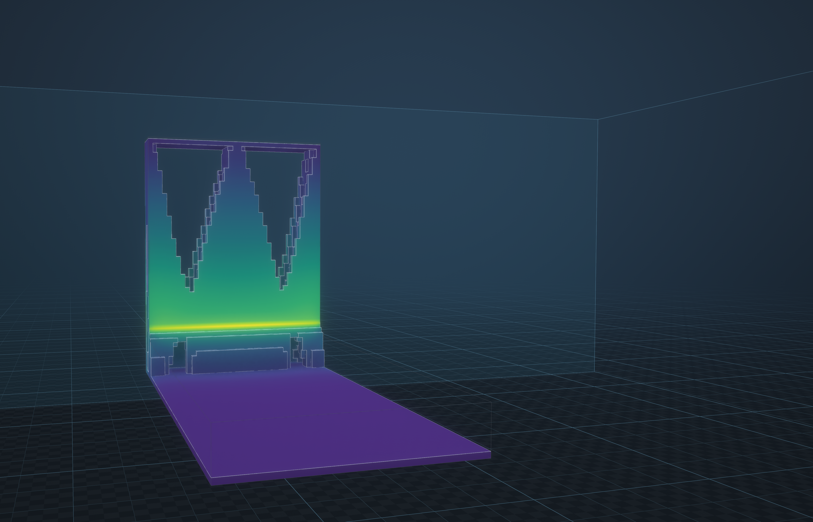
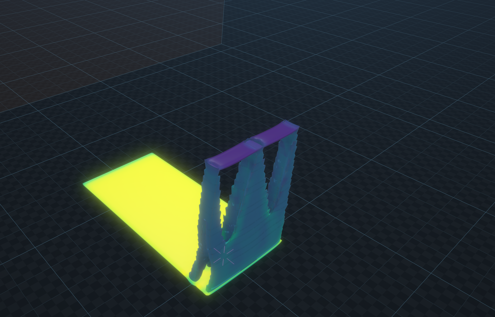
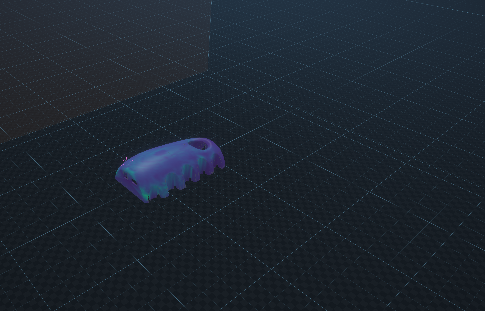
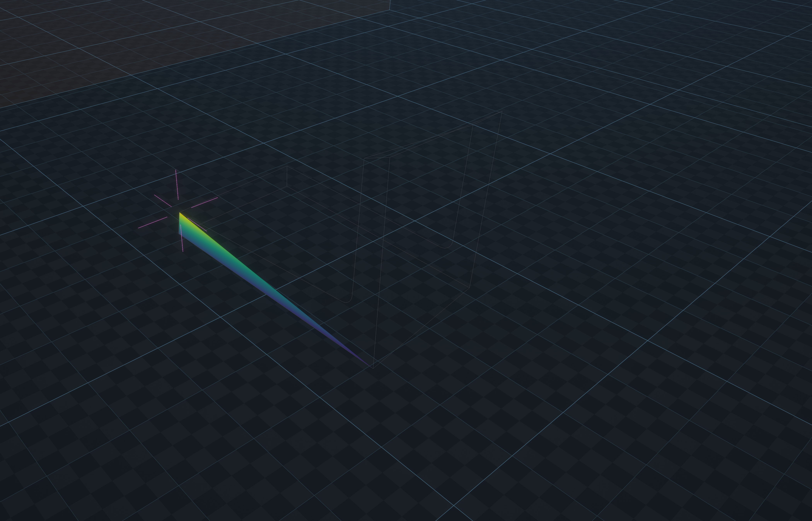
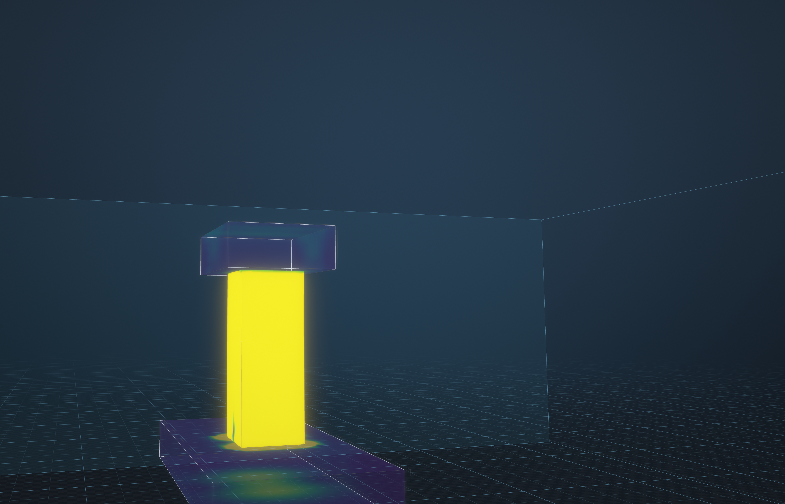
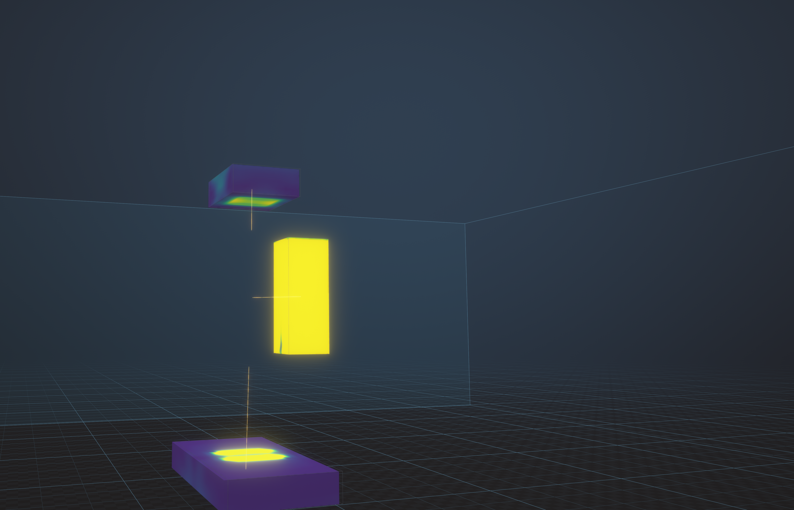

# The gallery

Every picture on this page is the software's own output. Each one was rendered by the app and written by EXPORT
IMAGE at three times the window (1400 x 900, so 4200 x 2700), with the same shading the window shows and no panel
over it. Nothing was drawn, retouched or composed anywhere else. The command under each image reproduces it.
Rendered on 2026-09-20 on a fanless M2 laptop with 8 GB.

The parts are real: the filleted L-bracket the tetrahedral comparison uses, the owner's assembly and the calibration
cantilever. The three-box stack is the one sample built from primitives,
and it is there because `samples/` holds no multi-body STL: `bracket.stl` and `cantilever.stl` are
each a single shell, so the exploded view is shown on the stack rather than on an invented part.

## 1. A bracket optimised for stiffness



The L-bracket of `tools/tetcompare.py` (base 60 x 6 mm, upright 6 x 40 mm, 30 mm deep, 3 mm inside fillet), meshed
at 0.75 mm into 40 120 voxels, held at its foot and pushed with 0.5 kN sideways at the top of the upright, then
optimised to keep 30 percent of its volume: 40 iterations and 41 solves in 282 s, compliance 0.0645 J against
2.73 J for a uniform grey design of the same volume, 11 698 elements above half density. The part is drawn at 45
percent opacity so the voids inside it show, with the feature edges over it. The one run that was tried at 0.65 mm
(60 306 elements) and 60 iterations passed ten minutes, so the mesh was coarsened and the iterations capped, which
is what the picture shows.

```
nohup ./navier --headless --size 1400x900 --workspace /tmp/navier-gallery-bracket \
  --exec 'exec tools/gallery_bracket.nav' > /tmp/gallery-bracket.log &
```

## 2. The same bracket, printed



The optimised part as EXPORT STL wrote it (29 660 triangles, a closed solid of 4893 mm3 after the export's own
repair), imported again, meshed at 1 mm into 5452 elements and built layer by layer in 2 mm layers with calibrated
inherent strain (AlSi10Mg): 20 stored layers, shown at the last one with the shape deformed as it really moves.

```
./navier --headless --size 1400x900 --workspace /tmp/navier-gallery-bracket-print \
  --exec 'exec tools/gallery_bracket_print.nav'
```

## 3. A real assembly with its result



`Zero_Final_Assembly_Complete.stl`, the owner's part, meshed at 2 mm, one end face held and 500 N down on the
other, with the stress drawn on the part's own surface rather than on the voxel mesh behind it.

```
./navier --headless --size 1400x900 --workspace /tmp/navier-gallery --exec 'exec tools/gallery.nav'
```

## 4. A fillet on 10-node tetrahedra



The same L bracket, meshed with curved TET10 elements at 1.5 mm surface size, foot bolted down, 0.5 kN sideways at
the top: the stress follows the arc of the fillet instead of a staircase of voxels.

```
./navier --headless --size 1400x900 --workspace /tmp/navier-gallery --exec 'exec tools/gallery.nav'
```

## 5. A metal print, as the machine leaves it

*Picture removed on 2026-09-27: it was rendered with strains from a commercial simulation of a partner's data. Rerun the command below to make it again with the repository's own values.*

The calibration cantilever built layer by layer with calibrated inherent strain, shown at the last step: the
part on its supports with the residual stress it carries, before the cut from the plate.

```
./navier --headless --size 1400x900 --workspace /tmp/navier-gallery --exec 'exec tools/gallery.nav'
```

## 6. Bodies you can see through, and pull apart





Three boxes imported as three bodies and placed into a stack (`geometry_place` puts the post 8 mm and the cap 40 mm
above the plate: without it the importer drops all three on the plate and they end up inside each other), meshed
together at 2 mm, held at the foot and pushed at the top. In the first picture the base is drawn at 22 percent
opacity and the cap at 35 percent; in the second the EXPLODE slider moves each body along the direction from the
assembly centroid to its own, with a thin line back to where it belongs. Each piece stays closed while it stands
apart: the drawn surface goes from 4032 triangles joined to 4320 exploded, and the 288 added triangles are exactly
the four interfaces the pieces used to hide.

```
./navier --headless --size 1400x900 --workspace /tmp/navier-gallery-three --exec 'exec tools/gallery_three.nav'
```

## The per-feature checks

`python3 tools/uicheck.py --presentation` runs the same three-body stack and writes one image per presentation
feature next to this page, each one also checked pixel by pixel in that suite:

| Image | Feature | What the check measures |
|---|---|---|
| `presentation-plain.png` | the baseline | no edges, no ambient occlusion |
| `presentation-ambient-occlusion.png` | screen-space ambient occlusion | the number of the part's own pixels it darkens, and the deepest darkening |
| `presentation-edges.png` | feature edges | dark lines appear over the surface (1788 pixels changed, darkest 21) |
| `presentation-glass-edges.png` | transparency | a glass body lets the rest through (12 016 pixels changed) |
| `presentation-exploded.png` | exploded view | the pieces move apart, each closed (+288 triangles), and the cap's top face carries a result colour |
| `presentation-section-exploded.png` | section and probe while exploded | the section plane and a click on a moved piece still work |
| `presentation-export-3x.png` | EXPORT IMAGE | 2700 x 1800 from a 900 x 600 window, with the part in it |

`python3 tools/uicheck.py --topopt` does the same for the optimiser: it clicks OPTIMISE and OPTIMISE NOW in the
panel, waits for the job, checks that the emptied elements leave the picture and that SHOW WHOLE brings them back,
that the export repairs the contour into a closed solid, and that the same operation runs through `navier-mcp` and
refuses a volume fraction smaller than the region the supports and loads hold solid. Its images are
`topopt-panel.png` (the controls) and `topopt-optimised.png` (the part that survived).
