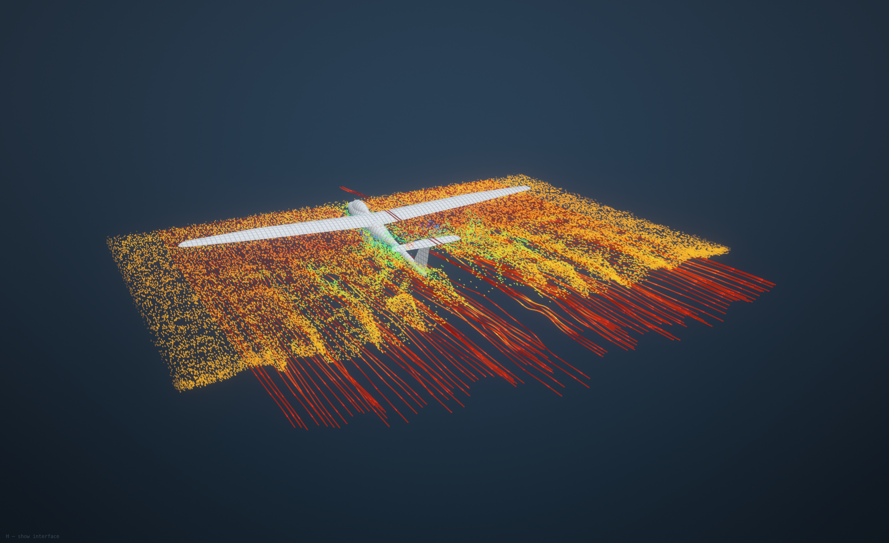
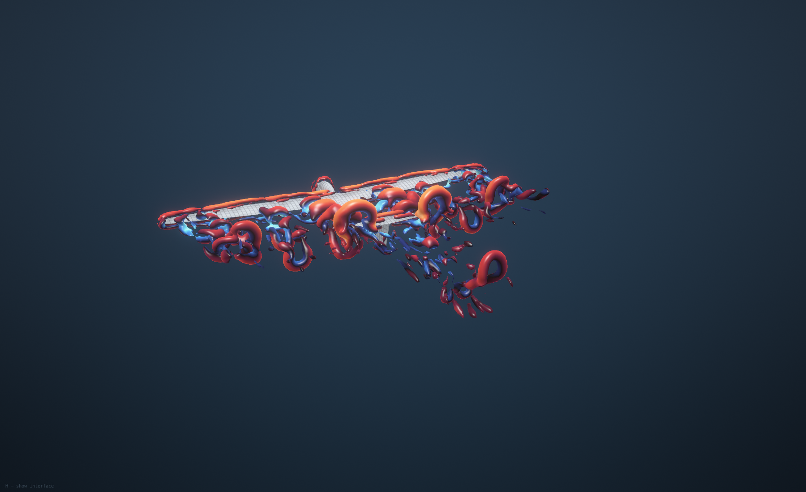

# OpenPhysicsAI: from a build to an inspectable result

The three images of this section were captured directly from the native app; they are being recaptured with the repository's own values. They use a dark background, feature edges,
ambient occlusion and a consistent camera, with the interface hidden. They have not been retouched. Captions carry
the context that would otherwise be visible in the app's panels. These are illustrative simulation results, not
validation figures; quantitative comparisons belong in the linked benchmark reports.

## Release from the plate

*Picture removed on 2026-09-27: it was rendered with strains from a commercial simulation of a partner's data. Rerun the command below to make it again with the repository's own values.*

The final stored state of a layer-by-layer LPBF inherent-strain build. Colour shows displacement magnitude; AUTO
exaggerates deformation for visibility. The undeformed outline provides a reference. The capture log reports a
maximum displacement of **2.49365209 mm** in this run. That is a computed value, not a measured error or a prediction
of an independently specified new experiment.

## Residual stress

*Picture removed on 2026-09-27: it was rendered with strains from a commercial simulation of a partner's data. Rerun the command below to make it again with the repository's own values.*

The same result, coloured by von Mises stress with deformation at **scale 1**. The final-state colour range reported
by the app is **16.277 to 591.575 MPa**. The setup supplies elastic constants and calibrated inherent strain; it does
not request the calibrated plastic model used by the best cantilever leaderboard entry. Do not interpret a local
elastic peak as a validated material-strength prediction. Purple is the low end of the map; yellow is the high end.

## An interior section

*Picture removed on 2026-09-27: it was rendered with strains from a commercial simulation of a partner's data. Rerun the command below to make it again with the repository's own values.*

A section at **y = 0.5** of the model extent, with true-scale deformation. The section changes visibility, not the
underlying solve. The thin outline is the undeformed geometry, including regions hidden by the section.

## Reproduce these images

From the repository root on macOS, after building the application:

```bash
./navier --headless --size 1800x1100 --workspace /tmp/openphysicsai-repo-demo \
  --exec 'exec tools/repo_showcase.nav'
```

Use the dedicated workspace above: the script replaces its `repo_lpbf` demonstration project. It imports the checked-in
`samples/cantilever.stl`, assigns `alsi10mg_lpbf`, uses 1 mm mesh elements and simulated layers, and supplies the
elastic strain of the P17 preset in `src/ctl/print_profiles.json` in orientation Y with E = 71 GPa and Poisson ratio
0.33. The pictures here were captured before 2026-09-27 with a strain set and a material record that were removed
that day, so a new capture looks alike but is not the same. The cut height (2.5 mm), kerf (0.3 mm) and
starting x (10 mm) are assumed demonstration settings, explicitly marked in the request.

The script follows the submitted LPBF job before waiting, so the screenshots refer to the completed build rather
than an earlier analysis. It then selects the last stored time and captures three PNGs at 1800 x 1100. Check the log
for a succeeded `lpbf_build`, stored time 10 of 10, and `SHOWCASE complete`; a screenshot alone does not prove success.

Capture provenance: source revision `e05d308`, with only README, showcase documentation and capture-script changes;
application built locally with `make -j4 navier`. The reviewed run completed successfully with ten stored times and
10,426 rendered triangles before sectioning. No numerical source code was changed for these images.

## Explore the wider laboratory

The [existing gallery](GALLERY.md) includes structural meshes, interior views, transparency, exploded assemblies and
topology optimisation. The fluid image on the [repository front page](../../README.md) illustrates the water-tunnel
environment; it is not an experimental validation plot.

For quantitative evidence, use the verification table of the [lab](../LAB.md), where every number names its reference.

## Fluid photography

The fluid images use a different visual language: a single glider, a dark background and space around its wake.
They are native renderer captures of a live lattice Boltzmann calculation, not generated artwork.

```bash
./navier --headless --size 1800x1100 --workspace /tmp/openphysicsai-flow \
  --exec 'exec tools/repo_flow.nav'
```

The script specifies a 9-degree angle of attack, normal lattice quality, 2,200 solver steps before capture, a
35,000-particle sheet emitter with 120 streamlines and a separate Q-criterion view at Q(L/U)^2 = 25. The particle view uses speed colouring
with the turbo line palette. The vortex view uses vorticity colouring with the icefire palette. Exposure is 1.15 and bloom
0.18; neither changes the flow calculation. HUD, floor grid, tunnel outline and slice are hidden to keep the subject
readable. These views illustrate flow structures; they do not establish aerodynamic accuracy or converged forces.





## The front page's media: one capture preset

The six demonstrations of the [README](../../README.md) replaced the earlier short films (`flow.gif`, `build.gif`,
`heat.gif`; their generator `tools/repo_films.py` is kept). Five remain: the sixth, a metal-printing film, showed a part
the project may not publish and was removed on 2026-09-27. Every one is made by a script in
[`tools/showcase/`](../../tools/showcase/showcase.py) from a finished run, and every one goes through the same preset,
defined once in `showcase.py`:

- **One renderer.** Results are drawn by the simulator's own software renderer (`results_render`, `view_render`) with
  `"style": "showcase"`: a dark neutral background (sRGB 20, 22, 27 over 13, 14, 18) and none of the renderer's bitmap
  annotations. The flow picture comes from the application's tunnel with `backdrop neutral`, calibrated to the same
  two colours, and no interface.
- **One frame.** Canvas 1600 x 900, picture area 1380 x 900 at the left, films 960 x 540. The phenomenon and the
  stored state or time at the top left, the colour bar with field name and unit at the right, prescribed inputs or
  the deformation scale at the bottom left, the run at the bottom right. Helvetica Neue throughout.
- **Legends that cannot drift.** The colour bar is evaluated from the renderer's own colour map formulas, read from
  `src/render/swrender.c`, over the range the renderer reports. Maps: viridis for displacement and stress, the
  sequential `heat` map for temperature. A film keeps one range for all its frames.
- **Only what exists.** A stored state of a build is drawn with the elements that exist at that state (born, and not
  yet cut away), and its range and maximum are those of the nodes that exist. `"groups"` chooses among part, support
  and plate.
- **Nothing painted.** The compositor draws around the rendered picture and never on it. No frame is interpolated,
  reversed or retimed.

| Media | Kind of claim | Run | Field, range, state | Prescribed | Computed and quoted | Limits |
|---|---|---|---|---|---|---|
| `showcase-heat.gif` | demonstration | [showcase-heat.json](../media/showcase-heat.json); [heat_sink.py](../../tools/showcase/heat_sink.py) | temperature, degC, 25 to 90 for every frame; 0 to 600 s every 15 s; the poster is t = 300 s | 20 W into the 20 x 20 mm pad for 300 s (5e4 W/m2), convection 25 W/(m2 K) to 25 degC air on all other faces, start at 25 degC; 316L from the library's published record | peak 80.1 degC at 300 s; 29.8 degC at 600 s; 52 640 elements of 1 mm | conduction only: the convection coefficient is an input, no air flow, no radiation |
| `showcase-flow.gif` | demonstration, qualitative | [showcase-flow.json](../media/showcase-flow.json); [flow_film.py](../../tools/showcase/flow_film.py) | tracer particles from a smoke sheet, coloured by the application's speed map; no legend because no quantity is claimed | scene glider with `models/showcase-sailplane.stl`, 8 degrees, draft lattice, 2 600 steps to develop the wake | 44 frames, exactly 10 solver steps each | no force coefficient claimed; draft lattice; the loop restarts, the flow is not periodic |
| `showcase-solid.png` | demonstration on verified elements | [showcase-solid.json](../media/showcase-solid.json); [bracket_static.py](../../tools/showcase/bracket_static.py) | von Mises stress, MPa, 0 to 75; deformation x40 over the undeformed outline | underside of the base fixed, 500 N sideways on the top of the upright; 316L published record | largest displacement 0.0708 mm; 99th percentile 74.2 MPa; largest nodal value 121 MPa at the fixed edge | linear elastic; the largest value is a support singularity and is not a design value |
| `showcase-polymer-print.gif` | demonstration, a forecast | the run of [validation/prints](../../validation/prints/README.md), `job-20260920-141401-4006-1`; [print_film.py](../../tools/showcase/print_film.py) `polymer` | von Mises stress in the part, MPa, 0 to 15 for every frame; every third stored state, then on the bed, then released; supports hidden (`groups: part`) | process read from the slicer's job file; PLA from the library's published record; ambient 25 degC assumed | 15.0 MPa on the bed, 9.0 MPa released, vertical warp -0.66 mm | five printed layers per simulated layer; the run's stored states are cooled states, so temperature is not filmed; never printed or measured |
| `showcase-topology.png` | demonstration; the method is verified in `topotest` | [showcase-topology.json](../media/showcase-topology.json); [topology.py](../../tools/showcase/topology.py) | geometry only: the design space and the cells at or above 0.5 density, same camera | left face fixed, 1 kN down on the right face, 30 % volume, penalty 3, filter 1.5 cells, loaded and held cells kept solid | compliance 0.691 J to 0.0484 J; 28 % of the cells kept; 80 iterations (the limit) | one load case, no stress or manufacturing constraint; the element order of the density field is checked by the mirror symmetry the case must have |

**Why the earlier flow film stuttered.** The particles advance with the solver's step count, at most 12 steps per
drawn frame with a backlog capped at 48. The earlier capture left the solver running while each screenshot was
written, so the interval between film frames varied and the backlog was clipped: the change from one frame to the
next swung by 23 % of its mean. The new capture pauses the solver and advances it by exactly 10 steps per frame; the
same measure is 2 %.
