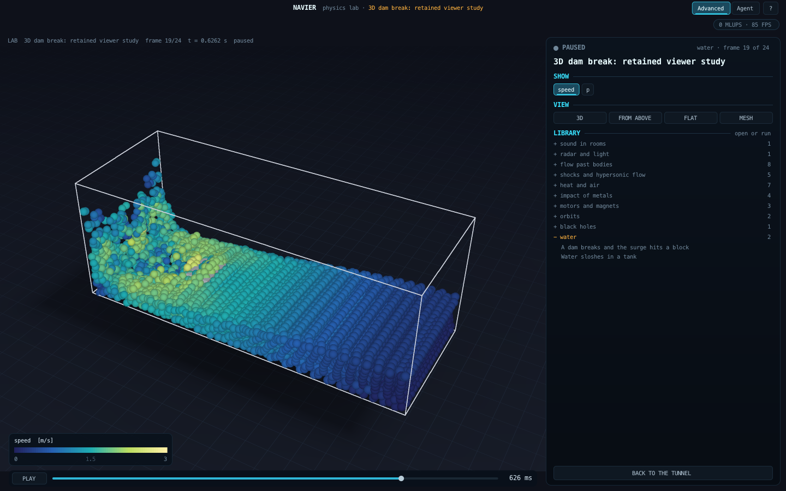
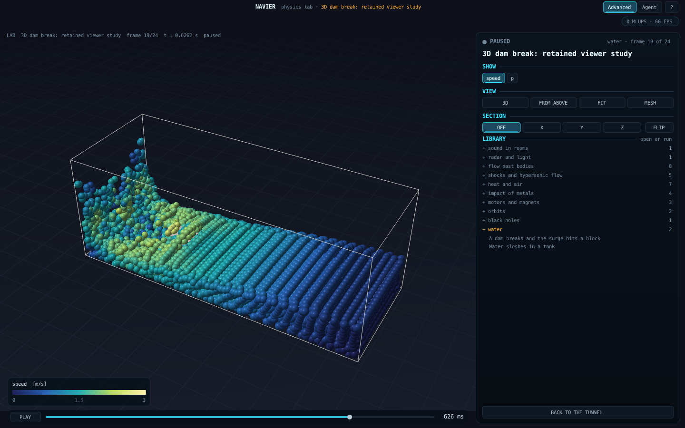
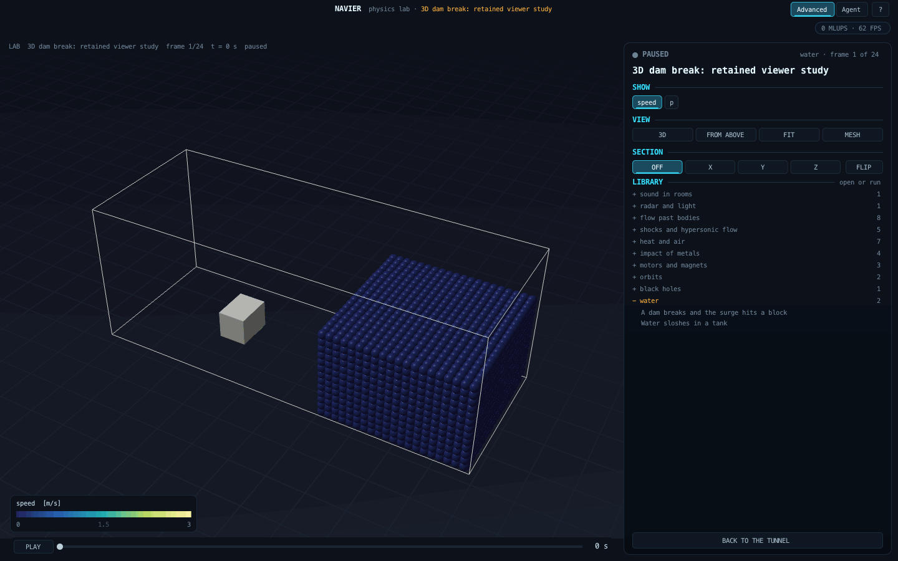
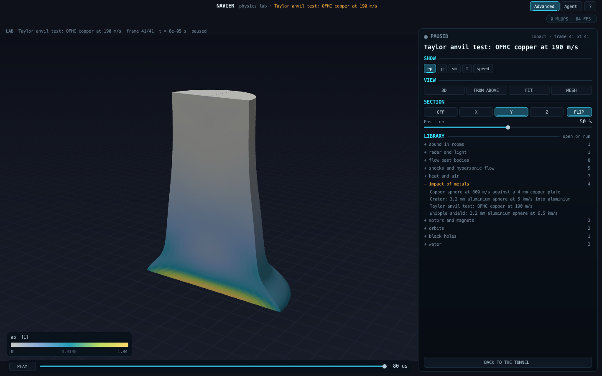
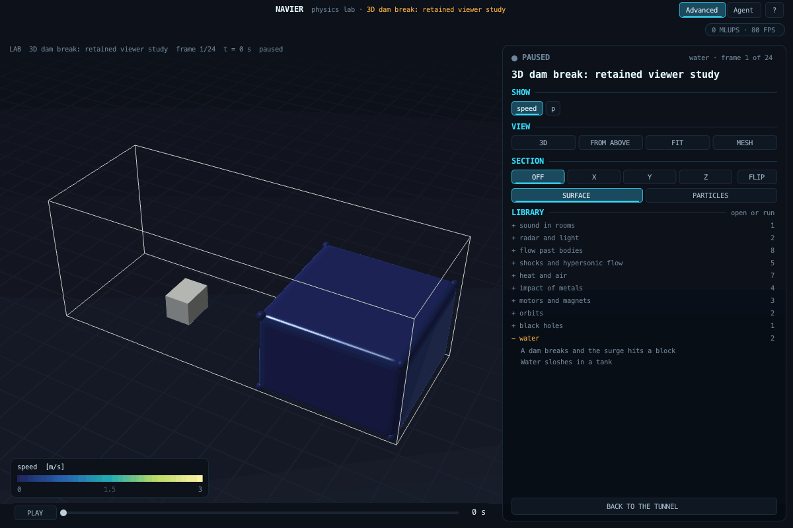
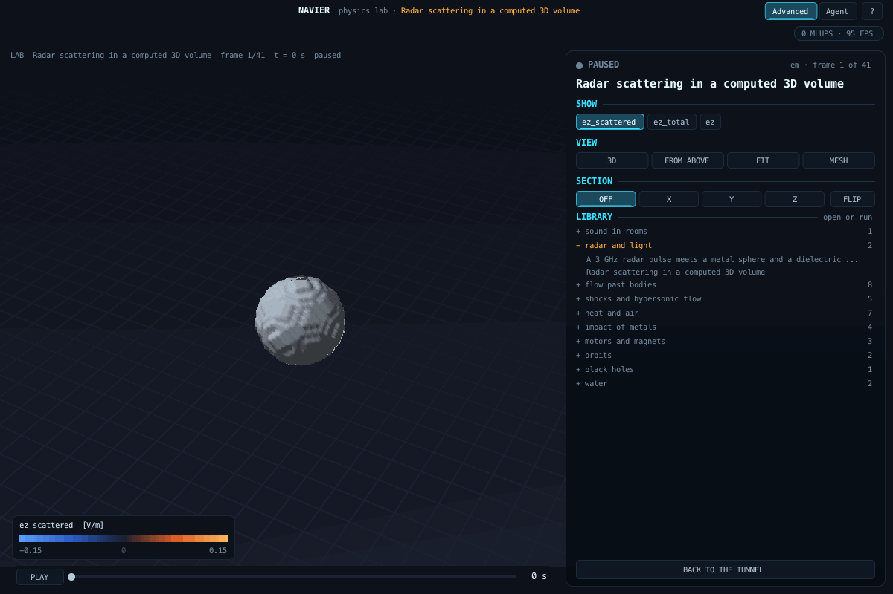
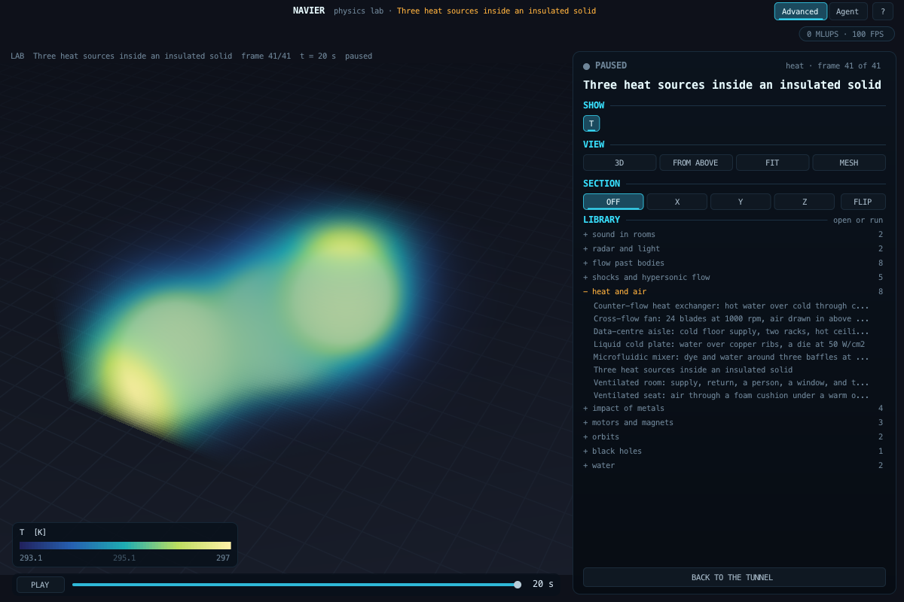
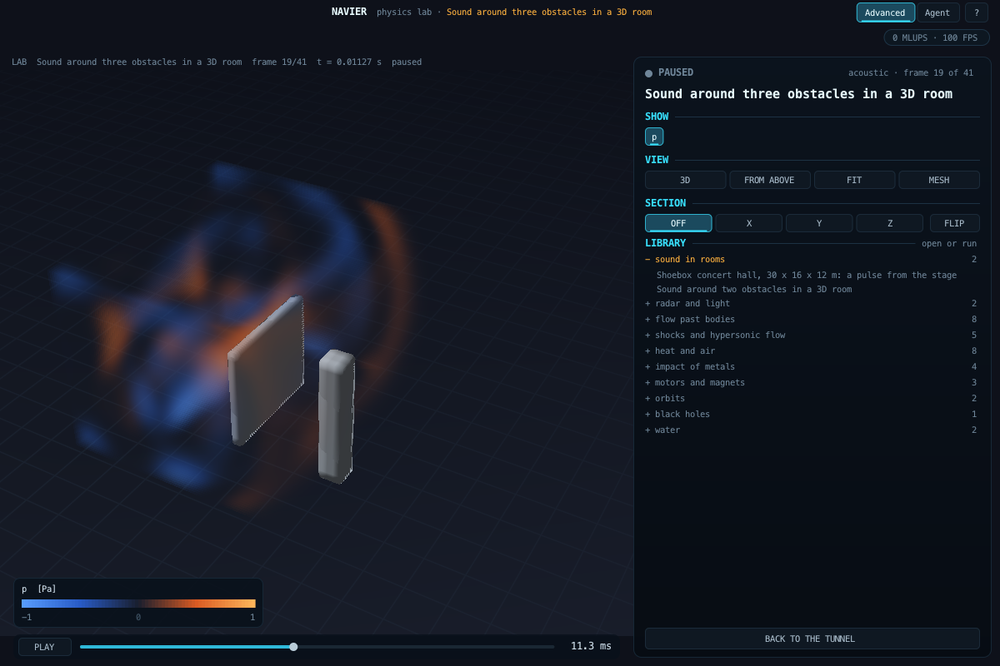
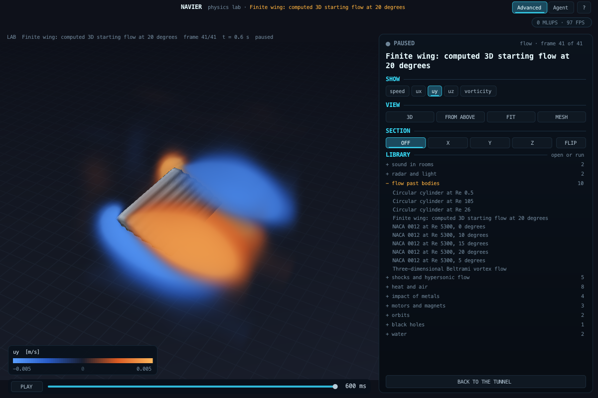
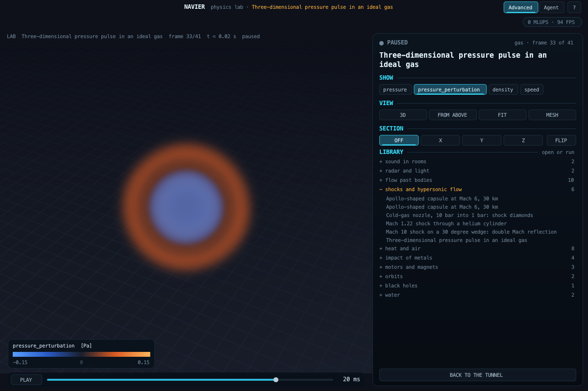

# The physics lab: documentation

Up: [AGENTS.md](../../AGENTS.md) · code: [src/lab/](../../src/lab/README.md) · goals: [GOALS.md](../../GOALS.md) ·
flags: [flags/README.md](../../flags/README.md)

| Domain | Document | Scenarios |
|---|---|---|
| Compressible flow (supersonic, hypersonic) | [gas.md](gas.md) | [examples/lab/](../../examples/lab/) |
| Sound in rooms | [acoustic.md](acoustic.md) | [shoebox_hall.json](../../examples/lab/shoebox_hall.json) |
| Orbits: planets, asteroids, relativity | [orbit.md](orbit.md) | [apophis_2029.json](../../examples/lab/apophis_2029.json), [apophis_flyby.json](../../examples/lab/apophis_flyby.json) |
| Electromagnetic waves | [em.md](em.md) | [radar_pulse.json](../../examples/lab/radar_pulse.json) |
| Flow past bodies, against the photographs | [flow.md](flow.md) | [cylinder_re26.json](../../examples/lab/cylinder_re26.json), [naca0012_re5300_aoa10.json](../../examples/lab/naca0012_re5300_aoa10.json) |
| Heat and flow: cooling, ventilation, mixing | [heat.md](heat.md) | (G11 applications) |
| Magnetic fields: motors, actuators, shields | [magnet.md](magnet.md) | [pm_motor.json](../../examples/lab/pm_motor.json) |
| Light near a black hole: lensing, the shadow, a shifted disk | [relativity.md](relativity.md) | [black_hole.json](../../examples/lab/black_hole.json) |
| Water with a free surface: a dam break, sloshing | [water.md](water.md) | [dam_break.json](../../examples/lab/dam_break.json), [sloshing_tank.json](../../examples/lab/sloshing_tank.json) |
| Brittle fracture: a glass bottle shatters | [fracture.md](fracture.md) | [glass_bottle.json](../../examples/lab/glass_bottle.json) |
| Thin sheets: rubber stretches, bends, drapes | [sheet.md](sheet.md) | [rubber_sheet.json](../../examples/lab/rubber_sheet.json) |
| Metal melting: a laser melts tracks into steel | [melt.md](melt.md) | [laser_tracks.json](../../examples/lab/laser_tracks.json) |
| Fluid and structure together: a flag flutters in the wind | [fsi.md](fsi.md) | [flag_3d.json](../../examples/lab/flag_3d.json) |
| Fire: a methane flame and its plume, against Heskestad and McCaffrey | [fire.md](fire.md) | [methane_fire.json](../../examples/lab/methane_fire.json) |
| Rooms in 3D: an office's ventilation, a data hall's aisles, a fire in a room with a doorway | [rooms.md](rooms.md) | [office_hvac_3d.json](../../examples/lab/office_hvac_3d.json), [data_centre_3d.json](../../examples/lab/data_centre_3d.json), [room_fire_3d.json](../../examples/lab/room_fire_3d.json) |
| Batteries: twelve lithium-ion cells in parallel on a cold plate under a heavy load | [battery.md](battery.md) | [battery_module.json](../../examples/lab/battery_module.json) |
| Impact of metals | [impact.md](impact.md) | [taylor_copper.json](../../examples/lab/taylor_copper.json), [sphere_plate.json](../../examples/lab/sphere_plate.json) |

## Running a scenario

```bash
make lab
python3 tools/lab_scenarios.py                                   # writes examples/lab/*.json
./build/labrun examples/lab/capsule_mach6_l2.json /tmp/capsule.lab
./build/labfilm /tmp/capsule.lab --info                          # what is in the result
./build/labfilm /tmp/capsule.lab --out /tmp/frames --field mach --mesh-below --solid solid
./build/labprobe /tmp/capsule.lab --field p --line -3 0 0 0 200  # numbers along a line
```

A scenario is JSON; every number carries its unit in its key (`length_m`, `pressure_pa`, `temperature_k`). The last
line `labrun` prints is a JSON record of the run: the scenario's SHA-256, frames, steps, wall time and the solver's
diagnostics.

## In the app

Every result opens in the native app, drawn by the same renderer as the films (`src/lab/labview.c`), so the app shows
what the README shows. In the terminal of the panel:

| Command | Does |
|---|---|
| `lab open FILE.lab` | opens a result; 2D results are drawn flat, 3D results can be turned |
| `lab run SCENARIO.json` | runs a scenario in the background into `~/NAVIER-Projects/lab/`, and opens it |
| `lab play`, `lab pause`, `lab next`, `lab prev`, `lab frame N`, `lab fps N` | time |
| `lab field NAME`, `lab cmap NAME`, `lab range LO HI`, `lab range auto` | colour |
| `lab view iso\|top\|front\|...`, `lab orbit AZIM ELEV` | the view; drag turns, the wheel zooms |
| `lab iso LEVEL` | where a result draws vortex surfaces (Q, in 1/s^2): lower shows more, higher only the strongest |
| `lab zoom F`, `lab focus X Y Z` (m) or `lab focus off` | frame a small feature: the view turns about the focus, F times closer (`lab fit` resets both) |
| `lab mesh`, `lab mirror`, `lab meshbelow`, `lab light` | the mesh, the axisymmetric mirror image, the refined mesh under the field |
| `lab info`, `lab close`, `lab help` | |

Code: `src/labapp.c`.

## Retained 3D viewer (lab/3d-native)

**One lit scene (2026-09-26).** Every 3D result is drawn by [src/labgpu.c](../../src/labgpu.c) in four passes: a shadow
map from the key light; the room, surfaces, particles and lines into a 4x multisampled HDR target lit by a hemisphere
sky, the shadowed key light, a rim and a specular lobe; the computed volume (at most one per frame), ray-marched and
stopped by the scene's depth so that a body inside a field hides what is behind it, shaded by the gradient of the
field's strength; and a compose pass with ambient occlusion from the depth buffer and a tone curve that leaves the
legend's colours exact below 0.82 and only rolls off highlights. A frame may now hold a volume and geometry together
(the loudspeaker's cone in its wall, the sofa in the room). Acoustic volumes are rooms: their far walls are drawn
where the view leaves the box (a cutaway). A result whose header says `"volume_look": "solid"` (3D conduction) is a
body: its outside is opaque and coloured by the field, and a section shows its inside. Bodies stored as occupancy
(`material`) are box-filtered once so that they are traced smooth rather than in voxel steps. All of this is
presentation; the colour of every surface and sample is the legend's colour of its stored value, scaled by light.

Computed particle and unstructured-cell results now use an OpenGL 4.1 retained renderer in the native app.
Camera motion changes camera uniforms without rereading a frame or rebuilding its geometry. One current frame is
cached, not the entire run. Four-sample antialiasing stays enabled during orbit and playback. The initial framing
stays fixed during playback; FIT reframes the current state. The reference software path remains available with
`lab renderer cpu`; `lab renderer gpu` restores the native path. Planar blocks and orbital pictures retain their
existing renderer at this stage. This does not turn a planar solve into a three-dimensional calculation.

SECTION exposes a cell-centroid cut on X, Y or Z. The terminal equivalent is `lab section y 0.5`, `lab section flip`
or `lab section off`. Hexes removed by the section expose their neighbours' interior faces with the original
cell or nodal field values. Particles are retained by their centres; the section is discrete at the stored
resolution, not a reconstructed continuous surface. It does not alter the solve or the legend's time range.

The room, directional lighting, specular highlights and particle sphere glyphs are presentation choices, not
computed radiance. Particle glyphs alone are not a water-surface reconstruction; the new SURFACE mode is defined below. Particle centres, scalar values and solid nodes come
from the stored result. Native screenshots and scripted screenshot sequences use this same GPU path; the portable
`labfilm` utility still uses its software reference renderer. GPU benchmark command: `lab bench 60` reports completed
draw time (including `glFinish`) and frame reads/uploads during a camera orbit, separately from solver runtime.

Implementation: `src/labgpu.c` and `src/lab/labscene.c`. Checks: `tools/labscenetest.c`, included in `make test-fast`,
and `python3 tools/uicheck.py --lab` (native section buttons, slider, FLIP, OFF, PLAY, and retained camera reuse).

Reproduce the native comparison, film and equal-camera-path benchmark:

```sh
python3 tools/showcase/retained_3d.py
```

The script uses the shipped dam-break scenario with 30 mm particle spacing, 24 stored frames and 0.8 s simulated.
It records actual stored states at 12 frames/s, then orbits a paused state, then repeats playback with a Y section.
This is slowed playback, not a real-time water experiment. The geometric test is a separate synthetic two-cell case.

| Software reference | Retained GPU renderer |
|---|---|
|  |  |



On this M2, 60 identical camera positions on the 5,200-particle result averaged 316.705 ms/draw on the software path
and 4.910 ms/draw on the GPU path (GPU completion included). Software used settled full quality with 2x supersampling;
the GPU used full resolution with four-sample antialiasing. The GPU orbit read no frames and uploaded no geometry;
the software path read 60 frames. These are one scene's measurements, with other work running on the laptop, not a
universal frame-rate guarantee. The capture log and generated scenario are retained in the script's output folder.

The same renderer was exercised on `examples/lab/taylor_copper.json`: 11,520 elements, 41 stored states through
80 microseconds. The section below shows stored equivalent plastic strain inside the deformed copper body. Reproduce
with `build/labrun examples/lab/taylor_copper.json build/taylor.lab`, then open it in the app and use
`lab frame 40; lab field ep; lab orbit -55 18; lab mesh off; lab section y 0.5; lab section flip`.



### Computed 3D electromagnetic volumes

`examples/lab/radar_volume.json` stores the full 80 x 64 x 64 Yee-grid result (`run.volume: true`).
The native GPU renderer samples this actual 3D field while orbiting and during playback. SECTION clips the volume
and displays interpolated field values on the cut plane. No slice is extruded into a volume. One frame is retained.
The sphere is drawn from stored material occupancy; its shading and the field opacity are presentation choices.
Opacity is proportional to squared field magnitude through a distance-corrected transfer function, not optical
absorption or electromagnetic energy density. Scalar colour uses the same legend palette and fixed range.

`ez_total` adds the computed incident wave outside the TF/SF box; `ez_scattered` subtracts it inside, before cell
averaging. These give consistent quantities across the injection interface. Legacy `ez` retains the original mixed
storage convention for compatibility. `tools/labvoltest.c` checks every legacy slice sample, and checks the empty-domain
reconstruction against the independent incident-line field. The native volume path currently accepts a single regular
3D block. The portable software `labfilm` renderer does not yet render these volumes; use native app captures.

### Water surface and particle inspection

Water results with particle spacing metadata now offer SURFACE and PARTICLES in the native panel (`lab surface on`
or `lab surface off`). SURFACE reconstructs a Wendland C2 coverage field from the stored particle centres and reference
particle volume dx^3, with h = 1.3 dx, on a grid of spacing dx/2. Its 0.5 isosurface is traced on the GPU. This coverage
is a presentation reconstruction, not a newly solved density or a measured interface. Displayed scalars are normalized
kernel averages of stored scalar samples; the time sequence and colour range remain those of the result.
Sparse samples below the surface threshold remain visible as sphere glyphs at their actual centres. The room,
studio reflection and gloss are appearance choices, not simulated optics. Tank and obstacle geometry is retained.
Temporary reconstruction arrays are limited to 64 MB; unsupported sizes fall back to particle inspection.

Checks in `tools/labwatertest.c` fix the criteria before running: reference-volume integral within 2%, interior
coverage within 2% of one, and constant scalar reproduction within 1e-5. The initial check measured 7.232e-5 relative
volume error and 0.999928 interior coverage. Native UI checks toggle both modes, inspect the changed viewport pixels,
and verify that returning to SURFACE restores the same image. Volume section checks use real UI controls too.

`lab benchframes 24` measures full changing-frame preparation plus drawing and GPU completion. On the 5,200-particle
case this measured 24.412 ms/frame for 24 states, compared with 6.931 ms/view for a cached camera orbit. These are
separate from simulation time and are observations on this laptop, not universal performance guarantees.

### Continuous water and computed radar volumes

The same native viewer now displays reconstructed water surfaces and full 3D electromagnetic fields.
These captures use fixed scalar ranges throughout playback. Water lighting and coverage reconstruction are
presentation choices described above; radar colours encode the computed scattered electric field.





Reproduce from stored results with `python3 tools/showcase/volume_surface.py --water WATER.lab --radar RADAR.lab`.
The radar scenario is `examples/lab/radar_volume.json`; the water result comes from
`tools/showcase/retained_3d.py`. The earlier retained-geometry benchmark explicitly uses particle mode.

Acoustic scenarios now export the complete computed 3D pressure grid by default, with movable native sections.
Set `run.volume` to `false` to reproduce legacy slices and wavefront points. Volume-export verification compares
all 9,261 pressure samples against the original slice writer, with exact equality; acoustic update equations are unchanged.

### Three-dimensional heat and sound

These native captures show computed temperature throughout a solid and acoustic pressure around obstacles.
The heat model is conduction only with insulating boundaries; the sound model solves the 3D wave equation.
Both use movable sections. The transparent colours are visualization transfer functions.





Reproduce with `build/labrun examples/lab/heat_volume.json /tmp/heat-volume.lab` and
`build/labrun examples/lab/sound_volume.json /tmp/sound-volume.lab`, then open the results in the lab.

### Finite-span three-dimensional flow



This 64 cubed computation resolves spanwise motion around a finite wing at 20 degrees. The coarse voxel
body and periodic boundaries remain visible limitations; no free-flight force accuracy is claimed.
Reproduce with `build/labrun examples/lab/wing_volume.json /tmp/wing-volume.lab`.

### Compressible gas in three dimensions



The new 3D Euler foundation exports a complete computed volume and supports movable sections.
Run `build/labrun examples/lab/gas_volume.json /tmp/gas-volume.lab`.
This periodic pressure-pulse case does not claim three-dimensional capsule validation.
