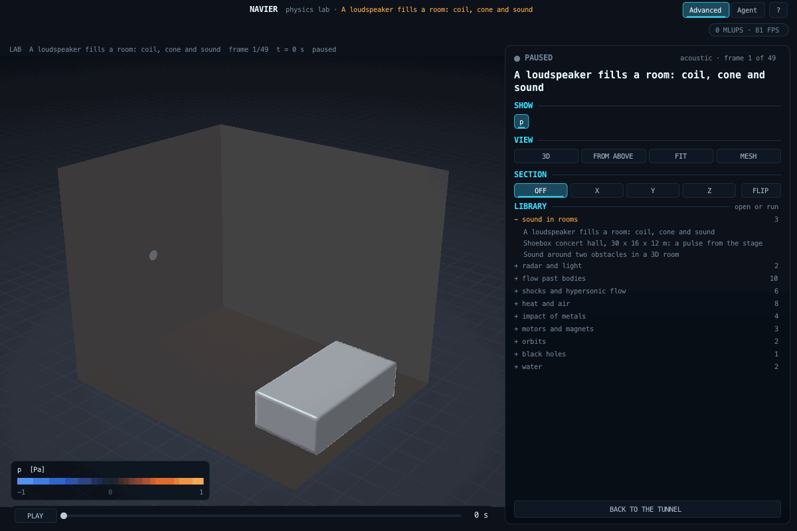

# Sound in rooms (`src/lab/acoustic`)

The acoustic pressure in a room or around objects: how a sound pulse travels, reflects from walls and seats, and
decays. Up: [docs/lab/README.md](README.md) · code: [acoustic.h](../../src/lab/acoustic/acoustic.h) · tests:
[tools/actest.c](../../tools/actest.c) · scenario: [examples/lab/shoebox_hall.json](../../examples/lab/shoebox_hall.json)

## Model

- **Equation:** the linear wave equation for the pressure, d2p/dt2 = c^2 lap(p): small amplitudes, still air, no
  wind, no temperature gradient, no air absorption.
- **Scheme:** the standard rectilinear finite-difference time-domain scheme on a node grid (seven-point Laplacian,
  leapfrog) at Courant number 1/sqrt(3), its stability limit. Ten nodes per wavelength keep the phase error along
  the axes below one per cent; it is largest along the diagonals. A 0.1 m grid is good to about 340 Hz.
- **Walls:** locally reacting, with a frequency-independent normalised impedance xi, from dp/dn = -(1 / (c xi))
  dp/dt written at the boundary node. A material is given by its normal-incidence absorption (xi = (1 + R) / (1 - R),
  R = sqrt(1 - alpha)) or its impedance. Obstacles are boxes with their own material. Frequency-dependent walls are
  not modelled yet.
- **Sources:** point sources injecting a pulse (the derivative of a Gaussian, so no net volume), calibrated to a
  stated pressure at 1 m in free field.
- **Receivers:** pressure histories at points; the run reports each receiver's peak and its T30 (Schroeder decay,
  -5 to -35 dB), when the record is long enough to decay by 35 dB.

## Verification (tools/actest.c, criteria written before the first run)

| Case | Against | Criterion | Result |
|---|---|---|---|
| A1 rigid room 1.0 x 0.7 x 0.45 m | modal frequencies c/2 sqrt(...) | 0.5 % | 0.01 % on (1,0,0), (0,1,0), (1,1,0), (2,0,0) |
| A2 free field | calibrated source, spherical spreading | 5 %, 3 % | 1.9 %, 0.8 % |
| A3 plane wave on an impedance wall | (xi - 1) / (xi + 1) | 0.02 | 0.0006 (xi 3), 0.0001 (xi 0.5) |
| A4 room 4 x 3 x 2.5 m, absorbing walls | Eyring with random-incidence absorption (Paris) | 15 % | +8.7 % |
| A5 baffled piston, radius 5.5 cm, dx 1 cm | exact on-axis transient rho c [v(t - r/c) - v(t - sqrt(r^2 + a^2)/c)] | peak 3 %, RMS 5 % of peak | +0.40 %, 0.73 % |
| A6 RS180-8 driven at 100 Hz, 1 V | the lumped driver's steady phasor solution | 0.1 % | 0.0000 % |
| A7 RS180-8 at 500 Hz, 2.83 V RMS, 1 m, half space | the maker's sensitivity, 87.1 dB SPL | 1 dB | 87.06 dB (-0.04 dB) |

A7 failed on its first run (84.05 dB): the test drove a sine of 2.83 V amplitude, while a sensitivity's 2.83 V is
RMS (1 W into 8 ohm). The drive was corrected to 2.83 sqrt(2) V peak; the criterion was not changed.

A3 failed on its first run because the test stopped before the reflected pulse reached the receiver; the boundary
itself was right (a rigid wall reflected 0.9994), the test was corrected, the criterion was not.

## A loudspeaker in the wall

A moving-coil driver described as its maker describes it, by its Thiele-Small parameters
([speaker.h](../../src/lab/acoustic/speaker.h)): the voice coil's circuit (Re, Le, back-EMF Bl v) and the cone's motion
(Mms, Rms, Cms, force Bl i), integrated by fourth-order Runge-Kutta at the acoustic time step. The cone's acceleration
drives a piston of area Sd in one wall: the boundary nodes inside the piston's disk carry the normal-velocity
condition dp/dn = -rho a (with the wall's own impedance outside the disk), so the electrical, mechanical and acoustic
parts form one chain. The coil's inductance is constant, the suspension linear, the cone rigid; the air load on the
cone is part of Mms as the sheet gives it, not fed back from the computed field.

[examples/lab/loudspeaker.json](../../examples/lab/loudspeaker.json): the RS180-8 in the wall of a 3 x 2.4 x 2.4 m room
with a sofa, a 400 Hz burst of four cycles at 2.83 V RMS; 640 000 nodes, 317 steps, under one second. The run record
gives the cone's largest excursion (0.05 mm) and the coil's peak current (0.6 A). Wall absorption is a demonstration
value, not a measured room.

## Scenario keys

`domain` = "acoustic", `title`, `room_m` [Lx, Ly, Lz], `dx_m`, `speed_of_sound_m_s`, `density_kg_m3`, `materials`
[{`name`, `absorption_normal` or `impedance_rho_c`}], `walls` {`all`, `x_low`, `x_high`, `y_low`, `y_high`, `z_low`,
`z_high`: a material name}, `boxes` [{`box_m` [x0, y0, z0, x1, y1, z1], `material`}], `sources` [{`position_m`,
`amplitude_pa_at_1m`, `pulse_width_s`, `delay_s`}], `receivers` [{`position_m`}], `speaker` {`face` (x_low ... z_high),
`centre_m` [u, v] in that face, `driver` {`re_ohm`, `le_h`, `bl_t_m`, `mms_kg`, `cms_m_n`, `sd_m2`, `rms_kg_s` or `fs_hz`
and `qms`, `source` (required)}, `drive` {`voltage_peak_v`, `frequency_hz`, `cycles`: a sine under a Hann window}},
`run` {`end_time_s`, `frames`, `volume` (default true: the whole pressure field), `slice_z_m`, `slice_y_m`, `slice_x_m`,
`wavefront_threshold_pa`, `wavefront_stride`}.
