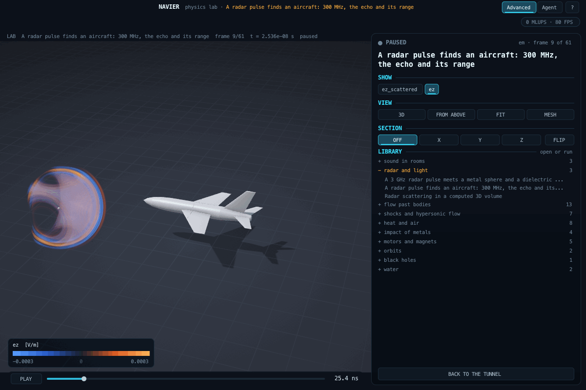

# Electromagnetic waves (`src/lab/em`)

Radar, antennas, microwave cavities, light scattering by particles: Maxwell's equations in the time domain.
Up: [docs/lab/README.md](README.md) · code: [em.h](../../src/lab/em/em.h) · tests: [tools/emtest.c](../../tools/emtest.c) ·
demonstration: [radar_pulse.json](../../examples/lab/radar_pulse.json)

## Model

- **Scheme:** Yee's staggered grid, leapfrog in time, Courant number 0.99 / sqrt(3); dielectrics and conductive
  losses per edge, from the volume average over the edge's own dual cell (sampled 4 x 4 x 4); perfect conductors
  where at least half of an edge's dual cell is metal.
- **Open boundaries:** convolutional perfectly matched layers (Roden and Gedney 2000), cubic grading, a
  complex-frequency shift for low frequencies; the memory variables are kept only where needed.
- **Plane waves:** total-field / scattered-field on a box, the incident wave computed on a 1D grid with the same step
  (it has exactly the 3D grid's dispersion along the axis, so the box does not leak: 9e-16 of the incident peak).
  Outside the box there is no incident wave, which is why a plane wave in the pictures ends at the box's edges.
- **Measurements:** point probes; the scattered power through a closed box at one frequency from running Fourier
  transforms, hence scattering cross-sections.
- **Not modelled:** dispersive materials (Drude, Lorentz, Debye), magnetic materials, anisotropy, conformal cells
  (surfaces are staircases: see E3), near-to-far-field transformation of the pattern.

## Verification (tools/emtest.c, criteria written before the first run)

| Case | Against | Criterion | Result |
|---|---|---|---|
| E1 plane wave through an empty domain | no scattered field | 1e-5 of the peak | 8.7e-16 (the first run leaked 55 per cent: a missing correction on two faces of the box) |
| E2 conducting box 0.20 x 0.15 x 0.10 m | TM110 at c / 2 sqrt(1/a^2 + 1/b^2) | 0.5 % | -0.016 % |
| E3 dielectric sphere, eps 4, ka = 1 | Mie series (Bohren and Huffman) | amended, see below | extrapolated -0.94 %; +11.7 % at 8 cells of radius |
| E5 a radar's echo from a conducting plane | image theory (a reversed dipole at the mirror point, from a second run) | 3 % of the echo's peak | 0.04 % (the first run stopped before the echo returned) |

E3 is on record as a failed criterion and an amendment. It asked for 5 per cent at 8 cells of radius; the first run
gave +18.5 per cent (edges took their material from the surrounding voxels, which moved the surface outwards), and
+11.7 per cent after the fix. A study at 4, 6, 8 and 12 cells showed the error falling as 0.77 / a, first-order
staircase convergence, whose extrapolation meets Mie to 0.9 per cent; the criterion was amended to that extrapolation
and to 15 per cent at 8 cells.

## A radar finds an aircraft

[radar_aircraft.json](../../examples/lab/radar_aircraft.json): a pulsed dipole antenna at 300 MHz (a VHF search radar's
band, vertical polarisation) 10 m from the nose of a 15 m swept-wing aircraft built from the shape library
([labshape.h](../../src/lab/labshape.h): a solid of revolution for the fuselage, NACA 0006 wings and tailplanes, a fin),
perfectly conducting, on 3.6 million cells of 10 cm (a tenth of the wavelength). The same scene without the aircraft is
stepped alongside, and their difference is the scattered field alone: the film shows the transmitted pulse, then the
wave the aircraft sends out, strongest forward (its electromagnetic shadow) and weaker back towards the radar. The
antenna listens to the scattered field behind a range gate (from the round trip to the nearest body), as a radar does;
the strongest echo returns 83 ns after transmission, a range of 12.5 m, at the nose and the swept leading edges behind
it. 4 minutes for both runs. Bodies enter the solver as conductors from their signed distance: edges more than a cell
from every surface are decided at once, the rest sampled over their dual cell as before.

Keys added: `bodies` (labshape.h; conductors), `radar` {`antenna_m`, `frequency_hz`, `bandwidth_hz`, `amplitude_v_m`},
`run.volume_stride`, `run.scattered` (default true with a radar and bodies).

## Scenario keys

`domain` = "em", `title`, `cells` [nx, ny, nz], `dx_m`, `pml_cells`, `plane_wave` {`tfsf_lo_cells`,
`tfsf_hi_cells`, `amplitude_v_m`, `frequency_hz`, `bandwidth_hz`}, `objects` [{`shape` sphere | box | cylinder_z,
`center_m`, `radius_m`, `box_m`, `z0_m`, `z1_m`, `conductor`, `relative_permittivity`, `conductivity_s_m`}],
`run` {`end_time_s`, `frames`, `slice_z_m`}.
