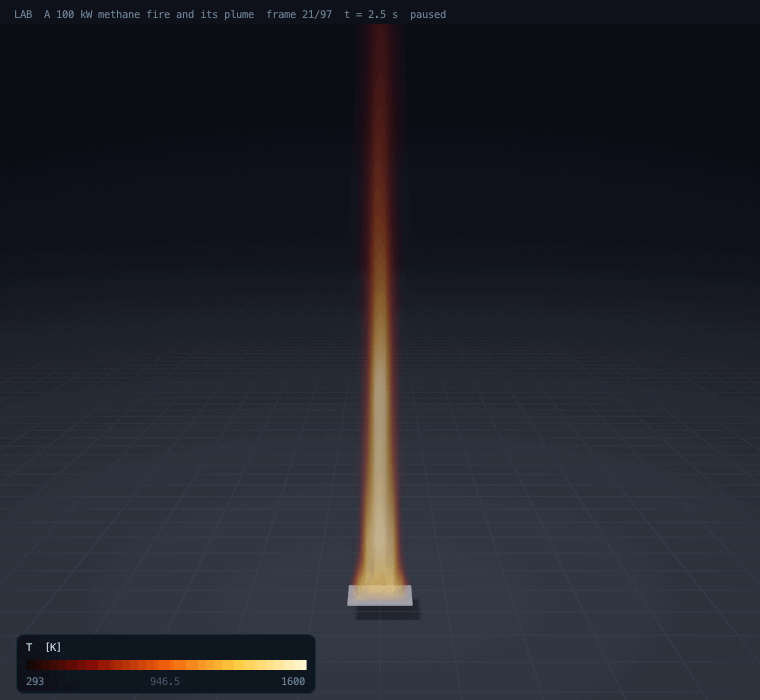

# Fire: a methane flame and its plume

Up: [the lab's documents](README.md) · code: [src/lab/fire/](../../src/lab/fire/fire.h), the Poisson solver
[src/lab/mg/](../../src/lab/mg/mg3d.h) · verification and validation: `tools/firetest.c` (`./build/firetest`, about
25 minutes: run it detached), `tools/poissontest.c` (`./build/poissontest`)



A methane fire of 100 kW burns on a square burner 0.3 m across in still air: the flame about a metre high (1.11 m in
the film's run, Heskestad's correlation gives 1.14), swaying and breaking up once the air around it has come to motion,
and its plume rising above it. 128 000 cells of 4 cm, 7 500 steps, 7 minutes. This is the problem fire-safety engineers solve with NIST's Fire Dynamics Simulator
(FDS), solved here the same way, and compared with the two empirical laws every fire model is checked against:
Heskestad's flame height and McCaffrey's plume.

## The model

| Part | What is computed | Reference |
|---|---|---|
| Flow | low-Mach Navier-Stokes: the gas ideal at the ambient pressure, sound filtered out; velocities on the cell faces | Rehm and Baum 1978; McGrattan et al., FDS Technical Reference |
| Heat into flow | the heat released (less the radiated fraction) and conduction set the velocity's divergence, div u = q (1 - chi_r) / (rho cp T) + div(k grad T) / (rho cp T) | FDS |
| Pressure | a projection with the density's inverse on the faces, div(grad p / rho) = (div u* - D) / dt, solved exactly by multigrid (FDS makes the coefficients constant by lagging a baroclinic term; the exact form is used here) | |
| Density, temperature | continuity for the density, the equation of state for the temperature | |
| Combustion | fuel, lumped products and air transported; fuel and air burn as fast as they mix, rho min(Y_F, Y_A / s) / tau, tau the shorter of the subgrid mixing time and the buoyant time sqrt(2 dx / g) | FDS's eddy dissipation concept, simplified |
| Heat capacities | each gas's own, varying with temperature (air, products, methane), from NIST-JANAF values | |
| Turbulence | large-eddy simulation, Smagorinsky's viscosity (0.2), turbulent Prandtl and Schmidt numbers 0.5 | |
| Transport | species and density by upwind-biased fluxes with a minmod limiter (bounded, conservative); momentum by central differences, upwind within two cells of an open face | |
| Boundaries | a free-slip floor with the burner (fuel at ambient temperature, ramped up over the first second); five open faces with the pressure perturbation zero and the normal velocity carried from the face inside; a sponge of four cells at the sides | |
| Time | Heun's two stages, CFL 0.4 and the diffusion limit | |

The multigrid (`src/lab/mg/mg3d.h`) solves Poisson's equation with constant or variable coefficients on the faces,
Dirichlet or Neumann per face, by V-cycles with red-black Gauss-Seidel smoothing: second order (errors fall by 3.99
when the grid halves), 11 V-cycles to a residual of 1e-10 on any grid, 128^3 cells in 0.25 s, a sevenfold jump in
the coefficient (a flame's density) in 13 cycles. Since the rooms ([rooms.md](rooms.md)) the V-cycle preconditions
conjugate gradients: 8 to 10 iterations on the same problems, and robust where walls and doorways make multigrid alone
stall. The same engine computes rooms, data halls and fires in rooms: walls, obstacles, vents, openings, fans and heat
sources are described in [rooms.md](rooms.md).

## Verification and validation

`tools/poissontest.c`, criteria written before the first run:

| Case | Against | Criterion | Result |
|---|---|---|---|
| Q1 mixed faces, manufactured solution | the solution; the error's fall from 32 to 64 cells | factor 3.5 to 4.5, below 1e-3 | 3.993, 1.8e-4 |
| Q2 V-cycles to a residual of 1e-10 | | 15 at 64 and 128 cells | 11 and 11 |
| Q3 every face Neumann (singular) | the mean-free solution | factor 3.5 to 4.5 | 3.991 |
| Q4 variable coefficient 1 + x / 2 | the solution | factor 3.5 to 4.5, 20 cycles | 3.997, 11 |
| Q5 a sevenfold jump | | 30 cycles | 13 |

`tools/firetest.c`: the 100 kW fire at 4 cm cells (D* / dx = 9.6), 38 s, averaged over the last 30 s. Criteria written
before the test's first run; the runs that led to the model as it is are recorded in the test's header.

| Case | Against | Criterion | Result |
|---|---|---|---|
| F1 the projection | the largest \|div u - D\| over the largest \|D\|, every step | 1e-6 | 9.7e-9 |
| F2 mass | the change of the gas in the box against what came in less what went out | 1e-6 of the box | 5.3e-13 |
| F3 heat | the averaged heat release against the burner's 100 kW | 3 % | +0.12 % |
| V1 flame height (99 % of the heat below it) | Heskestad, 1.14 m | 25 % | 1.04 m, -8.4 % |
| V2 centre line temperature rise, plume region | McCaffrey at 2.0 and 2.6 m | 25 % | +27.2 % +- 17 % (FAIL, recorded open) and +5.5 % +- 16 % |
| V3 centre line velocity | McCaffrey at 2.0 and 2.6 m | 25 % | +12.7 % +- 14 % and -16.2 % +- 14 % |

The uncertainties are the standard errors of the averages of five 6 s blocks: a puffing plume needs long averages
(two runs averaged over 12 s differed by 22 points at 2.0 m, and the test now averages 30 s).

Empirical correlations: Heskestad, L = 0.235 Q^(2/5) - 1.02 D (Q in kW, D the burner's equivalent diameter, 1.14 m
here); McCaffrey (1979), in the plume region z / Q^(2/5) > 0.2, the centre line's temperature rise 22.3 (z / Q^(2/5))^(-5/3)
K and velocity 1.1 Q^(1/5) (z / Q^(2/5))^(-1/3) m/s. They scatter by some 10 to 20 %; the criterion is 25 %.

What the runs taught: the fire first ran 25 to 30 % hot in its plume and short in its flame at 5 cm cells. Cells of 4
cm fixed the flame height (-5.6 %) but not the plume; a constant heat capacity (1100 J/(kg K), where hot products hold
1300 to 1500) was what made it too hot, and each gas's own heat capacity brought the plume 2.6 m up within 6 % and
2.0 m up to +15 to +37 % depending on the run, +27 % +- 17 % averaged over 30 s. The solver's
first open boundaries grew a wind through the box from nothing (with the pressure zero on every open face such a flow
costs nothing) and blew up at their faces; the normal velocity carried from inside, a sponge at the sides and upwind
advection next to open faces cured it.

Not modelled: radiation as transport (its fraction is removed where heat is released), soot, extinction, the burner's
own heat, the pressure's rise in a closed room (the box is open). Near the burner the averaged centre line runs hotter
than McCaffrey's continuous flame (about 1250 K against his 1100), which the coarse grid's flame sheet and the missing
radiation transport both push up.

## Open: the plume after the rooms engine (2026-09-27)

When the solver was generalised for rooms (walls, obstacles, vents, a pressure solve by conjugate gradients preconditioned
with the multigrid), the test was rerun. The projection, the mass and the heat stayed exact (1e-10, 6e-13, +0.22 %), but
the plume came out cooler, slower and its flame shorter, and V3 now fails. Two experiments followed, each changing one
thing back:

| Run (4 cm, 38 s, 30 s averaged) | Flame height | Rise at 2.0 m | Velocity at 2.0 m | Velocity at 2.6 m |
|---|---|---|---|---|
| before the change (the table above) | -8.4 % | +27.2 % +- 17 % | +12.7 % | -16.2 % |
| after the change | -16.4 % | -17.6 % +- 9 % | -20.2 % | -38.4 % |
| after, with the old step limit | the same to every digit: the limit never bound | | | |
| after, with the old upwind band next to open faces | -18.7 % | -28.2 % +- 13 % | -30.4 % | -45.3 % |
| the old solver with the new pressure solve | -20.1 % | -40.2 % +- 30 % | -56.5 % | -63.8 % |

Every run meets the discrete projection criterion. This does not rule out a pressure-coupling or boundary-condition
error. The three runs before the change all came out
hot and the three after it all cold, and the block errors of a 30 s average (as large as 30 % within one run) say the
average itself is far from converged. Which of the two, a real shift or an unconverged average, is decided by averaging
much longer (two minutes of fire or more, an overnight run: `FIRE_T_END=128 ./build/firetest`, queued in
[validation/QUEUE.md](../../validation/QUEUE.md)); until then V2 and V3 are open ([GOALS.md](../../GOALS.md) G13).

The [full rerun on 2026-10-03](../../validation/lab/fire-2026-10-03.log) reproduces the post-change values above:
F1/F2/F3/V1 pass, V2 at 2.6 m is -27.5 percent and V3 is -20.2/-38.4 percent, outside the unchanged 25 percent
criterion at the upper height. The test exits 1; V2 remains separately recorded open. Its historical generic V2
message describes the earlier hot plume, so use the height-specific numbers printed above it. The run took 3178 s
on the shared laptop while other checks ran. Fire solver physics and validation thresholds were not changed in this wave.

## Running it

```bash
make lab
./build/poissontest
nohup ./build/firetest > /tmp/firetest.log &                    # about 25 minutes
./build/labrun examples/lab/methane_fire.json /tmp/fire.lab     # 12 s of fire at 4 cm
```

Keys ([methane_fire.json](../../examples/lab/methane_fire.json)): `fuel` {`molar_mass_kg_mol`,
`heat_of_combustion_j_kg`, `air_per_fuel_kg`, `radiative_fraction`, `source`}, `burner` {`box_m` [x0, y0, x1, y1],
`heat_release_rate_w`, `ramp_s`}, `box_m`, `cell_m`, `ambient_temperature_k`, `run` {`end_s`, `frames`,
`average_from_s`}. The result is a block `gas` (fields `T` in K, `hrr` in W/m^3, `speed`) drawn in the fire palette, and
the burner. The run record gives the averaged heat release and the flame height against Heskestad's.
