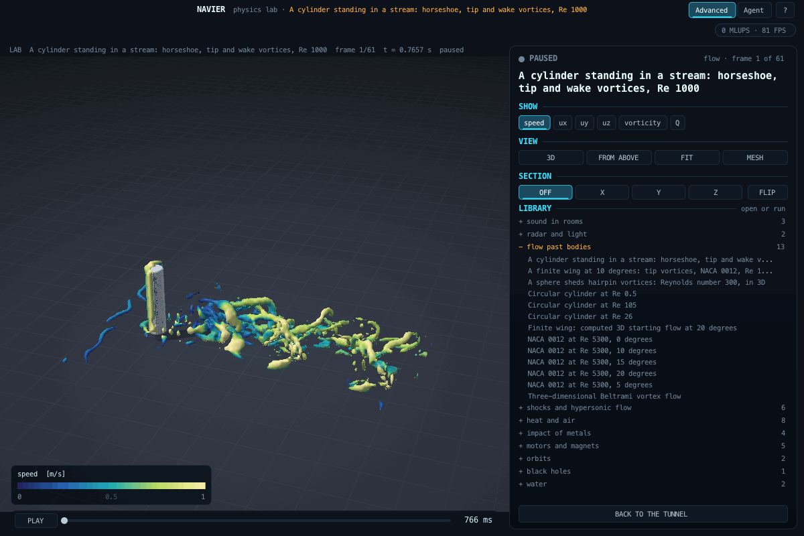

# Flow past bodies: cylinders and aerofoils against the photographs

Up: [the lab](README.md) · code: `src/lab/flow/` · test: `tools/flowtest.c` · flag:
[flow-cylinder-shedding](../../flags/flow-cylinder-shedding/FLAG.md)

## What it is

Incompressible flow past a two-dimensional body, on the lattice Boltzmann solver of the app (`src/lbm.c`: D3Q19,
recursive regularised collision, curved walls by interpolated bounce-back at the exact crossing of every link). The
span is four cells with periodic ends, so nothing varies along it and the flow is two-dimensional. On top of the solver,
the laboratory's own instruments: the forces on the body at every step, the shedding frequency from the lift, the length
of a steady wake, and dye released at points upstream and carried with the flow (streaklines), which is how the
classic photographs were made.

Two tunnels:

- **open** (the default): side walls held at the free stream (far field), uniform inflow, an absorbing layer at each
  end. Used for the photographs, where the body stood in a large tank.
- **channel** (`"channel": true`): no-slip floor and ceiling and a parabolic inflow whose mean is the free stream. Used
  for the Schaefer-Turek benchmark, which is defined in a channel.

## Verification (`tools/flowtest.c`, in `make test-fast`)

Against the benchmark of Schaefer and Turek (1996), a cylinder in a channel whose reference values are the intervals of
the best solutions of the groups that took part. Criteria written before the first run:

| Case | Quantity | Reference | Criterion |
|---|---|---|---|
| F1, Re 20, steady | drag coefficient | 5.57 to 5.59 | within 3 % of 5.58 |
| | recirculation length | 0.842 to 0.852 D | within 5 % of 0.847 D |
| F2, Re 100, periodic | Strouhal number | 0.295 to 0.305 | within 3 % of 0.300 |
| | largest drag coefficient | 3.22 to 3.24 | within 3 % of 3.23 |
| | largest lift coefficient | 0.99 to 1.01 | within 10 % of 1.00 |

Results of 2026-09-26 (D = 20 cells): F1 drag 5.689 (+2.0 %), recirculation length 0.845 D, lift 0.0118 (recorded);
F2 Strouhal number 0.3007 (+0.2 %), largest drag 3.318 (+2.7 %), largest lift 0.943 (-5.7 %). All pass.

### What the first runs found (recorded, criteria unchanged)

1. **First run, 2026-09-25:** F1 failed with drag 5.24 (-6.1 %) and a recirculation length of 0.898 D; F2 passed. The drag
   was still drifting 0.7 % per convective time: the channel started from rest, and its parabola takes a viscous time
   H^2 / nu (hundreds of D / U at Re 20) to form across it. The channel now starts from its Poiseuille flow.
2. **Second run:** F1 drag 5.39 (-3.4 %), F2 largest lift 0.893 (-10.7 %). Neither the collision (BGK gave the same
   drag), nor the Mach number (half the lattice velocity gave 5.31), nor the resolution (30 cells gave 5.37) moved it
   toward the reference, so the error was not discretisation. The cause was a defect in the lattice itself
   (`src/lbm.c`): wall links that cross the seam of a periodic span were never built. On a four-cell span, the links
   leaving the first and last layers diagonally across the seam carried no bounce-back and were missing from the
   force. The links are now built from the solid cell's image in the halo, so the fluid node on the other side
   receives its bounce-back and the momentum is counted. The same fix applies to the app's quasi-two-dimensional
   scenes and to `src/fem/flow.c` whenever the span is periodic. The flow flag's reference predictions were made
   before the fix and are rerun.

## Against the photographs (G8)

The scenarios `examples/lab/cylinder_re0p5.json`, `cylinder_re26.json`, `cylinder_re105.json` and
`naca0012_re5300_aoa00.json` to `aoa20` reproduce the set-ups of the photographs in Van Dyke's *An Album of Fluid
Motion* (1982): a cylinder at Re below 1 (creeping flow, fore-aft symmetric streamlines), at 26 (a pair of standing
eddies) and at 105 (the Karman street), and a NACA 0012 aerofoil at Re 5300 from 0 to 20 degrees (the separation
creeping forward from the trailing edge until the aerofoil stalls). The photographs are copyrighted and are not in the
repository; what is compared is what they show and measure.

## Scenario keys

| Key | Meaning |
|---|---|
| `reynolds` | Re = U D / nu, the only number the flow depends on |
| `shape` | `cylinder` or `naca`, with `naca` (four digits) and `aoa_deg` |
| `body_cells` | cells across the body (the diameter, or the chord) |
| `lattice_velocity` | free-stream speed in lattice units, 0.05 to 0.1 |
| `fluid_kinematic_viscosity_m2_s`, `body_size_m` | units for the pictures only |
| `tunnel.width_d`, `length_d`, `upstream_d` | the tunnel, in body sizes |
| `tunnel.channel`, `tunnel.body_y_d` | a no-slip channel with parabolic inflow; the body's height above the middle |
| `dye_rake.x_d`, `y_from_d`, `y_to_d`, `count` | release points of the dye, in body sizes from the body's centre |
| `dye_every_steps` | how often each point releases a particle |
| `run.convective_times`, `frames`, `film_from_convective_time` | the length of the run in D / U and the film |

## Limits

Two-dimensional: above Re of about 190 the real wake of a cylinder becomes three-dimensional, and this domain does not
represent that. The lattice is uniform (no refinement), so thin boundary layers at high Re need many cells.

## Three-dimensional periodic flow

`examples/lab/flow_volume.json` uses `model: periodic3d`: a double-precision D3Q19 BGK lattice
with periodic boundaries in all three directions. It is an independently tested 3D foundation, not yet
a replacement for the tunnel's body boundaries. The initial ABC Beltrami velocity varies in all axes;
its nonlinear acceleration is a pressure gradient, and its exact incompressible decay is exponential.

Specify `grid.cells_per_axis` (4..128), `grid.cell_m`, `time_step_s`, sourced
`fluid.kinematic_viscosity_m2_s`, `velocity_amplitude_m_s`, `boundary: periodic`,
`initial_field: abc`, and `run.end_time_s`/`frames`. Physical-to-lattice conversion is
`u_lattice = u * dt / dx`, `nu_lattice = nu * dt / dx^2`. Velocities and curl return to SI
in the full-volume output. The run refuses an initial ABC amplitude above .04 lattice units.

`tools/flow3dtest.c` preregisters uniform-state preservation and three-dimensional analytic decay.
Measured velocity L2 errors: 0.0146938521 at 16 cubed and 0.00368151554 at 32 cubed;
mass drift below 3e-14. These checks do not verify walls, finite wings, turbulence or external aerodynamics.

### Finite wing in a periodic volume

The same 3D core now supports stationary voxel bodies by halfway bounce-back and constant body acceleration
in its C interface. The added Poiseuille check preregisters 2% L2 velocity error and 1e-12 mass drift; measured
values were 0.7120% and 1.67e-13. It verifies the wall/forcing implementation, not wing-force accuracy.

`examples/lab/wing_volume.json` initializes uniform flow around a finite-span symmetric NACA section at 20 degrees.
Its `body` declares `finite_naca00`, `center_m`, `chord_m`, `span_m`, `angle_deg`, `thickness_ratio`.
This case is a coarse, transient periodic array of wings, not an isolated aircraft or a validated stall prediction.
A separate dimensionality guard detects nonzero spanwise velocity around a finite wing.
The 64 cubed demonstration took 600 steps and 25.79 s, producing 41 native volume frames.

## Bodies in a stream in 3D, on the GPU

**3D first (the owner, 2026-09-26).** A 3D solver is not enough: the first cylinder here was set up with a short
periodic span, a disturbance uniform along it and Reynolds number 200, and so came out as a 2D street stacked in depth,
which no real wake does. Scenarios are now designed so that 3D physics can happen: finite bodies with free ends or a
wall root, no periodic span faking an infinite body, seeded random disturbances in the start and at the inlet (as in any
real stream), Reynolds numbers where the flow is three-dimensional by nature, with large-eddy simulation.

A second 3D flow engine, built to carry bodies in a stream: [lbm3d.h](../../src/lab/flow/lbm3d.h) (CPU, double
precision, threaded) and [lbm3d_metal.h](../../src/lab/flow/lbm3d_metal.h) (the same algorithm on the GPU through Metal,
single precision with populations stored shifted by their weights, as in FluidX3D's published method). D3Q19 with a
two-relaxation-time collision at Ginzburg's Lambda = 3/16 (bounce-back walls exactly halfway), or a regularised one for
large-eddy simulation; Smagorinsky eddy viscosity; an inlet, an outlet and absorbing sponges before and after; slip or
periodic sides; curved bodies by Bouzidi's interpolated bounce-back with the wall's position found on each link from the
bodies' signed distance ([labshape.h](../../src/lab/labshape.h): spheres, cylinders, boxes, NACA wings); forces by
momentum exchange. On the laptop's M2 the GPU engine runs 370 to 440 million cell updates a second, the CPU one 21 to 26.

| Check (`tools/lbm3dtest.c`) | Against | Criterion | CPU | GPU |
|---|---|---|---|---|
| L1 Poiseuille flow, walls off the lattice | the parabola | RMS 1 % of the peak | 0.199 % | 0.200 % |
| L2 sphere at Re 100, two grids (16 and 24 cells) | 1.087 (Schiller-Naumann; Johnson and Patel 1999), Richardson extrapolation | 4 % (amended) | | +2.93 % |
| L4 the same small sphere on both engines | each other | 0.5 % | 1.98236 | 1.98235 |
| L5 a uniform stream through the pressure outlet, forward and reversed (entering through the outlet) | the stream, every cell | 1 % | 2e-12 % | 0.006 % |

L1 found three defects in the engine on its first runs (a regularised collision losing an eighth of the force, wall
links lost on periodic seams, the velocity read with the step's force in it). L2's first run gave +6.12 % on one grid of
16 cells in a 6 D box: exploratory runs showed about 2 % from the side walls and 2.5 % from the grid, and L2 was amended,
openly and after those runs, to a two-grid extrapolation within 4 %. L4 shows that single precision with shifted
populations loses nothing that matters here: the drag agrees with double precision to 5e-6. L5 checks the pressure
outlet (`"outlet": "pressure"`: the equilibrium at the reference density and the outlet's own velocity), added for
pulsing flows whose vortices and backflow leave through it ([fsi.md](fsi.md), the heart valve).

Examples: [cylinder_mounted_3d.json](../../examples/lab/cylinder_mounted_3d.json) (a cylinder 4 diameters tall standing on
a no-slip floor, Re 1000, LES with the regularised collision, 2.9 million cells, 2 minutes on the GPU; drag coefficient
1.04 on its frontal area, in the range measured for short standing cylinders; no validation claimed yet), [sphere_wake_3d.json](../../examples/lab/sphere_wake_3d.json) (Re 300; drag 0.77 against Johnson and
Patel's 0.656 on 16 cells to the diameter: the grid is too coarse for this Reynolds number, and a finer run is queued),
[wing_3d_10.json](../../examples/lab/wing_3d_10.json) (NACA 0012, aspect ratio 3, 10 degrees, Re 100 000, large-eddy
simulation on 24 cells to the chord: stable and quick, but its lift 0.20 and drag 0.17 are those of a massively separated
coarse simulation, not of a real wing; it shows the tip vortices, it is not a validation).

A perfectly smooth start keeps a symmetric wake symmetric far longer than any real flow: `disturbance` adds a seeded
random 3D field to the start (`noise_fraction`) and a random inlet disturbance new every step (`inlet_noise_fraction`),
the same on both engines. The floor can be a no-slip wall (`"floor": "wall"`), which stays out of the measured force.
The force leaves out the uniform ambient pressure (it cancels on a closed body and is false on one standing on the
floor). No vortex cores are drawn in the sponges and on the inlet and outlet planes, which are boundary zones.

Scenario keys (`"model": "lbm3d"`): `fluid` {`kinematic_viscosity_m2_s`, `density_kg_m3`, `source`}, `stream`
{`speed_m_s`}, `box_m`, `cell_m`, `lattice_speed` (default 0.05), `sides` or `sides_y` / `sides_z` (`slip` or
`periodic`), `bodies` (labshape.h), `les` {`smagorinsky`}, `collision` (`trt` or `regularized`), `sponge_cells`,
`sponge_viscosity_lattice`, `engine` (`gpu` by default, or `cpu`), `floor` (`wall` or none), `disturbance`
{`noise_fraction`, `inlet_noise_fraction`, `lateral_fraction`, `until_s`},
`reference` {`area_m2`, `length_m`}, `run` {`end_s`, `frames`, `output_stride`, `output_from_s`, `average_from_s`,
`iso_level_q_per_s2`}. The result holds the flow's speed, velocity, vorticity and Q on the grid, and the bodies'
surface; the app draws the vortex cores (Q above its level) as surfaces coloured by the chosen field.

