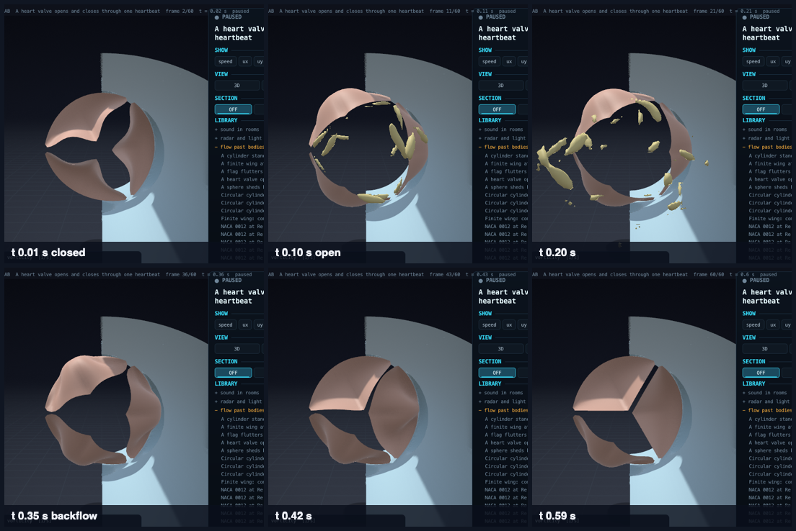

# Fluid-structure interaction: a flag flutters, a heart valve opens and closes

Up: [the lab's documents](README.md) · code: [src/lab/fsi/](../../src/lab/fsi/fsi.h), the immersed boundary in
[lbm3d_metal.m](../../src/lab/flow/lbm3d_metal.m) · verification: `tools/fsitest.c` (`./build/fsitest`, in
`make test-lab`)


A flag of cloth, 0.6 m by 0.4 m and 60 g/m2, is held along a pole in a wind of 6 m/s. The wind and the cloth are
solved together: the air pushes the cloth, the cloth moves the air. The flag ripples and flutters at 6.2 Hz, its
trailing edge swinging 0.26 m from side to side, a Strouhal number f A / U of 0.27 (flapping flags and swimming
animals sit near 0.2 to 0.4); vortices peel off the pole and the flag's edges. 1.3 million cells, 24 000 steps, 4.7
minutes on the development laptop's GPU.

## A heart valve through one heartbeat


Three leaflets shaped like the aortic valve's sit in a vessel of 25 mm with three sinuses behind them (the bulges of
Valsalva). Blood is pushed through for one heartbeat: the leaflets swing open (they are open in the film's frame at 60 ms), a starting vortex
ring leaves them and the jet breaks into turbulence; as the ejection slows, vortices in the sinuses and a short
backflow swing the leaflets back, and they close into the Y-shaped seal, held apart by their contact, for the rest of
the beat. The film shows the vortex cores (surfaces of the Q criterion) coloured by the blood's axial velocity: orange
where it moves downstream, blue where it flows back at closure. Seen end-on from downstream:



The first vessel was a straight tube: the valve opened, and after ejection its leaflets stayed pressed to the wall and
never closed. With the sinuses they close. That is the sinuses' known role (Leonardo da Vinci drew the vortices in
them; Bellhouse and Bellhouse measured their effect on closure in 1968), found here without being put in. The
leaflets' free edges move from 0.45 of the vessel's radius (closed) to 0.81 (open) and back to 0.53 at the end of the
beat. 640 000 cells of 0.6 mm, 60 000 steps, 9 minutes.

Blood: 1060 kg/m3, 3.5 mPa s, Newtonian (Ku 1997). Demonstration values, stated in the scenario: the leaflets as an
isotropic neo-Hookean sheet of 0.5 MPa and 0.5 mm (real leaflets are layered, anisotropic and stiffen with stretch),
the root's proportions, and the inflow waveform (peak 1.2 m/s, ejection 0.33 s, a closing backflow of about 3.5 % of
the stroke; the aortic pressure that shuts a real valve is represented only by that backflow, since the inflow is
prescribed). What made it run: the leaflet mesh follows the leaflet's height column by column (equal rows made
slivers at the commissures), the sheet's stable step comes from its shortest altitude, the flow step resolves the
leaflets' stretch waves (4 sheet steps per flow step), a pressure outlet takes the backflow (lbm3dtest L5), and the
regularised collision takes the immersed boundary's force correctly (fsitest F1R).

## The model

| Part | What is computed | Reference |
|---|---|---|
| Air | the 3D flow engine on the GPU ([flow.md](flow.md)): D3Q19, regularised collision, Smagorinsky LES, the pole by interpolated bounce-back | |
| Cloth | the thin-sheet solver ([sheet.md](sheet.md)): neo-Hookean membrane, plate bending, its first edge held | |
| Coupling | the immersed boundary: the cloth's nodes are points the air must follow, by direct forcing iterated four times, spread and interpolated with the three-point kernel, entering the collision by Guo's forcing split for TRT | Peskin 2002; Uhlmann 2005; Roma, Peskin and Berger 1999; Guo, Zheng and Shi 2002 |
| Light structures | each point's force is solved with its mass, so that air and cloth end the step at one velocity (a local implicit coupling); without it, a sheet lighter than the air it moves is unstable | |
| Stiff structures | a predictor: the cloth is first stepped under the force of the step before, and the air is asked to follow that predicted motion | |

The flow step must follow the cloth's stretch waves: with a woven-nylon stretch stiffness (E h about 30 kN/m) the cloth
took 17 of its own steps per flow step and the coupling went unstable within 70 steps, predictor or not. The flag's
cloth has E h = 600 N/m, the soft small-strain range of a woven cloth (its crimp), 4 cloth steps per flow step; under
this wind it stretches less than 0.2 %. A stiffer cloth needs a finer flow step (a smaller lattice speed or cell).
Demonstration values, stated in the scenario: the cloth's stiffness and bending, taken as isotropic. Not modelled: the
cloth touching itself, its weave (different stiffness along warp, weft and bias), turbulence finer than the 15 mm
cells.

## Verification (`tools/fsitest.c`)

Criteria written on 2026-09-26 before the first run; the first run is recorded in the source.

| Case | Against | Criterion | Result |
|---|---|---|---|
| F1 Couette flow made by an immersed plane moving over a no-slip floor | the linear profile; the fluid at the plane | 2 % | +1.31 %; -0.01 % |
| F1R the same with the regularised collision at relaxation time 0.55 | the same | 2 % | +1.55 %; -0.001 % |
| F2 an immersed sphere of radius 12 cells, held in a periodic array, the fluid driven by a body force | Hasimoto's (1959) drag of a periodic array of spheres in Stokes flow | 5 % | -3.79 % |
| F3 a free sheet (the sheet solver, two-way coupled) coasting through still fluid | the total momentum of fluid and sheet | 1 % | +0.002 % |

The regularised collision first took the force wrongly: the fluid received j + F (3/2 - omega/2) instead of j + F
(the non-equilibrium part must carry half the forcing term before it is regularised), half the force where the
viscosity is near zero. It was found on the heart valve (a jet outran the leaflets); F1 ran only TRT, and F1R now runs
the regularised collision where the two forms differ. The flag's first film was made before the fix (9.7 Hz, 0.12 m, Strouhal 0.19, with half the force) and was remade.
F3's first run went unstable: the sheet, one cell of fluid in mass per node, took the whole direct-forcing force
explicitly (the added-mass instability of partitioned coupling); the mass-aware forcing fixed it. F2's shortfall is
the immersed boundary's known thickening of a body by a fraction of a cell (the hydrodynamic radius is larger than the
points' radius).

## Running it

```bash
make lab
./build/fsitest                                                # about 8 minutes, most of it F2
./build/labrun examples/lab/flag_3d.json /tmp/flag.lab         # 24 000 steps, 3 s of wind, 4.7 minutes, 240 MB
```

```bash
./build/labrun examples/lab/heart_valve.json /tmp/valve.lab    # 60 000 steps, 0.6 s of a heartbeat, 9 minutes, 1.1 GB
```

A sheet enters any 3D flow scenario ([flag_3d.json](../../examples/lab/flag_3d.json)) as `sheet` {`material`
{`shear_modulus_pa`, `density_kg_m3`, `viscosity_pa_s`, `source`}, `thickness_m`, `cell_m`, `size_m` [a, b],
`corner_m`, `along`, `across` (the rectangle's two directions), `pinned` (`first_edge` or `none`), `gravity_m_s2`,
`bending_scale`, `look`, `iterations`, `relaxation`, `self_contact_m`}; or, for a valve, `valve` {`centre_m`,
`radius_m`, `height_m` (commissures to the lowest point of the attachment), `belly_m`, `gap_m` (between the closed
leaflets' free edges), `nodes_around`} in place of the rectangle. The flow takes `stream.waveform` {`period_s`,
`points` [[t, u], ...]}, `outlet: "pressure"`, bodies `pipe` and `aortic_root` {`radius_m`, `sinus_radius_m`,
`sinus_offset_m`, `sinus_x_m`, `sinus_phase_deg`}, and `bodies_cutaway` [nx, ny, nz] (draw the bodies' far half). The run record adds the flapping of the trailing edge's middle:
`sheet_flap_frequency_hz`, `sheet_flap_amplitude_m` (peak to peak), `sheet_strouhal`, and `sheet_substeps`.
`FSI_DEBUG=1` prints each step's largest node speed and force and the sheet's energies.
