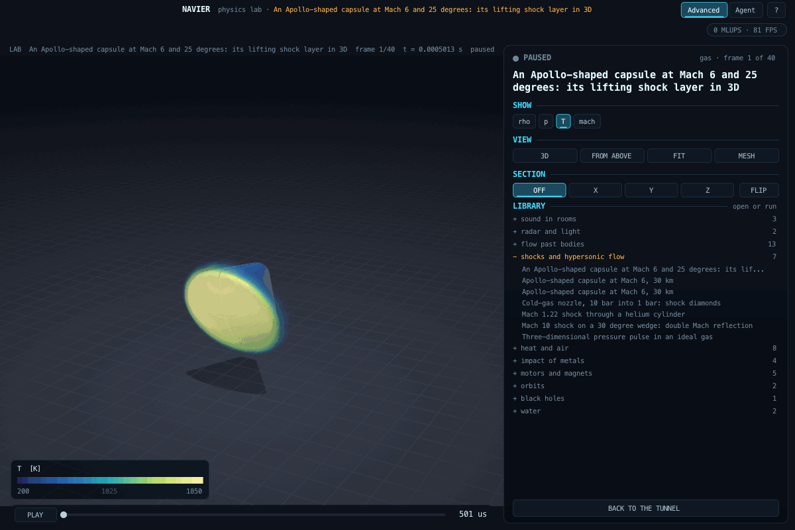

# Compressible flow on an adaptive mesh (`src/lab/gas`)

Supersonic and hypersonic flow, shock waves, blast waves, nozzles and shock-driven mixing of two gases, in two
dimensions, planar or axisymmetric. Up: [docs/lab/README.md](README.md) · code: [gas.h](../../src/lab/gas/gas.h) ·
tests: [tools/gastest.c](../../tools/gastest.c)

## Model

- **Equations:** Euler equations of an ideal gas; a second gas with its own ratio of specific heats is carried by
  G = 1 / (gamma - 1) in the quasi-conservative form of Johnsen and Colonius (2006), which keeps the pressure
  uniform across a material interface.
- **Not modelled:** viscosity and heat conduction (no boundary layers, no heating of a wall), real-gas effects
  (dissociation above about 2500 K in air), radiation. A Mach 6 capsule here is a perfect-gas capsule.
- **Scheme:** finite volume; primitive variables reconstructed linearly with the monotonised-central limiter; HLLC
  flux, switched to HLLE on faces lying along a strong shock (Quirk's carbuncle cure); SSP Runge-Kutta 2; one time
  step on all levels, CFL 0.4.
- **Adaptive mesh:** a quadtree of 16 x 16 cell blocks, refinement ratio 2, 2:1 balance with diagonal neighbours.
  A block is refined where the Loehner indicator of density or pressure exceeds 0.8 (as in FLASH), and next to a
  body, and coarsened where it falls below 0.2. A scenario may also require a real jump between neighbouring cells
  (`refine_jump`), which keeps smooth regions coarse. Coarse faces next to finer cells take the sum of the fine
  fluxes, and prolongation keeps the r-weighted total in axisymmetric runs, so mass, momentum and energy are
  conserved to round-off (G3, G7).
- **Bodies (cut cells):** circles and polygons as level sets. Each cell cut by the surface gets its fluid polygon
  from the level set at its corners: the fluid volume (r-weighted in axisymmetric runs), the open part of each of
  its faces, and the wall's area vector by closure, so a uniform state stays exactly uniform. Fluxes pass only
  through the open face areas; the wall carries the pressure of the exact reflecting Riemann problem, on the true
  surface. A cell with less than half a volume is merged with one large neighbour away from the wall (Quirk 1994),
  also across block edges: each block sees three ghost layers of geometry and of the provisional state, so the
  blocks on both sides of an edge form the same groups. Covered cells hold mirrored states (an image point across
  the surface) for the reconstruction next to the wall.

## Verification (tools/gastest.c, criteria written before the first run)

| Case | Against | Criterion | Result |
|---|---|---|---|
| G1 Sod shock tube, uniform | exact Riemann solution | L1(rho) < 0.005 at 512 cells, order >= 0.6 | 0.00115, ratio 3.39 |
| G2 Sod with 3 levels of AMR | the uniform 512 grid | within 1.3 times its error, fewer cells | 1.20 times, 17 % of the cells (criterion amended, see the test) |
| G3 conservation across levels | exact | < 1e-12 | 7e-15 mass, 2e-14 energy |
| G4 uniform stream, axisymmetric | exact | < 1e-12 | 3e-16 |
| G5 Mach 2.5, 15 degree ramp | theta-beta-Mach, Rankine-Hugoniot | 1 degree, 2 % | 0.02 degrees, -0.00 % |
| G6 Mach 2, 20 degree cone | Taylor-Maccoll | 1 degree, 3 % | 0.01 degrees, -0.07 % |
| G7 blast in a box with a body | exact | < 1e-10 | 1e-12 planar, 3e-14 axisymmetric |
| G8 Mach 3 past a cylinder | normal-shock entropy, stagnation temperature | 5 %, 2 % at the wall to 90 degrees (amended, see the test) | 2.1 %, 0.07 % |

History worth keeping, because each step was a real defect found by looking at a result:

1. The first body boundary (ghost cells only) let gas through the wall at O(dx). On the Mach 6 capsule the dead
   air behind the base heated steadily to 3600 K, twice the stagnation temperature. G7 exists because of that.
2. The conservative staircase wall that replaced it generated entropy at every step of a convex surface: the gas
   behind the capsule's shoulder came out eight times too hot. G8 exists because of that.
3. Cut cells with flux redistribution drove a sliver cell at a corner to negative density; state redistribution
   with overlapping neighbourhoods failed in the first step of an impulsive start; merging confined to one block
   failed where the slivers lay in a block's last column. Merging across block edges is what remains.

## Measured against the real world

- Flag [gas-sphere-bowshock](../../flags/gas-sphere-bowshock/FLAG.md): the bow shock ahead of a sphere at Mach 1.17
  to 1.81, from interferograms of a controlled experiment. The practice case (Mach 1.30) at level 2: standoff 0.983
  against 0.98 measured.

## Scenario keys

`domain` = "gas", `title`, `geometry` (planar, axisymmetric), `gas_constant_j_kgk`, `grid` {`x0_m`, `y0_m`,
`length_m`, `root_blocks` [nx, ny], `max_level`, `body_level`, `regrid_every`, `refine_above`, `coarsen_below`,
`refine_jump`}, `boundaries` {`x_low`, `x_high`, `y_low`, `y_high`: inflow, outflow, wall, axis}, `freestream`
{`mach`, `pressure_pa`, `temperature_k`, `gamma`, `angle_deg`}, `initial` (a state), `regions` [{`box_m` or
`circle_m`, `state`}], `bodies` [{`circle_m` [cx, cy, r]} or {`polygon_m` [[x, y], ...]}], `run` {`end_time_s`,
`frames`, `fields`, `cfl`}. A state is a free stream or {`density_kg_m3`, `velocity_m_s` [u, v], `pressure_pa`,
`gamma`}.

## Three-dimensional Euler volume foundation

`examples/lab/gas_volume.json` uses `model: euler3d`, a double-precision conservative
3D ideal-gas solver with MC-limited MUSCL reconstruction, SSP-RK2 time integration and HLLC fluxes.
Nonphysical reconstructed or star states fall back locally to the cell value or Rusanov flux; a
nonphysical completed update fails rather than clamping conserved quantities. Boundaries are periodic.
This is not yet the AMR/cut-cell hypersonic capsule solver in three dimensions.

Required inputs: `grid.cells_per_axis` (4..128), `grid.cell_m`, `boundary: periodic`,
sourced `initial` containing `density_kg_m3`, `pressure_pa`, `gamma`, `pulse_pressure_pa`,
`pulse_width_m`, `center_m`, and `run.end_time_s`/`frames`. Initialization is an isentropic
Gaussian pressure perturbation with zero velocity. The complete volume stores pressure, its
perturbation from the initial ambient pressure, density and speed in SI.

`tools/gas3dtest.c` records all criteria and failed intermediate methods. Final diagonal-wave L2 errors
were 0.00995642706 at 24 cubed and 0.00299207801 at 48 cubed. Central Sod density L1 errors
were 0.0242382451 at 32 cubed and 0.0164828035 at 64 cubed, passing the unchanged refinement
criterion. Its exact Riemann reference is reused from the existing gas verification suite.
Neither these checks nor the pulse illustration validate hypersonic flow around a body.

## Bodies in 3D: the capsule at its angle of attack

A compressible solver for bodies in three dimensions, [euler3d.h](../../src/lab/gas/euler3d.h): MUSCL-HLLC on a
Cartesian grid, switched to HLL within two cells of a strong pressure jump (HLLC's instability behind a bow shock), SSP
Runge-Kutta, faces as inflow, outflow or symmetry, bodies by ghost cells reflecting the gas at the image of each through
the surface (Tseng and Ferziger 2003), threaded. Bodies come from the shared library ([labshape.h](../../src/lab/labshape.h)),
which now takes any profile turned about an axis and pitched (`revolved`).

| Check (`tools/euler3dtest.c`) | Against | Criterion | Result |
|---|---|---|---|
| E1 Sod's tube along x | the exact Riemann solution | mean density error 1.5 % | 0.25 % |
| E2 Mach 3 onto a sphere, 40 cells to the radius | stagnation pressure, Rayleigh's pitot formula | 2 % | +1.59 % |
| E3 the same | standoff, a published inviscid Euler result (0.2178 R) | 10 % (reference amended) | +4.52 % |

The first runs found an outflow plane cutting the subsonic shock layer (the test's box), and HLLC's noise along the
stagnation line (the solver's flux). E3 first compared with Billig's fit to wind-tunnel data (0.2050 R); every grid gave
0.227 R, and a published inviscid simulation gives 0.2178 R, 6 % above Billig: E3 now compares with the inviscid value,
an amendment made after the runs and recorded in the test.

[capsule_3d.json](../../examples/lab/capsule_3d.json): the Apollo-shaped capsule of the 2D case, as a solid of revolution
pitched 25 degrees to the Mach 6 stream at 30 km (1197 Pa, 226.5 K), where the real capsule trimmed; half the body is
computed against the symmetry plane and the result written whole (exact by symmetry). 940 000 cells, 2 700 steps, 4.5
minutes. It gives a drag coefficient of 0.95 and a lift-to-drag ratio of 0.38 on the maximum section; modified Newtonian
theory on the same surface, an independent method accurate for blunt bodies at this Mach number, gives 0.99 and 0.39
(within 4 and 2 %). Apollo's flight lift-to-drag ratio at hypersonic speed was about 0.3 at its trim attitude, from a
different centre-of-mass and a real, reacting gas: no claim of agreement is made. Stagnation temperature 1857 K (perfect
gas); the Sutton-Graves stagnation heat flux for this free stream and nose radius is 65 kW/m2 (a correlation, not
computed: the solver is inviscid). The surface temperature shown is the gas's at the wall along the isentrope from the
stagnation point.

Keys (`"model": "compressible3d"`): `gas` {`gamma`, `gas_constant_j_kgk`, `source`}, `freestream` {`mach`,
`pressure_pa`, `temperature_k`, `direction_deg`}, `box_m`, `cell_m`, `faces` {`x_low` ... `z_high`: `inflow`, `outflow`
or `symmetry`}, `bodies`, `reference` {`area_m2`, `nose_radius_m`}, `run` {`end_s`, `frames`, `output_stride`, `cfl`}.

