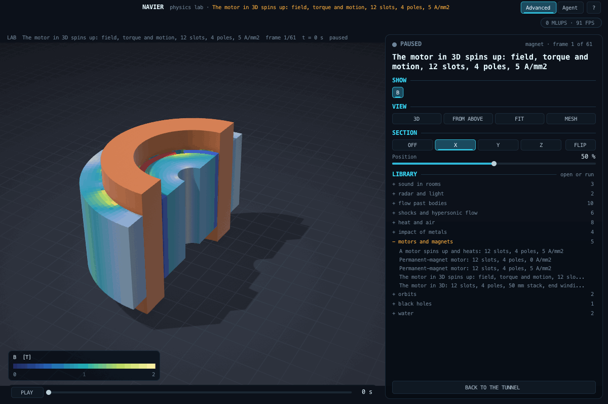
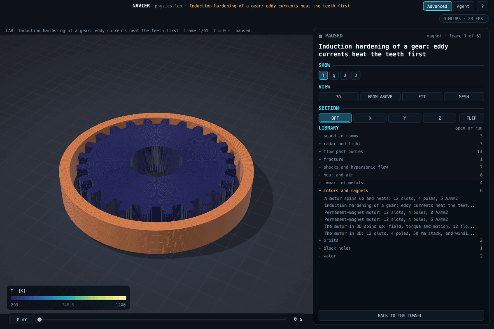

# Magnetic fields: motors, actuators, shields (`src/lab/magnet`)

Up: [the lab](README.md) · code: `src/lab/magnet/` · test: `tools/mgtest.c` · goals: [GOALS.md](../../GOALS.md) G11

## What it is

Two-dimensional magnetostatics in the cross-section of a long device: an electric motor, a solenoid actuator, a
magnetic shield. The unknown is the axial vector potential A (B = curl A); its contour lines are the lines of
magnetic flux.

    -div(nu grad A) = J + d(nu Br_y)/dx - d(nu Br_x)/dy,   nu = 1 / (mu0 mu_r)

J is the current density of the windings along the axis, Br the remanence of permanent magnets (B = mu0 mu_r H +
Br). Finite volumes on square cells with the reluctivity at each face the harmonic mean of its two cells, so that
the flux is continuous at material boundaries; the remanence enters as the flux of nu Br through the faces. The outer
boundary holds A: zero (flux parallel to it) or the potential of an applied uniform field. Conjugate gradients with
an incomplete Cholesky preconditioner. The torque on a rotor is the Maxwell stress on a circle in the air gap,
T = (1 / mu0) times the integral of r^2 B_r B_theta over the angle, per metre of length; copper losses are J^2 / sigma.

Materials are linear: saturation of the iron and the temperature dependence of the magnets are not modelled.

## Verification (`tools/mgtest.c`, in `make test-fast`; M5 to M7 in the next section)

Criteria written before the first run:

| Case | Against | Criterion | Result |
|---|---|---|---|
| M1 a conductor with uniform current | mu0 J r / 2 inside, mu0 I / (2 pi r) outside | 1 % | -0.004 %, +0.001 % |
| M2 an iron shell (mu_r 100) in a uniform field | 4 mu_r B0 / ((mu_r + 1)^2 - (mu_r - 1)^2 (a/b)^2) | 3 % | -0.13 % |
| M3 a transversely magnetised cylinder | Br / 2 at the centre (demagnetising factor 1/2) | 2 % | -0.22 % |
| M4 (added after the defect below) a magnet (mu_r 1.05) embedded in iron (mu_r 1000) | Br mu2 / (mu_m + mu2) | 2 % | -0.008 % |

A defect found by the motor, not by a test: the first form carried the remanence through a face as the mean of the
two cells' nu Br. At the stepped edge of a radially magnetised magnet on iron that leaves alternating currents from
step to step, weighted by the magnet's reluctivity; the linear iron (mu_r 4000) amplified them to 6.6 T under a pole,
and the normal flux was not continuous across the magnet's face (-0.2 T in the magnet, -5.5 T in the iron beside it).
The remanence now rides the face's harmonic reluctivity, F = nu_f [(A_nb - A_c) / dx + (P_c + P_nb) / 2], the exact
series flux of two half cells; the same rotor then carries 0.24 T under the pole. M4 was added first and passed with
both forms (it has no stepped radial edge), so the motor's picture is the check of this fix.

M2 failed its first run with no shielding at all: a ring given as a sector from 0 to 360 degrees had, after the
modulo, a span of zero and was never painted. Whole rings are now recognised; the test prints the first result.

## The motor (G11: electric motor)

[pm_motor.json](../../examples/lab/pm_motor.json): 12 slots, 4 poles, surface N42 magnets (Arnold's datasheet: Br
1.315 T, HcB 943 kA/m, a straight demagnetisation line of relative permeability 1.11), distributed three-phase
windings at 5 A/mm^2 turning with the rotor, swept through one slot pitch; [pm_motor_cogging.json](../../examples/lab/pm_motor_cogging.json)
is the same without current (the cogging torque). The lamination steel is linear with an assumed relative permeability
of 4000. The torques first quoted here (about 200 N m per metre) came from the defective remanence form above and are
withdrawn; the sweep is rerun with the fix, and the sensitivity to the steel's permeability is checked again with it.
Demonstration design, not a product.

## A motor that runs and heats


[pm_motor_drive.json](../../examples/lab/pm_motor_drive.json): the same motor with a 5 cm stack, driven by currents
locked to its rotor (a current-controlled drive), against a fan load. First the spin-up in real time: the flux lines
turn with the rotor. Then 90 minutes as a time lapse: the windings heat, the heat crosses the iron to a housing held
at 40 C by its cooling water, and the rotor, with no losses of its own, warms slowly through the air gap. Colour is
temperature; the lines are lines of magnetic flux.

How it is computed (`src/lab/magnet/mg_drive.c`, `mthermal.c`, `drive.h`):

- torque against rotor angle is tabulated once over its period (30 degrees for 12 slots and 4 poles) from the
  magnetostatic solver, since with the currents locked to the rotor it depends on the angle alone;
- the rotor follows J d omega/dt = T(theta) - T_load(omega) by fourth-order Runge-Kutta, with its inertia summed over
  its own cells (steel and magnets, densities from their sources) times the stack length;
- the copper loss is the cycle's mean J^2 / (k_fill sigma(T)) in every winding cell, with copper's resistivity rising
  0.393 % per kelvin (IEC 60028), the winding's fill factor 0.45;
- heat conduction on the field's own cells, implicit in time (stable at any step), each material with its sourced
  conductivity and heat capacity; the winding conducts as an impregnated bundle (1 W/(m K), an assumption in the range
  reported by Boglietti et al. 2009); the air gap conducts as still air.

Measured in the film's run (390 by 390 cells of 0.33 mm): mean torque 9.74 N m with a ripple of 7.79 N m from peak to
peak; inertia 4.58e-4 kg m^2; 90 % of the final speed in 0.022 s; 3211 rpm reached against 3213 rpm from balancing
the mean torque with the fan (the ripple averages out); copper loss 55.4 W; the hottest winding 320.7 K (7.6 K above
the housing); the rotor 316.4 K after 90 minutes, still warming (its time constant through the gap is about half an
hour by hand).

What this is not: a torque prediction. The same table on 0.25 mm cells gives 8.59 N m, 13 % less, so the torque has not
converged with the grid (the 1 mm air gap is three cells here, four there). The steel is linear: the teeth carry up to
2.9 T, where real lamination steel saturates near 2 T, so a real motor of this shape gives less torque still. Iron
losses, eddy currents in the magnets, the end windings and convection in the gap are not modelled. The drive, the load
and the cooling are chosen for the demonstration. What is verified is each part on its own: the field (M1 to M4),
the rotor's equation (M5) and the conduction (M6, M7).

| Case (added 2026-09-26, criteria before the first run) | Against | Criterion | Result |
|---|---|---|---|
| M5 a rotor from rest against a fan load under a constant torque | omega = sqrt(A/c) tanh(t sqrt(A c) / J) at t = tau and 3 tau | 1e-6 | 8.9e-16 |
| M6 a disk with a uniform source in a held ring, to steady state | T0 + q R^2/(4k) + q R^2/(2k) ln(R_b/R) (amended: the ring's measured radius R_b) | 1 % | -0.34 % |
| M7 the same disk in transient: heat released against heat stored plus heat into the ring | exact balance | 1e-6 | 1.1e-12 |

M6's first run failed (+1.62 %): its criterion placed the held temperature at R, but it is held at the centres of the
held cells, 0.4 cells further out on average; the closed form now uses that measured radius, the tolerance unchanged.

## The motor in 3D (MFEM)



The same motor, solved as a three-dimensional object: [motor3d.c](../../src/lab/magnet/motor3d.c) on
[mag3d.cpp](../../src/lab/magnet/mag3d.cpp). The 2D scenario's regions are extruded over a 50 mm stack; beyond the
stack, in air, each coil closes round its end turns (a coil runs from a slot carrying its phase forwards to the
nearest slot carrying it backwards, three slots on). The field is curl (nu curl A) = J + curl (nu Br), solved with
first-order Nedelec (edge) elements from [MFEM](../THIRD_PARTY.md) on a cylindrical grid whose rings and sectors follow
the regions' edges (18 rings, 144 sectors, 18 layers: 282 672 unknowns), by a sparse Cholesky factorisation from
Apple's Accelerate (1.3 GB, 6.6 s per rotor position on the laptop). The windings enter as a current vector potential
T (J = curl T), so their current is closed and divergence-free by construction; the torque is Arkkio's, the Maxwell
stress averaged through the air gap's volume over the whole axial length. With a `drive`, one period of torque (13
rotor positions) is tabulated and drives the rotor's equation of motion (drive.h); the film shows the solved fields
turning with the rotor, a whole period being the same solution turned by 30 degrees.

| Check | Against | Criterion | Result |
|---|---|---|---|
| T1 toroidal coil, 3D (`mag3dtest`) | B = mu0 I / (2 pi r) inside, 0 outside | 2 %, 3 % | 0.000 %, 0.000 % |
| T2 cylinder magnetised across its axis, periodic | B = Br (1 - k) / ((1 - k) + mu_r (1 + k)), k = (R / Rb)^2 | 1 % | -0.125 % |
| T3 the same, mu_r 1.05 | the same closed form | 1 % | -0.128 % |
| T4 sphere magnetised across the axis, 3D | B = 2 Br / 3 (demagnetising factor 1/3) | 3 % | -1.17 % |
| P1 the motor as a periodic slab (`motor3dtest`) | the lab's 2D finite-difference solver, six rotor angles | 5 % each | -1.6 to -3.0 % |
| P2 the motor with its ends | the slab times the stack length | 10 % | -0.96 % |

The closed form of T2 and T3: a cylinder of radius R, remanence Br across its axis and permeability mu_r, inside a
flux wall at Rb, has the potential A r cos(theta) inside and (C r + D / r) cos(theta) outside with C = D / Rb^2;
continuity of the potential and of B_r at R gives the uniform inner field above.

What the first runs found, recorded in the tests: the grid's inner cylinder was first a flux wall, which with the
outer walls holds the flux through every meridional section at zero and forbade the flux that circles a toroid's core
or a motor's yoke (T1 failed at 11 %); it is now a magnetic wall. Windings given as current densities constant on each
element do not conserve current at their corners, and removing their gradient part spreads a false current into the
air (T1 failed at 9 % outside); windings are now given as T. The Cholesky factorisation broke down on the needle-thin
elements at the axis (T4); a pivoted LDL^T takes over. And P1 failed at 17.5 degrees (-5.46 %) at the example's own
grid: a convergence study shows the 3D torque rising to within about 1 % of 2D as the rings and sectors refine, so P1
runs its slab on the finer grid, and **the example's torque (at the coarser grid, to fit the laptop's memory) is low by
up to 5 %**, most where the torque is smallest.

Not modelled: saturation (the steel is linear), eddy currents and iron losses, the end windings' true shape (they are
a band of the slots' radial depth), and the shaft (the grid's hole at 8 mm is a magnetic wall).

```bash
make mfem            # fetch, check and build MFEM 4.8 once (about ten minutes)
make lab && make test-lab3d
./build/labrun examples/lab/pm_motor_3d.json /tmp/m3.lab          # torque over one period, 13 positions, 90 s
./build/labrun examples/lab/pm_motor_3d_drive.json /tmp/m3d.lab   # and the spin-up, 61 frames
```

Keys: the 2D motor's, plus `three_d` {`stack_length_m`, `end_space_m`, `end_turn_m`, `outer_radius_m`, `sectors` (the
regions' angles must fall on sector edges), `stack_layers`, `radial_cell_m`, `gap_cells`, `periodic`, `source`}, and
for the spin-up `drive` {`density_kg_m3` {material: value, `source`}, `load` {`torque_n_m`, `fan_n_m_s2`, `source`},
`spin_up` {`duration_s`, `frames`, `step_s`}}.

## Induction heating: hardening a gear



An alternating current in a coil drives eddy currents in the steel inside it; they crowd into the surface within the
skin depth, most at the teeth, and their loss heats the steel. [eddy3d.h](../../src/lab/magnet/eddy3d.h) solves the
time-harmonic eddy currents, curl (nu curl A) + j omega sigma A = curl T, with MFEM's edge elements (real and imaginary
parts as one symmetric indefinite system, factorised by Accelerate's pivoted LDL^T), and the heat they make by
conduction on H1 elements with backward Euler. [induct3d.c](../../src/lab/magnet/induct3d.c) builds the gear on a
cylindrical grid that spans one tooth pitch with periodic sides (the gear's symmetry; the grid can now span a sector),
and writes all 24 teeth.

| Check (`tools/eddy3dtest.cpp`) | Against | Criterion | Result |
|---|---|---|---|
| I1 skin effect in a long cylinder, skin depth R / 3 | loss per metre from the Bessel solution, H_s J0(kr) / J0(kR) | 3 % | -0.22 % |
| I3 the same as a quarter with periodic sides | the whole | 0.5 % | -0.000 % |
| I2 heating for 0.5 s | heat stored against heat put in | 1 % | exact |

I1's first run was +23 %: the grid's inner cylinder, a magnetic wall, is an infinitely permeable rod on the axis into
which an axial field pours. For fields along the axis it is now a flux wall (`inner_flux_wall`); for a motor's, whose
flux circles the axis, it stays a magnetic wall. The two are duals, and each was found by a test.

[induction_gear.json](../../examples/lab/induction_gear.json): a gear of 24 teeth (tip radius 46 mm, 20 mm thick) in a
single-turn coil of 10 kA at 30 kHz; the steel (AISI 1045) at 800 C, above its Curie point, so non-magnetic
(conductivity 0.86 MS/m: skin depth 3.1 mm), its properties held constant. 118 000 unknowns for one tooth, 50 kW into
the gear; after 3 s the tooth tips reach 1093 K and below the root 845 K. 30 seconds. Not modelled: the steel's
magnetism below its Curie point (the first second of a real cycle, with a far thinner skin), the change of its
properties with temperature, the quench and the hardness it gives.

## Scenario keys

`domain` = "magnet", `title`; `grid` {`nx`, `ny`, `cell_m`}; `materials` [{`name`, `relative_permeability`,
`remanence_t`, `conductivity_s_m`, `source`}] (air is built in); `regions` [{`box_m` | `circle_m` |
`sector_m_deg` [x, y, r_in, r_out, angle0, angle1], `material`, `current_density_a_m2`, `magnetisation` none,
parallel or radial, `magnetisation_angle_deg` (parallel: the direction; radial: +1 outward, -1 inward), `rotor`,
`phase` A, B or C, `phase_sign`}] painted in order; `applied_field_t` [Bx, By]; `rotor` {`centre_m`,
`torque_radius_m`, `pole_pairs`}; `currents` {`peak_density_a_m2`, `electrical_angle_at_zero_deg`}; `run`
{`angle_from_deg`, `angle_to_deg`, `frames`}. A material without a `source` is refused.

A running motor adds `drive` {`stack_length_m`, `fill_factor`, `rotor_radius_m`, `copper_temperature_coefficient_1_k`,
`initial_temperature_k`, `source`, `torque_table` {`period_deg`, `points`}, `load` {`torque_n_m`, `fan_n_m_s2`},
`spin_up` {`duration_s`, `frames`, `step_s`}, `heat_run` {`duration_s`, `frames`, `steps_per_frame`}, `thermal`
{material name: {`thermal_conductivity_w_mk`, `volumetric_heat_capacity_j_m3k`, `density_kg_m3`, `held_temperature_k`,
`source`}}}; every material, air included, needs its thermal entry. The result carries the field `T` (K).
