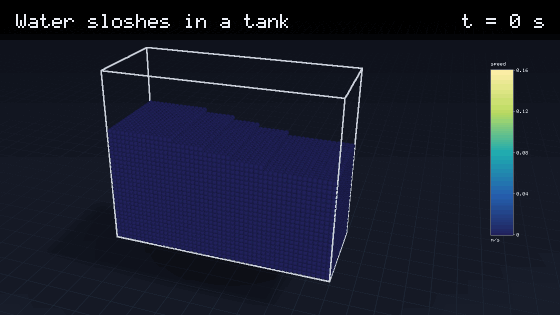

# Water with a free surface

Up: [the lab's documents](README.md) · code: [src/lab/water/](../../src/lab/water/water.h) · verification:
`tools/wtest.c` (`./build/wtest`, and `./build/wtest --fast` in the fast tier)





A wave breaks on a beach around a pier: a solitary wave 0.12 m high on 0.25 m of water (the Boussinesq profile, the
water under it moving with it) meets a 1-in-8 beach and a cylindrical pier. The crest steepens, breaks as it reaches
the pier, which splits it and leaves a hollow and a wake behind it, and the broken wave runs up the beach as a bore,
drains back and runs up again. 235 000 water particles of 1.5 cm on the GPU, 9 700 steps, 8 minutes. At this spacing
(8 particles across the wave's height) the wave spills; a plunging jet that curls over needs a finer spacing.

Water that moves as a whole and breaks apart: a column collapsing when a dam gives way, the surge running into a block
and climbing it, water sloshing in a tank. Each particle is a small parcel of water (2 cm across in the film) carrying
its velocity and density; the colour is its speed. The tank is drawn by its edges, the block as a solid.

## The model

Weakly compressible smoothed particle hydrodynamics (WCSPH), the method used for violent free-surface flow in the
SPHERIC benchmarks and in DualSPHysics.

| Part | What is computed | Reference |
|---|---|---|
| Kernel | Wendland C2 in 3D, smoothing length 1.7 spacings, support 3.4 spacings | Wendland 1995 |
| Pressure | Tait's equation p = B((rho/rho0)^7 - 1), B = rho0 c0^2 / 7; c0 = 10 sqrt(g H), so density varies by about 1 % | Monaghan 1994 |
| Density | the continuity equation with delta-SPH diffusion (delta = 0.1), less its hydrostatic part | Molteni and Colagrossi 2009; Fourtakas et al. 2019 |
| Momentum | the symmetric pressure gradient, gravity, Monaghan's artificial viscosity (alpha = 0.02) as the only viscosity | Monaghan 1992 |
| Walls | four layers of fixed boundary particles whose pressure extrapolates the water's, with gravity | Adami, Hu and Adams 2012 |
| Time | symplectic Euler: velocity from the forces, then position and density with the new velocity; step 0.25 h / (c0 + v) | |

The physical viscosity of water is not modelled: at the scale of a particle these flows run at Reynolds numbers of
1e5 and more, and the artificial viscosity is larger than water's own. Surface tension is not modelled (it matters
for drops below a few millimetres, far below the particle size). Air is not modelled: splashes fall through vacuum.

Two defects were found and fixed while this was built, and are recorded so that nobody reintroduces them:

- The density was first advanced with the velocities from before the kick while positions used those after it. For
  sound waves that pairing is forward Euler, which grows at every step; water at rest boiled to 12 m/s in 0.2 s. The
  density's rate is now computed in a second pass with the new velocities.
- At a smoothing length of 1.3 spacings (the value that suits the cubic spline used for solids) the Wendland kernel's
  gradient errors stirred water at rest to 5 % of sqrt(g H). At 1.7 spacings, the usual value for this kernel in 3D,
  the stirring falls to about 1 %.

## The GPU engine

`water_metal.h`: the same scheme on the GPU through Metal, one thread per particle, in single precision. Every step
the particles are re-sorted into cell order on the GPU (counted, scanned, scattered); the step is computed on the GPU
from the largest speed and acceleration, so batches of steps run without the CPU; each particle's neighbours, found by
the force pass, are kept for the density pass. Single precision needed care: positions are kept relative to the
region's corner and density as its deviation from rho0, both summed with Kahan's compensation, and Tait's pressure is
computed from the deviation by the exact expansion of (1 + e)^7 - 1. wtest runs W0, W1 and W2 on both engines to the
same criteria (below; W1's stillness fails on the GPU). A scenario runs on the GPU unless it says `"engine": "cpu"`.

Speed on the development laptop (M2): the dam break 25 s against 151 s on the CPU; the breaking wave (500 000
particles with the walls) about 10 million particle-steps a second. `WATER_PROFILE=1` times each kernel: the force
pass takes 59 % and the density pass 29 %, both limited by memory bandwidth (every particle reads some 600 candidate
neighbours). The next step for speed is to tile neighbours through threadgroup memory.

## Verification (`./build/wtest`)

Criteria written on 2026-09-26 before the first run; every amendment is dated in the source and its first run printed.

| Case | Against | Criterion | Result |
|---|---|---|---|
| W0 (fast tier) | a column 0.2 by 0.3 m collapses for 0.4 s: stable, no particle through a wall, kinetic + potential + elastic energy never above its start (the scheme may only dissipate) | gain below 0.5 % of the energy released | +0.020 %, none through, 5 s |
| W1 | water at rest, 0.4 m deep at 1 cm spacing, after 1 s: the pressure's slope against rho0 g, where p = 0, the fastest particle | slope 2 % (amended from 1 %), surface within a spacing, speed below 2 % of sqrt(g H) | slope +1.65 %, surface -0.22 spacings, 2.8e-2 m/s |
| W2 | the first sloshing mode of a tank 1 m long with 0.5 m of water: period against linear theory 2 pi / sqrt(g k tanh(k h)) | 2 % | -0.21 % |
| W0 (GPU) | the same | the same | +0.020 %, none through |
| W1 (GPU) | the same | the same | FAIL on stillness: 4.35e-2 m/s against 3.96e-2 (runs repeat exactly; before the order within cells was fixed they spread 3.95 to 4.90e-2); slope and surface pass |
| W2 (GPU) | the same | the same | -0.29 % |

The GPU's runs are recorded in wtest.c. W1 fails on stillness: still water on the GPU keeps about a third more motion
than on the CPU. Stepping both side by side, they agree to four digits for 0.6 s; then the GPU's atomic ordering breaks
the periodic slab's symmetry across y and the water takes on 3D disorder, which the CPU's exactly repeated arithmetic
holds off (CPU runs nudged at the start reach 2.75 to 3.54e-2, near the limit themselves). Density kept as a deviation,
compensated sums, Tait's pressure expanded, positions kept as a cell and an offset, and a fixed order within cells
(which made the GPU's runs repeat bit for bit) did not remove it. For moving water (the dam break, the waves) the
difference is far below the flow; for water that should stay still, use the CPU engine (`"engine": "cpu"`).

W1's amendment: the criterion compared the slope with rho0 g, but a weakly compressible model lets the density rise
about 1 % at that depth by design, so its own equilibrium slope is rho(z) g, 0.5 % steeper on average; the rest is the
SPH pressure gradient's first-order error, which was measured to fall with the spacing (+2.7 % at 2 cm, +1.65 % at 1 cm).
So hydrostatic pressures in these results are high by about 1.6 % at 1 cm spacing and 2.7 % at 2 cm. W0's amendment:
the energy sum first left out the elastic energy of the hydrostatically compressed start (about 0.05 J, exactly the
"gain" seen), and "inside the tank" was first drawn at the wall's line instead of at its first layer of particles.

Not yet done: a comparison with measurements. The SPHERIC benchmark 2 (a dam break over a box, Kleefsman et al. 2005)
publishes measured water heights and pressures in a 2.5 MB archive at spheric-sph.org; fetching it needs the owner's
agreement, and it is listed in [GOALS.md](../../GOALS.md).

## Running it

```bash
make lab
./build/wtest --fast
./build/labrun examples/lab/dam_break.json /tmp/dam_break.lab           # 18 000 particles, 2 s of flow: 25 s on the GPU
./build/labrun examples/lab/breaking_wave.json /tmp/wave.lab            # 235 000 particles, 3 s: 8 minutes
./build/labfilm /tmp/dam_break.lab --out /tmp/db --field speed
```

Scenario keys ([dam_break.json](../../examples/lab/dam_break.json), [sloshing_tank.json](../../examples/lab/sloshing_tank.json)):

| Key | Meaning |
|---|---|
| `particle_spacing_m` | the particles' spacing; the cost grows as its inverse to the fourth power |
| `gravity_m_s2` | along -z |
| `water.density_kg_m3`, `water.source` | the water, and where the value comes from (required) |
| `tank.size_m` | the tank's inside, from the origin; it has a floor and four walls, and no lid |
| `columns[].box_m` | boxes of water at rest at the start, [x0, y0, z0, x1, y1, z1] |
| `obstacles[].box_m` | solid boxes |
| `sloshing.depth_m`, `sloshing.amplitude_m` | water filling the tank with its surface at depth + amplitude cos(pi x / L) |
| `still_water.depth_m` | water at rest filling the tank to that depth, clear of the beach and bodies |
| `solitary_wave.height_m`, `.depth_m`, `.crest_x_m` | still water with a solitary wave on it: eta = H sech^2(k (x - x0)), k = sqrt(3 H / (4 d^3)), the water under it at c eta / (d + eta), c = sqrt(g (d + H)) |
| `beach.toe_x_m`, `beach.slope` | a plane rising from its toe along +x |
| `bodies` | solids from the shape library ([labshape.h](../../src/lab/labshape.h)): piers, rocks, hulls |
| `engine` | `gpu` (the default) or `cpu` |
| `numerics.h_factor`, `numerics.alpha`, `numerics.delta`, `numerics.cfl`, `numerics.c0_m_s` | the scheme's constants (defaults above) |
| `run.end_s`, `run.frames` | |

The result has a part `water` (points, fields `speed` in m/s and `p` in Pa), `tank` (its edges), `obstacle`, `beach`
and `body`. The run
record's diagnostics give the particle counts, the speed of sound, where the surge's front started and ended, and the
largest pressure.
