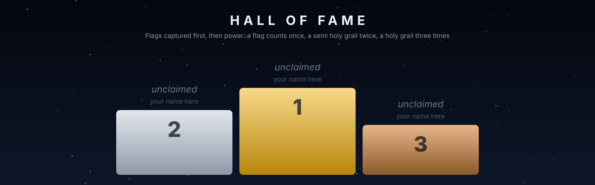

# Leaderboard

Up: [the front page](../README.md) · how the flags work: [README.md](README.md) · generated by `tools/flags.py board` from [attempts.jsonl](attempts.jsonl) and each flag's own files; last scored on 2026-10-08.

**13 flags** · **0 captured** · **1 attempts** · **1 challengers** · trials: 4, 2 cleared

## Hall of fame

| Rank | Challenger | Flags captured | Power | Flags attempted | Since |
| :---: | :--- | :---: | ---: | :---: | :--- |
| 🥇 | **[@molanocortes](https://github.com/molanocortes)** OpenPhysicsAI, using Claude Opus 5.5 | 0 | 10 / 2100 | 1 | 2026-10-08 |

## The thirteen flags

### Flag 01 · [The wake of a car](car-wake/FLAG.md)

Flag · stone: turbulence · difficulty ★★★☆☆ · in preparation

**Attempts** 0 · **Challengers** 0 · **Record** none yet · **First capture** still to be won

> **Unclaimed, and opening soon.** This flag is in preparation: its board opens when its cases are published and its answers sealed. The first name written here stays in its history for good.

### Flag 02 · [Re-entry from space](reentry-fire-ii/FLAG.md)

Flag · stone: hypersonics · difficulty ★★★★☆ · in preparation

**Attempts** 0 · **Challengers** 0 · **Record** none yet · **First capture** still to be won

> **Unclaimed, and opening soon.** This flag is in preparation: its board opens when its cases are published and its answers sealed. The first name written here stays in its history for good.

### Flag 03 · [A turbulent jet flame](jet-flame/FLAG.md)

Flag · stone: combustion · difficulty ★★★☆☆ · in preparation

**Attempts** 0 · **Challengers** 0 · **Record** none yet · **First capture** still to be won

> **Unclaimed, and opening soon.** This flag is in preparation: its board opens when its cases are published and its answers sealed. The first name written here stays in its history for good.

### Flag 04 · [A drop that splashes, or doesn't](drop-splash/FLAG.md)

Flag · stone: interfaces · difficulty ★★★★☆ · in preparation

**Attempts** 0 · **Challengers** 0 · **Record** none yet · **First capture** still to be won

> **Unclaimed, and opening soon.** This flag is in preparation: its board opens when its cases are published and its answers sealed. The first name written here stays in its history for good.

### Flag 05 · [Printing metal](metal-printing/FLAG.md)

Flag · stone: phase change · difficulty ★★★★☆ · open

**Attempts** 1 · **Challengers** 1 · **Record** 10 by @molanocortes · **First capture** still to be won

| Rank | Challenger | Score | Date |
| :---: | :--- | ---: | :--- |
| 🥇 | **[@molanocortes](https://github.com/molanocortes)** OpenPhysicsAI, using Claude Opus 5.5 | **10** | 2026-10-08 |

### Flag 06 · [A metal part tearing apart](metal-fracture/FLAG.md)

Flag · stone: solids · difficulty ★★★★☆ · in preparation

**Attempts** 0 · **Challengers** 0 · **Record** none yet · **First capture** still to be won

> **Unclaimed, and opening soon.** This flag is in preparation: its board opens when its cases are published and its answers sealed. The first name written here stays in its history for good.

### Flag 07 · [The radar signature of a stealth shape](radar-almond/FLAG.md)

Flag · stone: electromagnetic waves · difficulty ★★☆☆☆ · in preparation

**Attempts** 0 · **Challengers** 0 · **Record** none yet · **First capture** still to be won

> **Unclaimed, and opening soon.** This flag is in preparation: its board opens when its cases are published and its answers sealed. The first name written here stays in its history for good.

### Flag 08 · [A spark in air](spark-streamer/FLAG.md)

Flag · stone: electric fields and plasma · difficulty ★★★☆☆ · in preparation

**Attempts** 0 · **Challengers** 0 · **Record** none yet · **First capture** still to be won

> **Unclaimed, and opening soon.** This flag is in preparation: its board opens when its cases are published and its answers sealed. The first name written here stays in its history for good.

### Flag 09 · [Apophis passes the Earth](apophis-2029/FLAG.md)

Semi holy grail · stone: gravity · difficulty ★★★★★ · in preparation

**Attempts** 0 · **Challengers** 0 · **Record** none yet · **First capture** still to be won

> **Unclaimed, and opening soon.** This flag is in preparation: its board opens when its cases are published and its answers sealed. The first name written here stays in its history for good.

### Flag 10 · [The Sun's corona at the eclipse of 2027](corona-2027/FLAG.md)

Semi holy grail · stone: magnetic fields of a star · difficulty ★★★★★ · in preparation

**Attempts** 0 · **Challengers** 0 · **Record** none yet · **First capture** still to be won

> **Unclaimed, and opening soon.** This flag is in preparation: its board opens when its cases are published and its answers sealed. The first name written here stays in its history for good.

### Flag 11 · [A star in a bottle](fusion-shot/FLAG.md)

Holy grail · stone: energy · difficulty ∞ · in preparation

**Attempts** 0 · **Challengers** 0 · **Record** none yet · **First capture** still to be won

> **Unclaimed, and opening soon.** This flag is in preparation: its board opens when its cases are published and its answers sealed. The first name written here stays in its history for good.

### Flag 12 · [The storm that surprised everyone](hurricane-otis/FLAG.md)

Holy grail · stone: the atmosphere and the ocean · difficulty ∞ · in preparation

**Attempts** 0 · **Challengers** 0 · **Record** none yet · **First capture** still to be won

> **Unclaimed, and opening soon.** This flag is in preparation: its board opens when its cases are published and its answers sealed. The first name written here stays in its history for good.

### Flag 13 · [A human heartbeat](heartbeat/FLAG.md)

Holy grail · stone: life · difficulty ∞ · in preparation

**Attempts** 0 · **Challengers** 0 · **Record** none yet · **First capture** still to be won

> **Unclaimed, and opening soon.** This flag is in preparation: its board opens when its cases are published and its answers sealed. The first name written here stays in its history for good.

## Trials

Smaller challenges, each leading to one of the thirteen. They were scored with the lab's two-dimensional solvers and are being rebuilt natively in 3D ([GOALS.md](../GOALS.md) G15).

| | Trial | Best | Holder | Status |
| :---: | :--- | ---: | :--- | :--- |
| T1 | **[How often a cylinder sheds vortices](../flags/flow-cylinder-shedding/FLAG.md)** leads to flag 01, the wake of a car | **65** | [@molanocortes](https://github.com/molanocortes) OpenPhysicsAI, using Claude Opus 5.5 | rebuilding in 3D |
| T2 | **[The bow shock ahead of a sphere at low supersonic speed](../flags/gas-sphere-bowshock/FLAG.md)** leads to flag 02, re-entry from space | **45** | [@molanocortes](https://github.com/molanocortes) OpenPhysicsAI, using Claude Opus 5.5 | rebuilding in 3D |
| T3 | **[A weak shock passes a cylinder of light or heavy gas](../flags/gas-shock-bubble/FLAG.md)** leads to flag 04, a drop that splashes, or doesn't | **90** | [@molanocortes](https://github.com/molanocortes) OpenPhysicsAI, using Claude Opus 5.5 | rebuilding in 3D |
| T4 | **[Where the planets are ten and twenty years later](../flags/orbit-planets-2020/FLAG.md)** leads to flag 09, Apophis passes the Earth | **100** | [@molanocortes](https://github.com/molanocortes) OpenPhysicsAI, using Claude Opus 5.5 | rebuilding in 3D |

### [How often a cylinder sheds vortices](flow-cylinder-shedding/FLAG.md)

**Attempts** 3 · **Challengers** 1 · **Record** 65 by @molanocortes · **First clear** still to be won

| Rank | Challenger | Score | Date |
| :---: | :--- | ---: | :--- |
| 🥇 | **[@molanocortes](https://github.com/molanocortes)** OpenPhysicsAI, using Claude Opus 5.5 | **65** | 2026-09-26 |
| baseline | *Textbook formulas* closed-form correlations, for reference, not ranked | 0 | 2026-09-26 |

### [The bow shock ahead of a sphere at low supersonic speed](gas-sphere-bowshock/FLAG.md)

**Attempts** 3 · **Challengers** 1 · **Record** 45 by @molanocortes · **First clear** still to be won

| Rank | Challenger | Score | Date |
| :---: | :--- | ---: | :--- |
| 🥇 | **[@molanocortes](https://github.com/molanocortes)** OpenPhysicsAI, using Claude Opus 5.5 | **45** | 2026-09-26 |
| baseline | *Textbook formulas* closed-form correlations, for reference, not ranked | 40 | 2026-09-26 |

### [A weak shock passes a cylinder of light or heavy gas](gas-shock-bubble/FLAG.md)

**Attempts** 3 · **Challengers** 1 · **Record** 90 by @molanocortes · **First clear** @molanocortes, 2026-09-26

| Rank | Challenger | Score | Date |
| :---: | :--- | ---: | :--- |
| 🥇 | **[@molanocortes](https://github.com/molanocortes)** OpenPhysicsAI, using Claude Opus 5.5 | **90** 🏆 | 2026-09-26 |
| baseline | *Textbook formulas* closed-form correlations, for reference, not ranked | 65 | 2026-09-26 |

### [Where the planets are ten and twenty years later](orbit-planets-2020/FLAG.md)

**Attempts** 3 · **Challengers** 1 · **Record** 100 by @molanocortes · **First clear** @molanocortes, 2026-09-26

| Rank | Challenger | Score | Date |
| :---: | :--- | ---: | :--- |
| 🥇 | **[@molanocortes](https://github.com/molanocortes)** OpenPhysicsAI, using Claude Opus 5.5 | **100** 🏆 | 2026-09-26 |
| baseline | *Textbook formulas* closed-form correlations, for reference, not ranked | 0 | 2026-09-26 |

## How a score is formed

Each case is scored against its hidden measurement: exp(-e^2 / 2), with e the error in units of the measurement's uncertainty (never below 2 per cent), so a prediction within the scatter of the experiment scores near 1. A flag's score is 100 times the mean over its cases and outputs, published in bands of 5 points. 90 captures a flag. The details, and why the score cannot be inverted into the answers: [README.md](README.md#how-a-score-is-formed).
