# Flag 09 · Apophis passes the Earth

**Semi holy grail** · stone: **gravity** · difficulty **★★★★★** · in preparation · [the thirteen flags](../../README.md#the-thirteen-flags) · [leaderboard](../LEADERBOARD.md) · [how the flags work](../README.md)

> On 13 April 2029 an asteroid 340 metres across will pass the Earth closer than our geostationary satellites, and the Earth's tides will twist it. Predict how, before it happens.

## The flag

The asteroid 99942 Apophis will pass about 38 000 km from the centre of the Earth on 13 April 2029, bright enough to be seen with the naked eye from much of the Eastern Hemisphere. Its orbit is known to kilometres. What nobody knows is what the Earth's pull will do to the body itself. Apophis tumbles slowly, turning about more than one axis; the Earth's tides, stronger on its near side than on its far side, will change that tumbling, and may shift the loose rock on its surface. NASA's OSIRIS-APEX spacecraft will meet it after the flyby and telescopes will watch it throughout. The flag asks for the change in Apophis's rotation caused by the flyby, and whether its surface moves.

**Predictions close at 00:00 UTC, 13 April 2029.** The answer does not exist until 13 April 2029.

## Why it is worth capturing

The answer exists nowhere yet, not in a sealed file, not in a paper: nature will write it on 13 April 2029, and every prediction registered before that day will stand or fall on its own. It matters to all of us: if an asteroid is ever found on a course for the Earth, how we deflect it depends on how such bodies hold together, and a flyby this close by a body this large happens, by current estimates, about once in a thousand years.

## Why it is hard

Apophis is thought to be a rubble pile, loose rock held together by its own feeble gravity, and nobody has seen its inside. How its spin changes depends on its shape and on how its mass is spread; whether its surface slides depends on friction and cohesion between grains that weigh almost nothing. A prediction has to carry every one of those uncertainties honestly, and the answer will show which assumptions were right.

## What it takes, and where to start

- Orbits with the pull of the Earth, the Moon and the Sun on an extended body (the tidal torque, the coupling of its spin and its orbit), a shape from radar, and for the surface, the dynamics of a self-gravitating granular body (discrete elements).
- In this repository: the N-body orbit solver (`src/lab/orbit`, verified in `tools/orbtest.c` against Kepler's closed form and Mercury's relativistic perihelion, and in the trial against observed planet positions). Missing: the extended body and its grains.
- Giants to stand on: REBOUND, and open discrete-element codes for granular matter.
- The [physics map](../../docs/map/PHYSICS.md) says, for every solver in this repository, what it computes, how it was verified and which files to read first.

Trial: the planets ten and twenty years ahead ([its flag](../orbit-planets-2020/FLAG.md)), being rebuilt natively in 3D.

## The measurement

The answer does not exist yet. A prediction counts if it is committed to its entry before 00:00 UTC on 13 April 2029: the commit's date is the registration. The question's exact outputs and how each is scored are written into [flag.json](flag.json) well before that day. Once the measured change is published, the flag is scored and the answer is published with it.

## Leaderboard

<!-- board:begin -->

**Attempts** 0 · **Challengers** 0 · **Record** none yet · **First capture** still to be won

> **Unclaimed, and opening soon.** This flag is in preparation: its board opens when its cases are published and its answers sealed. The first name written here stays in its history for good.

<!-- board:end -->

## Capture it

Fork this repository or bring your own open-source simulator, build on any open-source library, work with any AI model: the board credits the person who captures the flag, the libraries and the model. Download the lab, make it better with your own AI agent, describe your entry in `flags/entries/<your GitHub name>/entry.json` and open a pull request: a machine reruns it from your commit, scores it against the sealed measurements and posts the score on your pull request, and a capture is merged into the lab for everyone once its code has been read ([how to take part](../../README.md#capture-a-flag)). The rules and the scoring: [how the flags work](../README.md). No prize and no money: the reward is your name on this board, and the first capture is kept for good.
