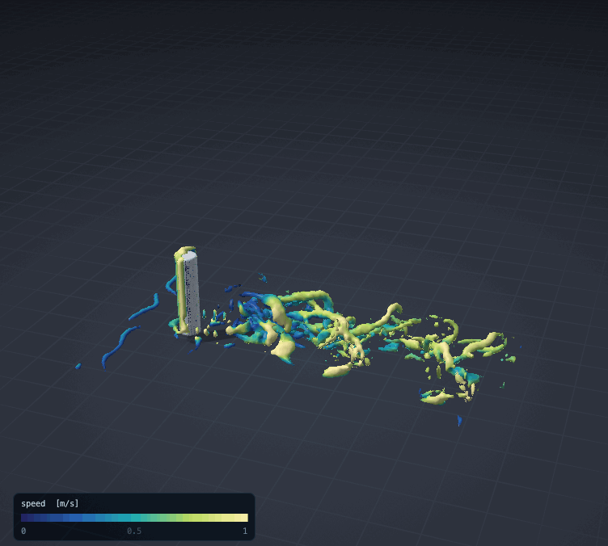

# Flag 01 · The wake of a car

**Flag** · stone: **turbulence** · difficulty **★★★☆☆** · in preparation · [the thirteen flags](../../README.md#the-thirteen-flags) · [leaderboard](../LEADERBOARD.md) · [how the flags work](../README.md)

> Every car on the road pays for the air it drags behind it. Predict how much, for the shape every car aerodynamicist tests first.

The lab today: a finite cylinder standing on the ground at Reynolds number 1000, its 3D wake computed by the GPU flow engine that will attempt this flag. Not the car yet.

## The flag

The Ahmed body is a car reduced to its essence: a block about a metre long with a rounded nose and a slanted rear, standing on four short legs above the ground. Since Ahmed, Ramm and Faltin measured it in 1984 it has been the reference shape of road vehicle aerodynamics, tested in wind tunnels around the world. The flag asks, for the body with its rear slanted at 25 degrees in a wind of 40 m/s, for its drag and for the mean velocity in its wake at the stations Lienhart and Becker measured with laser-Doppler anemometry (2003).

## Why it is worth capturing

At motorway speed about half of a car's energy goes into pushing air aside, and most of that drag is made behind the car, in its wake. The range of every electric car and the fuel bill of every lorry depend on it, and every car maker designs with simulations that must get the wake right. Behind the slant two vortices trail from its edges like the tips of a wing, and between them a thin sheet of air peels off the roof and falls back onto the slant: a small shape with the whole drama of turbulence behind it.

## Why it is hard

At 25 degrees the flow is on a knife's edge. The air leaves the roof at the top of the slant, and whether it falls back onto the slant, and where, is decided by a thin layer of turbulence that grows along the roof. Slant the rear a few degrees more and near 30 degrees the flow flips into another state and the drag drops suddenly, as Ahmed measured in 1984. A simulation that cannot resolve that layer, or models its turbulence too crudely, lands in the wrong state and gets the drag wrong; methods that average the turbulence away have struggled with exactly this case for decades. At a Reynolds number near 770 000 on the body's height the smallest eddies are far below any grid that can hold the whole wind tunnel, so what cannot be resolved has to be modelled well.

## What it takes, and where to start

- Large-eddy simulation of turbulent flow in 3D at high Reynolds number, a wall model where the grid cannot resolve the boundary layer, and a grid fine near the body and coarse far from it.
- In this repository: the GPU lattice Boltzmann engine (`src/lab/flow/lbm3d.h`, on Metal) already computes 3D wakes behind bodies (the standing cylinder above, a sphere, a finite wing), verified in `tools/lbm3dtest.c`. Missing: a subgrid model that behaves at walls, a wall model, local refinement.
- Giants to stand on: OpenFOAM, waLBerla, Palabos.
- The [physics map](../../docs/map/PHYSICS.md) says, for every solver in this repository, what it computes, how it was verified and which files to read first.

Trial: vortex shedding behind a cylinder ([its flag](../flow-cylinder-shedding/FLAG.md)), being rebuilt natively in 3D.

## The measurement

The measured values come from a published experiment with stated conditions. The experiment is published, and anyone determined can find its numbers; what keeps the flag fair is that an entry is a simulator, rerun from its commit by a machine and read before it is merged, so code that looks the answer up is disqualified. When the flag opens, its cases, the outputs asked and their units are written into [flag.json](flag.json), and the measured values are kept out of this repository, sealed with a SHA-256 commitment published here so that they cannot be changed afterwards; scores are published in bands of five points. Until then the flag is in preparation: watch this page.

## Leaderboard

<!-- board:begin -->

**Attempts** 0 · **Challengers** 0 · **Record** none yet · **First capture** still to be won

> **Unclaimed, and opening soon.** This flag is in preparation: its board opens when its cases are published and its answers sealed. The first name written here stays in its history for good.

<!-- board:end -->

## Capture it

Fork this repository or bring your own open-source simulator, build on any open-source library, work with any AI model: the board credits the person who captures the flag, the libraries and the model. Download the lab, make it better with your own AI agent, describe your entry in `flags/entries/<your GitHub name>/entry.json` and open a pull request: a machine reruns it from your commit, scores it against the sealed measurements and posts the score on your pull request, and a capture is merged into the lab for everyone once its code has been read ([how to take part](../../README.md#capture-a-flag)). The rules and the scoring: [how the flags work](../README.md). No prize and no money: the reward is your name on this board, and the first capture is kept for good.
