# Flag 10 · The Sun's corona at the eclipse of 2027

**Semi holy grail** · stone: **magnetic fields of a star** · difficulty **★★★★★** · in preparation · [the thirteen flags](../../README.md#the-thirteen-flags) · [leaderboard](../LEADERBOARD.md) · [how the flags work](../README.md)

> On 2 August 2027 the Moon will cover the Sun along a path from Spain to Egypt, and for up to six minutes the corona will shine around it. Predict its shape before the day.

## The flag

During a total eclipse the corona, the Sun's outer atmosphere, appears around the dark Moon: bright streamers stretching out like petals, dark gaps where the Sun's magnetic field opens into space, fine rays at its poles. Its shape is the Sun's magnetic field made visible, and it is different at every eclipse. The flag asks for the corona's structure on 2 August 2027 (where its streamers stand and how they lean, where its dark holes open), predicted from the magnetic field measured on the Sun's surface in the weeks before, and scored against the photographs taken during totality.

**Predictions close at 00:00 UTC, 2 August 2027.** The answer does not exist until 2 August 2027.

## Why it is worth capturing

It is the most beautiful thing a person can see in the sky, and the most beautiful test a simulator of magnetic fields can face. It matters on the ground: the solar wind and the storms that light the aurora, disturb satellites and threaten power grids leave the Sun through the same field, and the models that predict the corona are the models that forecast space weather. Like Apophis, its answer does not exist yet: the Moon reveals it on the day.

## Why it is hard

The field is measured only on the face of the Sun turned towards us, poorly at its poles and not at all on its far side, and it has to be carried from there into a plasma at a million degrees whose heating is still not understood, where the plasma and the field drag on each other. Groups have predicted the corona before recent eclipses and got its broad shape right, yet missed details; placing the streamers and their tilt right needs the physics and the data together.

## What it takes, and where to start

- A model of the corona's magnetic field from maps of the field on the Sun's surface: first a potential field out to a source surface, then magnetohydrodynamics with the corona's heating, and a synthetic image of the white-light corona to set against the photographs.
- In this repository: magnetostatics in 2D, and in 3D on MFEM (`src/lab/magnet`, verified in `tools/mgtest.c` and `tools/mag3dtest.cpp`). Nothing solar yet.
- Giants to stand on: pfsspy (potential fields of the Sun), SunPy.
- The [physics map](../../docs/map/PHYSICS.md) says, for every solver in this repository, what it computes, how it was verified and which files to read first.

## The measurement

The answer does not exist yet. A prediction counts if it is committed to its entry before 00:00 UTC on 2 August 2027: the commit's date is the registration. How the photographs are measured and each feature scored is written into [flag.json](flag.json) well before that day. After the eclipse the flag is scored against photographs of the corona taken during totality, and the measured features are published with the scores.

## Leaderboard

<!-- board:begin -->

**Attempts** 0 · **Challengers** 0 · **Record** none yet · **First capture** still to be won

> **Unclaimed, and opening soon.** This flag is in preparation: its board opens when its cases are published and its answers sealed. The first name written here stays in its history for good.

<!-- board:end -->

## Capture it

Fork this repository or bring your own open-source simulator, build on any open-source library, work with any AI model: the board credits the person who captures the flag, the libraries and the model. Download the lab, make it better with your own AI agent, describe your entry in `flags/entries/<your GitHub name>/entry.json` and open a pull request: a machine reruns it from your commit, scores it against the sealed measurements and posts the score on your pull request, and a capture is merged into the lab for everyone once its code has been read ([how to take part](../../README.md#capture-a-flag)). The rules and the scoring: [how the flags work](../README.md). No prize and no money: the reward is your name on this board, and the first capture is kept for good.
