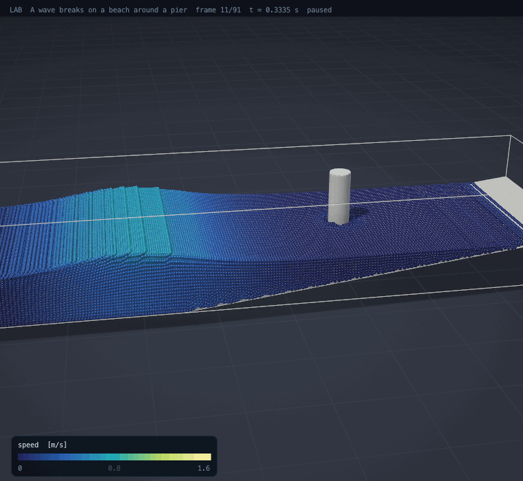

# Flag 04 · A drop that splashes, or doesn't

**Flag** · stone: **interfaces** · difficulty **★★★★☆** · in preparation · [the thirteen flags](../../README.md#the-thirteen-flags) · [leaderboard](../LEADERBOARD.md) · [how the flags work](../README.md)

> A drop hits a dry, smooth plate and splashes into a crown. Lower the air pressure around it and the splash disappears. Predict where.

The lab today: a solitary wave breaking on a beach around a pier, free-surface water in 3D (SPH on the GPU). A splash needs a sharp surface, the air around it and surface tension.

## The flag

In 2005 Lei Xu, Wendy Zhang and Sidney Nagel filmed drops of liquid hitting a smooth, dry glass plate in a chamber whose air pressure they could lower. At atmospheric pressure a drop throws up a thin crown that breaks into droplets. Below a threshold pressure the splash vanishes and the drop spreads quietly. The threshold depends on the speed of impact and on the gas: lighter gases need more pressure to make a splash. The flag asks for the threshold pressure for stated liquids, drop sizes, speeds and gases.

## Why it is worth capturing

Splashing decides how rain spreads soil and disease among crops, how ink lands on paper, how paint, fuel and pesticide sprays coat what they hit, and how the droplets that carry disease are made. The discovery that the thin air under a drop, not the liquid, makes the splash overturned what everyone assumed; a simulator that predicts it has understood the physics down to the scale of the air's own molecules. The crown with its necklace of droplets is one of the most photographed forms in fluid mechanics.

## Why it is hard

The liquid spreads over a film of air thinner than a micrometre, so thin that the air's molecules travel a good fraction of its thickness between collisions and the air no longer behaves as an ordinary fluid. The edge of the spreading drop lifts off that film in microseconds, pulled by the air and held back by surface tension and viscosity. The simulation must follow a sharp liquid surface from millimetres down to tens of nanometres, with the gas compressible, the surface tension exact and the contact with the plate right.

## What it takes, and where to start

- Two-phase flow with a sharp interface (volume of fluid or level set), surface tension, a compressible gas, and adaptive refinement to cells far below a micrometre under the drop, in 3D.
- In this repository: free-surface water by SPH on the GPU (`src/lab/water`, verified in `tools/wtest.c`), without the air, and compressible flow of two gases on adaptive meshes (`src/lab/gas`).
- Giants to stand on: Basilisk (adaptive volume of fluid, the tool of many splash studies).
- The [physics map](../../docs/map/PHYSICS.md) says, for every solver in this repository, what it computes, how it was verified and which files to read first.

Trial: a shock through a bubble of gas ([its flag](../gas-shock-bubble/FLAG.md)), being rebuilt natively in 3D.

## The measurement

The measured values come from a published experiment with stated conditions. The experiment is published, and anyone determined can find its numbers; what keeps the flag fair is that an entry is a simulator, rerun from its commit by a machine and read before it is merged, so code that looks the answer up is disqualified. When the flag opens, its cases, the outputs asked and their units are written into [flag.json](flag.json), and the measured values are kept out of this repository, sealed with a SHA-256 commitment published here so that they cannot be changed afterwards; scores are published in bands of five points. Until then the flag is in preparation: watch this page.

## Leaderboard

<!-- board:begin -->

**Attempts** 0 · **Challengers** 0 · **Record** none yet · **First capture** still to be won

> **Unclaimed, and opening soon.** This flag is in preparation: its board opens when its cases are published and its answers sealed. The first name written here stays in its history for good.

<!-- board:end -->

## Capture it

Fork this repository or bring your own open-source simulator, build on any open-source library, work with any AI model: the board credits the person who captures the flag, the libraries and the model. Download the lab, make it better with your own AI agent, describe your entry in `flags/entries/<your GitHub name>/entry.json` and open a pull request: a machine reruns it from your commit, scores it against the sealed measurements and posts the score on your pull request, and a capture is merged into the lab for everyone once its code has been read ([how to take part](../../README.md#capture-a-flag)). The rules and the scoring: [how the flags work](../README.md). No prize and no money: the reward is your name on this board, and the first capture is kept for good.
