# Trial T1 · How often a cylinder sheds vortices

**A trial on the way to [flag 01, the wake of a car](../car-wake/FLAG.md).** Scored with the lab's two-dimensional lattice solver; being rebuilt natively in 3D. Its board below stands until the rebuild is scored ([GOALS.md](../../GOALS.md) G15).

**Category:** fluid flow · **cases:** 4 hidden, 1 practice · **definition:** [flag.json](flag.json) · **rules:** [flags/README.md](../README.md)

Behind a circular cylinder in a steady stream, above a Reynolds number of about 40, vortices leave the two sides in
turn: the Kármán vortex street. Report how often, as a Strouhal number St = f d / U, at Reynolds numbers between 60
and 145, where the street is regular and laminar.

The answers are wind-tunnel measurements on cylinders of several sizes, corrected for blockage, stated by their author
to be accurate to about one per cent. Practice case: St = 0.1671 at Re = 100.

Why it is not trivial: the frequency depends on the wake's instability, which a simulation must resolve without
numerical damping; tunnel walls raise the frequency (the answer is for an unbounded flow), and a flow that is
really two-dimensional sheds a little faster than one with oblique shedding.

## Leaderboard

<!-- board:begin -->

**Attempts** 2 · **Challengers** 1 · **Record** 65 by @molanocortes · **First clear** still to be won

| Rank | Challenger | Score | Date |
| :---: | :--- | ---: | :--- |
| 🥇 | **[@molanocortes](https://github.com/molanocortes)** OpenPhysicsAI, using Claude Opus 5.5 | **65** | 2026-09-26 |
| baseline | *Textbook formulas* closed-form correlations, for reference, not ranked | 0 | 2026-09-26 |

<!-- board:end -->
