# Flag 11 · A star in a bottle

**Holy grail** · stone: **energy** · difficulty **∞** · in preparation · [the thirteen flags](../../README.md#the-thirteen-flags) · [leaderboard](../LEADERBOARD.md) · [how the flags work](../README.md)

> In 2023 the JET tokamak held a plasma far hotter than the core of the Sun for five seconds and released 69 megajoules of fusion energy. Predict it from first principles.

## The flag

JET, the Joint European Torus near Oxford, was for forty years the largest operating tokamak in the world: a ring-shaped vessel in which magnetic fields hold a plasma of hydrogen isotopes at more than a hundred million degrees, hot enough for deuterium and tritium to fuse. In its last campaigns it set the world records for fusion energy, 59 megajoules in 2021 and 69 megajoules in 2023, the second from 0.2 milligrams of fuel. The flag gives the machine (its vessel, coils and walls) and what its operators programmed for a record pulse (the magnetic field and current, the heating and the fuelling), and asks for the fusion power through the pulse and the energy released, as neutron detectors measured them.

## Why it is worth capturing

Fusion would give humanity energy without carbon, from fuels found in sea water and lithium, without the long-lived waste of fission and without the risk of a runaway reaction. The machines that will make it, ITER and the power plants after it, cost billions and take decades, and they are designed with simulations that today must be calibrated on the machines that came before. A simulator that predicts a fusion shot from first principles would let us design the power plant on a computer. It is, literally, lighting a star: a ring of plasma ten times hotter than the core of the Sun, glowing in its magnetic cage.

## Why it is hard

Everything that decides the shot happens at once, across scales no computer spans today. Turbulence in the plasma, eddies from the gyration of electrons (fractions of a millimetre) to the size of the machine (metres), carries heat out as fast as the heating puts it in. At the plasma's edge a thin barrier to heat forms and relaxes in repeated bursts; the plasma touches the wall and draws in impurities that radiate its energy away; the beams and waves that heat it deposit their power in ways that depend on the plasma itself; and sudden instabilities can end the shot. The best integrated codes reproduce such pulses with models calibrated on the machine; a prediction from first principles is beyond today's physics and computers. It may be within reach in about ten years.

## What it takes, and where to start

- A magnetic equilibrium (the Grad-Shafranov equation), the transport of heat and particles by turbulence (gyrokinetics, or models trained on it), the edge and its bursts, heating by neutral beams and radio waves, the fusion reactions and their neutrons, all coupled through the pulse.
- In this repository: none of it yet. An honest first attempt is an equilibrium with transport and a model of the turbulence, and it will score poorly; the distance is the point.
- Giants to stand on: FreeGS (equilibria), GS2 (gyrokinetic turbulence), TORAX (integrated transport).
- The [physics map](../../docs/map/PHYSICS.md) says, for every solver in this repository, what it computes, how it was verified and which files to read first.

## The measurement

The fusion power and energy of JET's record pulses were measured by neutron detectors and published with the pulses' conditions by the EUROfusion consortium. The experiment is published, and anyone determined can find its numbers; what keeps the flag fair is that an entry is a simulator, rerun from its commit by a machine and read before it is merged, so code that looks the answer up is disqualified. When the flag opens, its cases, the outputs asked and their units are written into [flag.json](flag.json), and the measured values are kept out of this repository, sealed with a SHA-256 commitment published here so that they cannot be changed afterwards; scores are published in bands of five points. Until then the flag is in preparation: watch this page.

## Leaderboard

<!-- board:begin -->

**Attempts** 0 · **Challengers** 0 · **Record** none yet · **First capture** still to be won

> **Unclaimed, and opening soon.** This flag is in preparation: its board opens when its cases are published and its answers sealed. The first name written here stays in its history for good.

<!-- board:end -->

## Capture it

Fork this repository or bring your own open-source simulator, build on any open-source library, work with any AI model: the board credits the person who captures the flag, the libraries and the model. Download the lab, make it better with your own AI agent, describe your entry in `flags/entries/<your GitHub name>/entry.json` and open a pull request: a machine reruns it from your commit, scores it against the sealed measurements and posts the score on your pull request, and a capture is merged into the lab for everyone once its code has been read ([how to take part](../../README.md#capture-a-flag)). The rules and the scoring: [how the flags work](../README.md). No prize and no money: the reward is your name on this board, and the first capture is kept for good.
