# Flag 13 · A human heartbeat

**Holy grail** · stone: **life** · difficulty **∞** · in preparation · [the thirteen flags](../../README.md#the-thirteen-flags) · [leaderboard](../LEADERBOARD.md) · [how the flags work](../README.md)

> A heart beats some three billion times in a lifetime. Predict one beat of one person's heart.

The lab today: a three-leaflet valve in an aortic root opens, jets and closes through a heartbeat, the blood and the leaflets computed together on the GPU. The heart that drives it is what this flag asks for.

## The flag

Magnetic resonance imaging can see a living heart in motion and measure the blood flowing through it in three dimensions and in time (4D flow MRI). From a real person's scans in an open clinical dataset, with the heart's shape, the directions of its muscle fibres where they were measured and its electrical rhythm from the ECG, the flag asks what the scans measured: the volume the left ventricle pumps each beat, the share of its blood it ejects, the timing of its valves opening and closing, and the vortex ring that forms inside it as it fills. Pressures are asked where a catheter measured them.

## Why it is worth capturing

Diseases of the heart and its vessels kill more people than any other cause, about a third of all deaths in the world. A simulator that predicts one person's heart could test a new valve, a drug or an operation on that heart before touching it, and choose the best for each patient. It is also the most moving simulation there is: a heart beating, and inside it the blood turning in a vortex that helps it fill and empty.

## Why it is hard

A heartbeat needs every kind of physics at once. An electrical wave runs through the muscle cells, carried by the channels of ions in their walls. The muscle, stiff along its fibres and soft across them, contracts as the wave passes, and twists. Valves open and seal, their leaflets touching. The blood swirls, speeds up and slows down, and thins as it shears; the arteries push back. Nerves and hormones adjust it all, beat by beat, and every heart is different. Each piece has been simulated; all of them together, for one person, well enough to predict what the scans measured, is not yet possible. It may be within reach in about ten years.

## What it takes, and where to start

- Cardiac electrophysiology (a monodomain or bidomain model with models of the cells), active hyperelastic muscle with fibres, fluid-structure interaction with the valves, the flow of blood in the chambers, a model of the circulation as the load, and one patient's geometry from images.
- In this repository: fluid-structure interaction on the GPU with immersed boundaries and thin sheets in contact, the three-leaflet valve above (`src/lab/fsi` and `src/lab/sheet`, verified in `tools/fsitest.c` and `tools/sheettest.c`), and 3D flow (`src/lab/flow`). Missing: the muscle, its electricity, the circulation.
- Giants to stand on: lifex, Chaste (cardiac electrophysiology), SimVascular (blood flow).
- The [physics map](../../docs/map/PHYSICS.md) says, for every solver in this repository, what it computes, how it was verified and which files to read first.

## The measurement

The measured values come from a published experiment with stated conditions. The experiment is published, and anyone determined can find its numbers; what keeps the flag fair is that an entry is a simulator, rerun from its commit by a machine and read before it is merged, so code that looks the answer up is disqualified. When the flag opens, its cases, the outputs asked and their units are written into [flag.json](flag.json), and the measured values are kept out of this repository, sealed with a SHA-256 commitment published here so that they cannot be changed afterwards; scores are published in bands of five points. Until then the flag is in preparation: watch this page.

## Leaderboard

<!-- board:begin -->

**Attempts** 0 · **Challengers** 0 · **Record** none yet · **First capture** still to be won

> **Unclaimed, and opening soon.** This flag is in preparation: its board opens when its cases are published and its answers sealed. The first name written here stays in its history for good.

<!-- board:end -->

## Capture it

Fork this repository or bring your own open-source simulator, build on any open-source library, work with any AI model: the board credits the person who captures the flag, the libraries and the model. Download the lab, make it better with your own AI agent, describe your entry in `flags/entries/<your GitHub name>/entry.json` and open a pull request: a machine reruns it from your commit, scores it against the sealed measurements and posts the score on your pull request, and a capture is merged into the lab for everyone once its code has been read ([how to take part](../../README.md#capture-a-flag)). The rules and the scoring: [how the flags work](../README.md). No prize and no money: the reward is your name on this board, and the first capture is kept for good.
