# Flag 12 · The storm that surprised everyone

**Holy grail** · stone: **the atmosphere and the ocean** · difficulty **∞** · in preparation · [the thirteen flags](../../README.md#the-thirteen-flags) · [leaderboard](../LEADERBOARD.md) · [how the flags work](../README.md)

> In October 2023 Hurricane Otis grew from a tropical storm into a Category 5 hurricane in about a day and struck Acapulco almost unannounced. Every forecast missed it. Predict it.

## The flag

Otis formed over the eastern Pacific in October 2023. Forecasts expected a tropical storm to reach the coast of Mexico; instead, in about a day, it grew into a Category 5 hurricane and made landfall near Acapulco on 25 October with winds of about 265 km/h, one of the fastest intensifications ever observed. The flag gives the state of the atmosphere and the ocean as analysed two days before landfall, and asks for the storm's peak sustained wind and lowest central pressure at landfall, as the US National Hurricane Center recorded them in its report on the storm.

## Why it is worth capturing

Tropical cyclones are among the deadliest disasters on Earth, and the storms that strengthen fastest are the most dangerous, because people have no time to prepare: Otis killed dozens of people. Forecasts of a storm's track have improved enormously; forecasts of its strength much less, and rapid intensification is the hardest part. A simulator that captures Otis would save lives on every coast. And a hurricane is among the most beautiful structures nature builds: the clear eye, the stadium of cloud around it, the bands spiralling out over hundreds of kilometres.

## Why it is hard

A hurricane intensifies through towers of cloud a few kilometres wide, inside a storm hundreds of kilometres across. Its fuel is heat from the upper ocean, drawn through a sea surface torn into spray by winds of seventy metres per second. How water vapour condenses, freezes and falls decides where the heat is released, and small differences in the storm's core, poorly observed, decide whether it explodes or not. Operational models on grids of a few kilometres missed Otis; capturing it may take finer grids, better physics of the sea surface and the clouds, and a better picture of the storm's start. It may be within reach in about ten years.

## What it takes, and where to start

- A non-hydrostatic model of a moist atmosphere on a rotating Earth (water vapour, cloud, rain and ice, and the heat they release), coupled to an ocean that cools as the storm stirs it, with turbulence at the sea surface, started from an analysis of the observed state.
- In this repository: the low-Mach buoyant flow of fire and rooms (`src/lab/fire`, verified in `tools/roomtest.c` and `tools/firetest.c`) is the right family of equations, without the moisture, the rotation or the ocean.
- Giants to stand on: WRF and MPAS (open weather models), the ERA5 reanalysis for the starting state.
- The [physics map](../../docs/map/PHYSICS.md) says, for every solver in this repository, what it computes, how it was verified and which files to read first.

## The measurement

The measured values come from a published experiment with stated conditions. The experiment is published, and anyone determined can find its numbers; what keeps the flag fair is that an entry is a simulator, rerun from its commit by a machine and read before it is merged, so code that looks the answer up is disqualified. When the flag opens, its cases, the outputs asked and their units are written into [flag.json](flag.json), and the measured values are kept out of this repository, sealed with a SHA-256 commitment published here so that they cannot be changed afterwards; scores are published in bands of five points. Until then the flag is in preparation: watch this page.

## Leaderboard

<!-- board:begin -->

**Attempts** 0 · **Challengers** 0 · **Record** none yet · **First capture** still to be won

> **Unclaimed, and opening soon.** This flag is in preparation: its board opens when its cases are published and its answers sealed. The first name written here stays in its history for good.

<!-- board:end -->

## Capture it

Fork this repository or bring your own open-source simulator, build on any open-source library, work with any AI model: the board credits the person who captures the flag, the libraries and the model. Download the lab, make it better with your own AI agent, describe your entry in `flags/entries/<your GitHub name>/entry.json` and open a pull request: a machine reruns it from your commit, scores it against the sealed measurements and posts the score on your pull request, and a capture is merged into the lab for everyone once its code has been read ([how to take part](../../README.md#capture-a-flag)). The rules and the scoring: [how the flags work](../README.md). No prize and no money: the reward is your name on this board, and the first capture is kept for good.
