# Flag 03 · A turbulent jet flame

**Flag** · stone: **combustion** · difficulty **★★★☆☆** · in preparation · [the thirteen flags](../../README.md#the-thirteen-flags) · [leaderboard](../LEADERBOARD.md) · [how the flags work](../README.md)

> The flame every combustion model in the world is judged against.

The lab today: a 100 kW methane fire and its plume, low-Mach reacting flow in 3D, burning as fast as fuel and air mix. This flag needs the chemistry itself.

## The flag

A jet of methane mixed with three times its volume of air leaves a tube 7.2 mm across at a Reynolds number of 22 400, held by a ring of pilot flame, into a slow stream of air. Barlow and Frank measured this flame point by point with lasers (Raman and Rayleigh scattering, laser-induced fluorescence): its temperature, how far fuel and air have mixed, and the species it makes, among them carbon monoxide, the hydroxyl radical and nitric oxide. It became the reference case of the workshop where the world's combustion modellers compare their predictions (the TNF workshop). The flag asks for the mean and fluctuating temperature and chosen species at stations along and across the flame.

## Why it is worth capturing

Burning still gives the world most of its energy: power stations, aircraft engines, furnaces, ships. What they emit, carbon monoxide and the oxides of nitrogen, and whether they could burn hydrogen or ammonia instead, is decided in thin sheets of flame folded by turbulence. A model that predicts Flame D can be trusted to design cleaner combustors. And a turbulent flame is one of the most beautiful things a laboratory makes: it flickers and breathes, and all its chemistry happens in sheets thinner than a millimetre.

## Why it is hard

Methane burns through dozens of species and hundreds of reactions, some in microseconds, in reaction zones thinner than a millimetre that turbulence folds and stretches. Where it stretches them too hard the flame goes out locally and relights. Carbon monoxide and the hydroxyl radical are made and destroyed exactly there, so predicting them needs the chemistry and the turbulence right together, on a grid that cannot resolve the flame sheets.

## What it takes, and where to start

- Large-eddy simulation of a variable-density jet with detailed chemistry, through a flamelet or progress-variable table or transported probability densities.
- In this repository: low-Mach reacting flow in 3D (`src/lab/fire`, verified in `tools/firetest.c` against Heskestad's flame height and McCaffrey's plume) with its multigrid pressure solver (`src/lab/mg`). It burns fuel as fast as fuel and air mix and has no detailed chemistry yet.
- Giants to stand on: Cantera (chemistry), the GRI-Mech 3.0 mechanism.
- The [physics map](../../docs/map/PHYSICS.md) says, for every solver in this repository, what it computes, how it was verified and which files to read first.

## The measurement

The measured values come from a published experiment with stated conditions. The experiment is published, and anyone determined can find its numbers; what keeps the flag fair is that an entry is a simulator, rerun from its commit by a machine and read before it is merged, so code that looks the answer up is disqualified. When the flag opens, its cases, the outputs asked and their units are written into [flag.json](flag.json), and the measured values are kept out of this repository, sealed with a SHA-256 commitment published here so that they cannot be changed afterwards; scores are published in bands of five points. Until then the flag is in preparation: watch this page.

## Leaderboard

<!-- board:begin -->

**Attempts** 0 · **Challengers** 0 · **Record** none yet · **First capture** still to be won

> **Unclaimed, and opening soon.** This flag is in preparation: its board opens when its cases are published and its answers sealed. The first name written here stays in its history for good.

<!-- board:end -->

## Capture it

Fork this repository or bring your own open-source simulator, build on any open-source library, work with any AI model: the board credits the person who captures the flag, the libraries and the model. Download the lab, make it better with your own AI agent, describe your entry in `flags/entries/<your GitHub name>/entry.json` and open a pull request: a machine reruns it from your commit, scores it against the sealed measurements and posts the score on your pull request, and a capture is merged into the lab for everyone once its code has been read ([how to take part](../../README.md#capture-a-flag)). The rules and the scoring: [how the flags work](../README.md). No prize and no money: the reward is your name on this board, and the first capture is kept for good.
