# Flag 06 · A metal part tearing apart

**Flag** · stone: **solids** · difficulty **★★★★☆** · in preparation · [the thirteen flags](../../README.md#the-thirteen-flags) · [leaderboard](../LEADERBOARD.md) · [how the flags work](../README.md)

> A machined metal part is pulled until it tears. Predict where the crack starts, where it runs, and at what load.

The lab today: a glass bottle dropped on concrete shatters, brittle fracture by peridynamics in 3D. Metal tears differently: it flows first, and voids grow inside it.

## The flag

Sandia National Laboratories machines a part of a ductile metal with holes and notches, tests many copies of it, and before revealing the results asks teams around the world to predict them blind: the force against the stretch, the load at which a crack starts, and the path it takes. It has done so several times since 2012, and the predictions have spread widely. The flag poses one such part, with its geometry, the tests that calibrate its material and its loading, and asks for the peak load, the stretch at which it cracks and the path of the crack.

## Why it is worth capturing

Every bridge, aircraft, pressure vessel, reactor and crash structure is designed to know when metal will tear, with safety factors that are large because the prediction is uncertain. Better predictions mean lighter aircraft, safer reactors and structures that fail gracefully. Watching a part neck, a crack start between two holes and snake to the edge is watching the most consequential event in engineering.

## Why it is hard

Before metal tears it flows: large plastic strains, the material hardening and warming, then microscopic voids opening around impurities, growing and joining into a crack. Whether and where that happens depends on the whole state of stress, not on a single number, and small differences in the machined geometry or the material decide which of two holes cracks first. The material has to be calibrated from a few standard tests and the prediction carried to a shape it has never seen.

## What it takes, and where to start

- Finite-strain plasticity with a model of ductile damage (of the Gurson kind, or phase-field fracture) in 3D, quasi-static or slowly dynamic, with the crack free to choose its path.
- In this repository: explicit dynamics with Johnson-Cook plasticity and erosion (`src/lab/impact`, verified in `tools/imptest.c`), brittle fracture by peridynamics (`src/lab/fracture`, `tools/peritest.c`) and the structural finite elements of `src/fem` (`tools/femtest.c`, `tools/tettest.c`).
- Giants to stand on: MOOSE, deal.II, FEniCS, and MFEM, which this repository already builds.
- The [physics map](../../docs/map/PHYSICS.md) says, for every solver in this repository, what it computes, how it was verified and which files to read first.

## The measurement

The measured values come from a published experiment with stated conditions. The experiment is published, and anyone determined can find its numbers; what keeps the flag fair is that an entry is a simulator, rerun from its commit by a machine and read before it is merged, so code that looks the answer up is disqualified. When the flag opens, its cases, the outputs asked and their units are written into [flag.json](flag.json), and the measured values are kept out of this repository, sealed with a SHA-256 commitment published here so that they cannot be changed afterwards; scores are published in bands of five points. Until then the flag is in preparation: watch this page.

## Leaderboard

<!-- board:begin -->

**Attempts** 0 · **Challengers** 0 · **Record** none yet · **First capture** still to be won

> **Unclaimed, and opening soon.** This flag is in preparation: its board opens when its cases are published and its answers sealed. The first name written here stays in its history for good.

<!-- board:end -->

## Capture it

Fork this repository or bring your own open-source simulator, build on any open-source library, work with any AI model: the board credits the person who captures the flag, the libraries and the model. Download the lab, make it better with your own AI agent, describe your entry in `flags/entries/<your GitHub name>/entry.json` and open a pull request: a machine reruns it from your commit, scores it against the sealed measurements and posts the score on your pull request, and a capture is merged into the lab for everyone once its code has been read ([how to take part](../../README.md#capture-a-flag)). The rules and the scoring: [how the flags work](../README.md). No prize and no money: the reward is your name on this board, and the first capture is kept for good.
