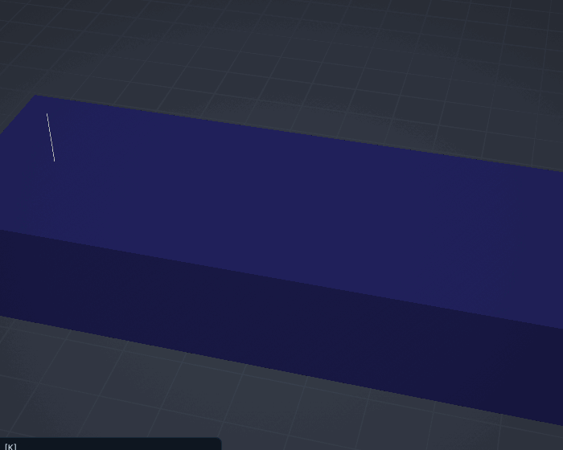

# Flag 05 · Printing metal

**Flag** · stone: **phase change** · difficulty **★★★★☆** · in preparation · [the thirteen flags](../../README.md#the-thirteen-flags) · [leaderboard](../LEADERBOARD.md) · [how the flags work](../README.md)

> A laser draws a line on a metal plate. Predict the pool it melts and the crystals it leaves behind.

The lab today: a laser track in 316L with Marangoni flow in the melt; the pool grows wider and shallower than conduction alone makes it. The keyhole and the crystals are what this flag adds.

## The flag

The US National Institute of Standards and Technology runs AM-Bench, benchmark measurements for additive manufacturing. In its single-track experiments a laser scans lines across bare plates of nickel superalloy at stated power, speed and spot size. NIST measured the melt pool's width and depth in cross sections, its cooling with high-speed thermal cameras, and the solidified structure it left, and it collected predictions before releasing the measurements. The flag asks for the melt pool's width and depth, the cooling rate at solidification and the spacing of the solidification cells, for stated tracks.

## Why it is worth capturing

Printed metal flies in rocket engines and jet turbines and lives in hip implants, and its strength is decided in a pool of liquid metal a tenth of a millimetre wide that lives for a millisecond. A simulator that predicts the pool and the metal it leaves replaces months of trial prints and makes printed parts certifiable. This is where this project began, predicting how printed parts distort, and it is where heat, flow, surface tension and the growth of crystals meet.

## Why it is hard

The pool is stirred by its own surface tension at metres per second, may be dug into a keyhole by the recoil of evaporating metal, and solidifies at up to a million degrees per second, growing cells a micrometre apart. The scales run from micrometres to millimetres and from microseconds to milliseconds, and the properties of the liquid alloy, two and a half thousand degrees hot, are themselves hard to measure.

## What it takes, and where to start

- Heat with melting and solidification, flow in the melt with the Marangoni stress, evaporation and a free surface that can deform into a keyhole, the laser's absorption, then a model of the microstructure (phase field or cellular automaton) fed by the thermal history.
- In this repository: the melt pool solver with the enthalpy method and Marangoni flow (`src/lab/melt`, verified in `tools/melttest.c` against Rosenthal, Neumann and the thermocapillary return flow), and the distortion of printed parts, validated against measured cantilevers. Missing: the keyhole, the alloy's measured properties, the crystals.
- Giants to stand on: MOOSE, PRISMS-PF (phase field).
- The [physics map](../../docs/map/PHYSICS.md) says, for every solver in this repository, what it computes, how it was verified and which files to read first.

## The measurement

The measured values come from a published experiment with stated conditions. The experiment is published, and anyone determined can find its numbers; what keeps the flag fair is that an entry is a simulator, rerun from its commit by a machine and read before it is merged, so code that looks the answer up is disqualified. When the flag opens, its cases, the outputs asked and their units are written into [flag.json](flag.json), and the measured values are kept out of this repository, sealed with a SHA-256 commitment published here so that they cannot be changed afterwards; scores are published in bands of five points. Until then the flag is in preparation: watch this page.

## Leaderboard

<!-- board:begin -->

**Attempts** 0 · **Challengers** 0 · **Record** none yet · **First capture** still to be won

> **Unclaimed, and opening soon.** This flag is in preparation: its board opens when its cases are published and its answers sealed. The first name written here stays in its history for good.

<!-- board:end -->

## Capture it

Fork this repository or bring your own open-source simulator, build on any open-source library, work with any AI model: the board credits the person who captures the flag, the libraries and the model. Download the lab, make it better with your own AI agent, describe your entry in `flags/entries/<your GitHub name>/entry.json` and open a pull request: a machine reruns it from your commit, scores it against the sealed measurements and posts the score on your pull request, and a capture is merged into the lab for everyone once its code has been read ([how to take part](../../README.md#capture-a-flag)). The rules and the scoring: [how the flags work](../README.md). No prize and no money: the reward is your name on this board, and the first capture is kept for good.
