# Flag 07 · The radar signature of a stealth shape

**Flag** · stone: **electromagnetic waves** · difficulty **★★☆☆☆** · in preparation · [the thirteen flags](../../README.md#the-thirteen-flags) · [leaderboard](../LEADERBOARD.md) · [how the flags work](../README.md)

> Shine radar on a smooth metal almond and very little comes back. Predict how little, from every angle.

The lab today: a radar pulse at 300 MHz meets an aircraft 15 m long, Maxwell's equations on a 3D grid. The almond asks for the returned signal to a fraction of a decibel.

## The flag

In the early 1990s the Electromagnetic Code Consortium chose a set of shapes to test simulators of radar scattering, built them in metal and measured them: among them an ogive, a cone joined to a sphere, and the NASA almond, a smooth body shaped to reflect little. Radar at stated frequencies was shone on each from every angle around it, in both polarisations, and the power scattered straight back, its radar cross section, was recorded. The flag asks for the radar cross section of the almond at stated frequencies, angles and polarisations.

## Why it is worth capturing

Radar keeps aircraft apart, ships off the rocks and storms on the forecast, and every antenna, phone and MRI scanner runs on the same equations, Maxwell's, the equations of light itself. A simulator that predicts the almond to a fraction of a decibel has mastered waves meeting curved metal, the everyday problem of electromagnetic engineering. The picture is beautiful too: fronts of the wave wrapping round the body, and a faint wave creeping round its back.

## Why it is hard

The almond was shaped to send little back, so at many angles its echo is a small fraction of what a ball of the same size would return, and a small error on the curved surface or at the sharp tip swamps it. Waves creep round the back and return; the tip scatters on its own. Getting within a decibel at every angle needs the geometry right to a small fraction of a wavelength, and the field carried far away without losing that precision.

## What it takes, and where to start

- A full-wave solver of Maxwell's equations: finite differences in time with curved (conformal) surfaces, finite elements, or boundary elements (the method of moments), and a transform from the near field to the far field.
- In this repository: finite differences in time on Yee's grid with perfectly matched layers (`src/lab/em`, verified in `tools/emtest.c` against a resonant cavity and Mie scattering) and the 3D radar above. Missing: curved surfaces without staircases, the far-field transform.
- Giants to stand on: MEEP, Bempp, and MFEM, which this repository already builds.
- The [physics map](../../docs/map/PHYSICS.md) says, for every solver in this repository, what it computes, how it was verified and which files to read first.

## The measurement

The measured values come from a published experiment with stated conditions. The experiment is published, and anyone determined can find its numbers; what keeps the flag fair is that an entry is a simulator, rerun from its commit by a machine and read before it is merged, so code that looks the answer up is disqualified. When the flag opens, its cases, the outputs asked and their units are written into [flag.json](flag.json), and the measured values are kept out of this repository, sealed with a SHA-256 commitment published here so that they cannot be changed afterwards; scores are published in bands of five points. Until then the flag is in preparation: watch this page.

## Leaderboard

<!-- board:begin -->

**Attempts** 0 · **Challengers** 0 · **Record** none yet · **First capture** still to be won

> **Unclaimed, and opening soon.** This flag is in preparation: its board opens when its cases are published and its answers sealed. The first name written here stays in its history for good.

<!-- board:end -->

## Capture it

Fork this repository or bring your own open-source simulator, build on any open-source library, work with any AI model: the board credits the person who captures the flag, the libraries and the model. Download the lab, make it better with your own AI agent, describe your entry in `flags/entries/<your GitHub name>/entry.json` and open a pull request: a machine reruns it from your commit, scores it against the sealed measurements and posts the score on your pull request, and a capture is merged into the lab for everyone once its code has been read ([how to take part](../../README.md#capture-a-flag)). The rules and the scoring: [how the flags work](../README.md). No prize and no money: the reward is your name on this board, and the first capture is kept for good.
