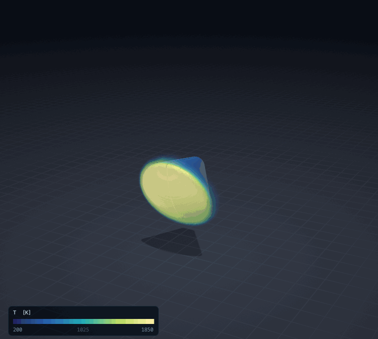

# Flag 02 · Re-entry from space

**Flag** · stone: **hypersonics** · difficulty **★★★★☆** · in preparation · [the thirteen flags](../../README.md#the-thirteen-flags) · [leaderboard](../LEADERBOARD.md) · [how the flags work](../README.md)

> In 1965 NASA sent a probe back into the Earth's atmosphere at eleven kilometres a second and measured the heat that reached it. Predict that heat.

The lab today: an Apollo-shaped capsule at its trim angle in a hypersonic stream, the shock layer in 3D (inviscid, a perfect gas). The glow, the chemistry and the heat on the wall are what this flag adds.

## The flag

Project FIRE (Flight Investigation of the Reentry Environment) flew a scale model of the Apollo heat shield back into the atmosphere at the speed of a return from the Moon. Its second flight, in 1965, entered at about 11 km/s; instruments behind layers of beryllium measured the total heat reaching the shield, and radiometers measured the part arriving as light from the glowing gas. The flag asks for the heat flux at the centre of the shield, total and radiative, at chosen moments of the descent, from the probe's shape, its speed and the air it flew through.

## Why it is worth capturing

Every capsule that has brought people home, from Apollo to the spacecraft flying today, was designed from predictions of this heat, with a margin that exists because the predictions are uncertain; each kilogram of heat shield is a kilogram not carried to the Moon or to Mars. The gas in front of the shield is hotter than the surface of the Sun: it breaks apart, loses its electrons and glows, and on a return from the Moon a large share of the heat arrives as light.

## Why it is hard

Behind the bow shock the air is heated in a few millimetres to more than ten thousand kelvin. Molecules break apart and atoms lose electrons faster than the gas can settle, so its temperatures of motion and of vibration differ and its chemistry runs out of equilibrium. The glowing gas emits in thousands of lines and bands and absorbs part of its own light on the way to the wall. Near the wall a boundary layer carries the rest of the heat, and on the real probe the shield itself changed as it heated. Each of these alone is a field of research.

## What it takes, and where to start

- Compressible flow with a viscous wall, reacting air (five species at least, eleven with the ions), two temperatures, and radiation carried through the shock layer.
- In this repository: compressible flow on adaptive meshes with cut-cell bodies in 2D and 3D (`src/lab/gas`, verified in `tools/gastest.c`, `tools/gas3dtest.c` and `tools/euler3dtest.c`) and the 3D capsule above. They are inviscid, with a perfect gas.
- Giants to stand on: Mutation++ (the thermochemistry of air), SU2.
- The [physics map](../../docs/map/PHYSICS.md) says, for every solver in this repository, what it computes, how it was verified and which files to read first.

Trial: the bow shock ahead of a sphere ([its flag](../gas-sphere-bowshock/FLAG.md)), being rebuilt natively in 3D.

## The measurement

The measured values come from a published experiment with stated conditions. The experiment is published, and anyone determined can find its numbers; what keeps the flag fair is that an entry is a simulator, rerun from its commit by a machine and read before it is merged, so code that looks the answer up is disqualified. When the flag opens, its cases, the outputs asked and their units are written into [flag.json](flag.json), and the measured values are kept out of this repository, sealed with a SHA-256 commitment published here so that they cannot be changed afterwards; scores are published in bands of five points. Until then the flag is in preparation: watch this page.

## Leaderboard

<!-- board:begin -->

**Attempts** 0 · **Challengers** 0 · **Record** none yet · **First capture** still to be won

> **Unclaimed, and opening soon.** This flag is in preparation: its board opens when its cases are published and its answers sealed. The first name written here stays in its history for good.

<!-- board:end -->

## Capture it

Fork this repository or bring your own open-source simulator, build on any open-source library, work with any AI model: the board credits the person who captures the flag, the libraries and the model. Download the lab, make it better with your own AI agent, describe your entry in `flags/entries/<your GitHub name>/entry.json` and open a pull request: a machine reruns it from your commit, scores it against the sealed measurements and posts the score on your pull request, and a capture is merged into the lab for everyone once its code has been read ([how to take part](../../README.md#capture-a-flag)). The rules and the scoring: [how the flags work](../README.md). No prize and no money: the reward is your name on this board, and the first capture is kept for good.
