# Flag 08 · A spark in air

**Flag** · stone: **electric fields and plasma** · difficulty **★★★☆☆** · in preparation · [the thirteen flags](../../README.md#the-thirteen-flags) · [leaderboard](../LEADERBOARD.md) · [how the flags work](../README.md)

> Put tens of thousands of volts on a needle above a plate and a finger of glowing plasma runs across the gap, carrying its own electric field. Predict how fast it runs and how wide it is.

## The flag

A sharp electrode stands a few centimetres above a flat one in ordinary air. A voltage pulse of several to tens of kilovolts is applied, and from the tip a streamer starts: a thin channel of ionised air that grows across the gap at hundreds to thousands of kilometres per second, glowing as it goes. At Eindhoven University of Technology, Briels, Nijdam and their colleagues photographed such streamers with fast cameras and measured their velocity and diameter against the voltage. The flag asks for the velocity and the diameter of positive streamers at stated voltages and gaps.

## Why it is worth capturing

Every spark and every lightning bolt begins as streamers, and so do sprites, the red flashes high above thunderstorms. Power grids, insulators, electric aircraft and the switches of the energy transition are designed around them; the plasma they make turns air into ozone, treats wounds and cleans exhaust. And a streamer is the clearest window on electromagnetism there is: charges that create their own field, which in turn drives the charges, a loop you can watch.

## Why it is hard

The head of a streamer is a tenth of a millimetre across and crosses a centimetre in nanoseconds. There the field is several times the field at which air breaks down, and ionisation grows exponentially with it, so a small error in the field is a large error in the speed. Ahead of the head, ultraviolet light from the glowing gas ionises the air and seeds its growth. In three dimensions streamers branch, at random, into trees. The simulation must solve the electric field every few picoseconds from charges it is itself moving, on a mesh that refines around the head as it runs.

## What it takes, and where to start

- The drift, diffusion and reactions of electrons and ions in their own electric field (a Poisson solve every step), photoionisation, and adaptive mesh refinement in 3D.
- In this repository: the multigrid Poisson solver with conjugate gradients (`src/lab/mg`, verified in `tools/poissontest.c`) and Maxwell's equations in time (`src/lab/em`). The plasma model itself is not written yet.
- Giants to stand on: Afivo-streamer.
- The [physics map](../../docs/map/PHYSICS.md) says, for every solver in this repository, what it computes, how it was verified and which files to read first.

## The measurement

The measured values come from a published experiment with stated conditions. The experiment is published, and anyone determined can find its numbers; what keeps the flag fair is that an entry is a simulator, rerun from its commit by a machine and read before it is merged, so code that looks the answer up is disqualified. When the flag opens, its cases, the outputs asked and their units are written into [flag.json](flag.json), and the measured values are kept out of this repository, sealed with a SHA-256 commitment published here so that they cannot be changed afterwards; scores are published in bands of five points. Until then the flag is in preparation: watch this page.

## Leaderboard

<!-- board:begin -->

**Attempts** 0 · **Challengers** 0 · **Record** none yet · **First capture** still to be won

> **Unclaimed, and opening soon.** This flag is in preparation: its board opens when its cases are published and its answers sealed. The first name written here stays in its history for good.

<!-- board:end -->

## Capture it

Fork this repository or bring your own open-source simulator, build on any open-source library, work with any AI model: the board credits the person who captures the flag, the libraries and the model. Download the lab, make it better with your own AI agent, describe your entry in `flags/entries/<your GitHub name>/entry.json` and open a pull request: a machine reruns it from your commit, scores it against the sealed measurements and posts the score on your pull request, and a capture is merged into the lab for everyone once its code has been read ([how to take part](../../README.md#capture-a-flag)). The rules and the scoring: [how the flags work](../README.md). No prize and no money: the reward is your name on this board, and the first capture is kept for good.
